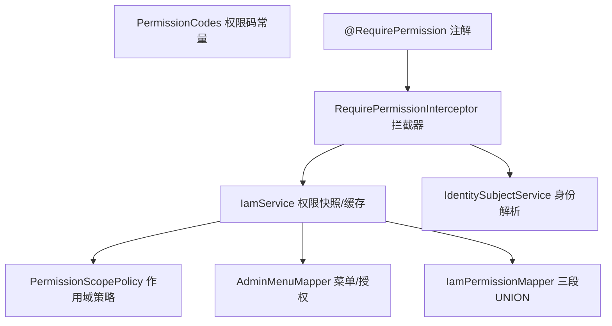
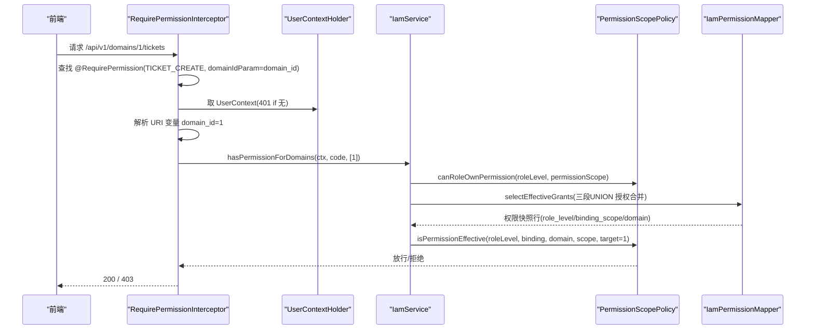
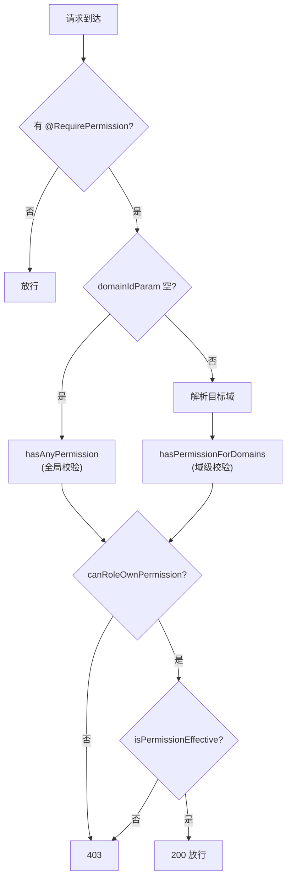
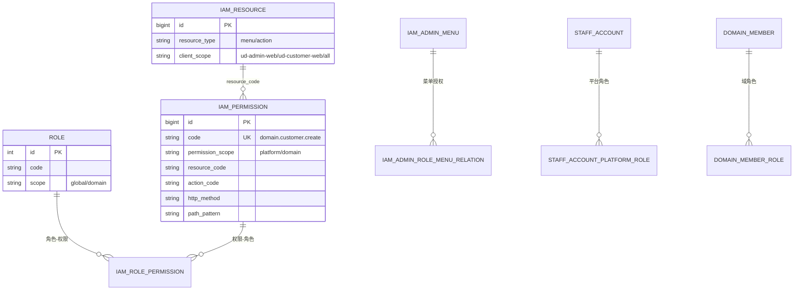
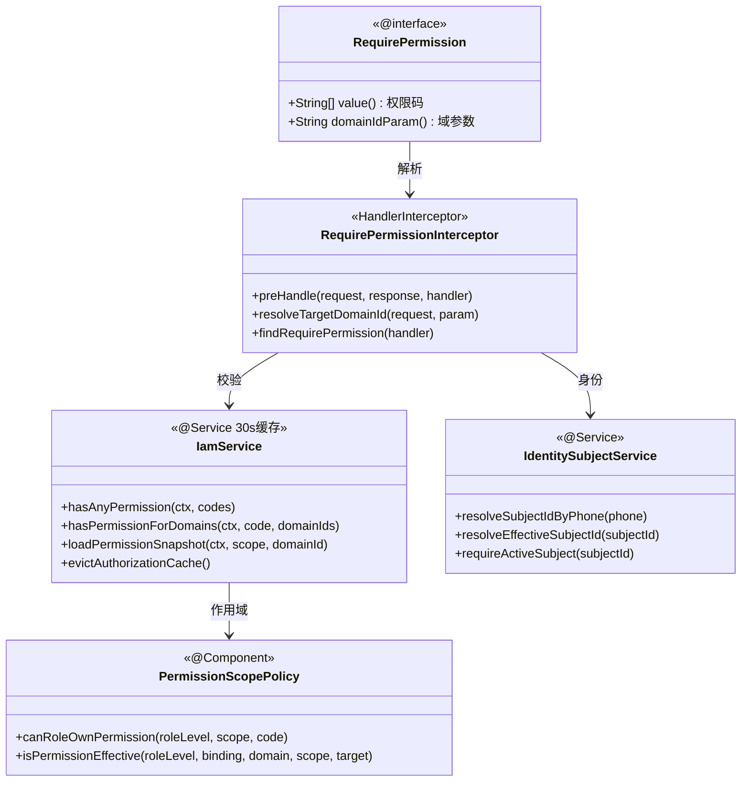

<cite>
- [UnionDesk/uniondesk-iam/src/main/java/com/uniondesk/iam/core/PermissionCodes.java](file://UnionDesk/uniondesk-iam/src/main/java/com/uniondesk/iam/core/PermissionCodes.java#L3-L60)
- [UnionDesk/uniondesk-iam/src/main/java/com/uniondesk/iam/core/RequirePermission.java](file://UnionDesk/uniondesk-iam/src/main/java/com/uniondesk/iam/core/RequirePermission.java#L8-L19)
- [UnionDesk/uniondesk-iam/src/main/java/com/uniondesk/iam/web/RequirePermissionInterceptor.java](file://UnionDesk/uniondesk-iam/src/main/java/com/uniondesk/iam/web/RequirePermissionInterceptor.java#L22-L81)
- [UnionDesk/uniondesk-iam/src/main/java/com/uniondesk/iam/core/PermissionScopePolicy.java](file://UnionDesk/uniondesk-iam/src/main/java/com/uniondesk/iam/core/PermissionScopePolicy.java#L7-L79)
- [UnionDesk/uniondesk-iam/src/main/java/com/uniondesk/iam/core/IamService.java](file://UnionDesk/uniondesk-iam/src/main/java/com/uniondesk/iam/core/IamService.java#L34-L77)
- [UnionDesk/uniondesk-iam/src/main/java/com/uniondesk/iam/core/IamService.java](file://UnionDesk/uniondesk-iam/src/main/java/com/uniondesk/iam/core/IamService.java#L102-L146)
- [UnionDesk/uniondesk-iam/src/main/java/com/uniondesk/iam/core/IamService.java](file://UnionDesk/uniondesk-iam/src/main/java/com/uniondesk/iam/core/IamService.java#L491-L495)
- [UnionDesk/uniondesk-iam/src/main/java/com/uniondesk/iam/core/IdentitySubjectService.java](file://UnionDesk/uniondesk-iam/src/main/java/com/uniondesk/iam/core/IdentitySubjectService.java#L11-L21)
</cite>

# UnionDesk IAM 权限体系

## 简介

本文档详解 IAM 权限体系：权限码模型（`PermissionCodes` 常量 + `iam_permission` 表）、权限作用域策略（`PermissionScopePolicy` 平台/域/shared 三级）、`@RequirePermission` 注解 + `RequirePermissionInterceptor` 拦截器（含域级校验）、角色-权限绑定（三段 UNION 授权合并）、菜单/动作资源、身份主体解析（`IdentitySubjectService`）。该体系支撑「平台/域双作用域、按钮级粒度、接口级校验」。

章节来源：
- [UnionDesk/uniondesk-iam/src/main/java/com/uniondesk/iam/core/PermissionCodes.java](file://UnionDesk/uniondesk-iam/src/main/java/com/uniondesk/iam/core/PermissionCodes.java#L3-L60)
- [UnionDesk/uniondesk-iam/src/main/java/com/uniondesk/iam/web/RequirePermissionInterceptor.java](file://UnionDesk/uniondesk-iam/src/main/java/com/uniondesk/iam/web/RequirePermissionInterceptor.java#L22-L55)

## 项目结构

权限体系组件：



图表来源：
- [UnionDesk/uniondesk-iam/src/main/java/com/uniondesk/iam/web/RequirePermissionInterceptor.java](file://UnionDesk/uniondesk-iam/src/main/java/com/uniondesk/iam/web/RequirePermissionInterceptor.java#L22-L29)
- [UnionDesk/uniondesk-iam/src/main/java/com/uniondesk/iam/core/IamService.java](file://UnionDesk/uniondesk-iam/src/main/java/com/uniondesk/iam/core/IamService.java#L34-L42)

## 核心组件

**1. PermissionCodes 权限码**：集中定义全部权限码常量（L5-60）——`platform.*`（平台菜单/角色/角色模板/组织）与 `domain.*`（域菜单/客户/屏蔽词/工单属性/状态/审计）双前缀体系；Controller 注解直接引用常量（见 TicketController `PermissionCodes.TICKET_CREATE`）。

**2. @RequirePermission 注解**：`@Target(METHOD, TYPE)` + `@Retention(RUNTIME)`（L8-9）；`value()` 权限码数组（L12）+ `domainIdParam()` 域参数名（L18）——非空时按目标域校验。

**3. RequirePermissionInterceptor 拦截器**：`preHandle`（L32-55）——HandlerMethod 判断 → 注解查找（方法优先、类兜底，L72-80）→ 无注解放行 → 有注解校验 `UserContext`（401，L40-41）→ 无域参数走 `hasAnyPermission`（L42-46）→ 有域参数从 URI 模板变量解析目标域（L48、L57-70）并走 `hasPermissionForDomains`（L49-50）；失败 403。

**4. IamService**：`hasAnyPermission`（L55）、`hasPermissionForDomains`（L59，按域过滤）、`loadPermissionSnapshot`（L142-146，菜单+动作+角色）、`listCurrentMenuResources`（L102）、30 秒缓存（L36/42）、`evictAuthorizationCache`（L491-495）。

**5. PermissionScopePolicy 作用域策略**：`canRoleOwnPermission`（L16-38）——global 角色只能拥有 `platform.` 前缀权限（L24-29）；domain 角色只能拥有非 `platform.` 前缀（L33-36）；`isPermissionEffective`（L40-64）——平台权限仅 global 角色 global 绑定生效；域权限要求域绑定且目标域匹配（L56-62）。

**6. IdentitySubjectService 身份解析**：`resolveSubjectIdByPhone`（L21）、`resolveEffectiveSubjectId`（L38，合并链解析）、`requireActiveSubject`（L54，状态校验）——操作者身份统一解析。

章节来源：
- [UnionDesk/uniondesk-iam/src/main/java/com/uniondesk/iam/web/RequirePermissionInterceptor.java](file://UnionDesk/uniondesk-iam/src/main/java/com/uniondesk/iam/web/RequirePermissionInterceptor.java#L32-L81)
- [UnionDesk/uniondesk-iam/src/main/java/com/uniondesk/iam/core/PermissionScopePolicy.java](file://UnionDesk/uniondesk-iam/src/main/java/com/uniondesk/iam/core/PermissionScopePolicy.java#L16-L64)
- [UnionDesk/uniondesk-iam/src/main/java/com/uniondesk/iam/core/IamService.java](file://UnionDesk/uniondesk-iam/src/main/java/com/uniondesk/iam/core/IamService.java#L55-L77)

## 架构总览

请求权限校验的完整链路：



图表来源：
- [UnionDesk/uniondesk-iam/src/main/java/com/uniondesk/iam/web/RequirePermissionInterceptor.java](file://UnionDesk/uniondesk-iam/src/main/java/com/uniondesk/iam/web/RequirePermissionInterceptor.java#L32-L55)
- [UnionDesk/uniondesk-iam/src/main/java/com/uniondesk/iam/core/IamService.java](file://UnionDesk/uniondesk-iam/src/main/java/com/uniondesk/iam/core/IamService.java#L55-L77)

## 详细分析

**权限体系设计要点**：

1. **权限码三段式**：`资源.动作` 语义（`domain.customer.create` = 域-客户-创建）；前缀 `platform.`/`domain.` 直接决定作用域归属——`PermissionScopePolicy` 用前缀判定「角色能否拥有该权限」（L24-36），从模型层防越权挂载。
2. **注解+拦截器双层**：Controller 注解声明（`@RequirePermission`），拦截器运行时解析（方法级优先、类级兜底 L72-80）；无注解端点放行（如公开端点）；`domainIdParam` 从 URI 模板变量解析目标域（L57-70）——域级校验防域角色跨域。
3. **三段 UNION 授权合并**：`selectEffectiveGrants`（见查询模式）合并「平台角色（global）+ 域成员角色（domain+域）+ 客户固定角色」，输出 `role_level/binding_scope/business_domain_id/permission_scope` 快照行——一次查询完成全部授权判定数据。
4. **作用域有效性矩阵**：`isPermissionEffective`（L40-64）——platform 权限要求「global 角色 + global 绑定」；domain 权限要求「domain 角色 + domain 绑定 + 目标域匹配（或 null 通配）」——严格矩阵防越权。
5. **菜单/动作资源双轨**：`iam_resource`（menu/action 树）声明能力；`iam_admin_menu` 挂权限码渲染前端；`PermissionSnapshotView` 聚合菜单树+动作+域（L142-146）一次下发前端。
6. **身份解析前置**：`IdentitySubjectService` 解析操作者 subject（手机号/合并链/状态校验），权限判定基于解析后的有效身份。
7. **缓存与失效**：30 秒 TTL 缓存权限快照（L36）；授权变更 `evictAuthorizationCache` 主动失效（L491-495）——变更后最长 30s 生效。



图表来源：
- [UnionDesk/uniondesk-iam/src/main/java/com/uniondesk/iam/web/RequirePermissionInterceptor.java](file://UnionDesk/uniondesk-iam/src/main/java/com/uniondesk/iam/web/RequirePermissionInterceptor.java#L36-L55)
- [UnionDesk/uniondesk-iam/src/main/java/com/uniondesk/iam/core/PermissionScopePolicy.java](file://UnionDesk/uniondesk-iam/src/main/java/com/uniondesk/iam/core/PermissionScopePolicy.java#L16-L64)

## 数据模型

权限体系核心实体：



图表来源：
- [UnionDesk/uniondesk-iam/src/main/java/com/uniondesk/iam/core/PermissionCodes.java](file://UnionDesk/uniondesk-iam/src/main/java/com/uniondesk/iam/core/PermissionCodes.java#L5-L36)（权限码前缀）
- [UnionDesk/uniondesk-iam/src/main/java/com/uniondesk/iam/core/PermissionScopePolicy.java](file://UnionDesk/uniondesk-iam/src/main/java/com/uniondesk/iam/core/PermissionScopePolicy.java#L10-L14)（作用域常量）

## 依赖关系分析



图表来源：
- [UnionDesk/uniondesk-iam/src/main/java/com/uniondesk/iam/web/RequirePermissionInterceptor.java](file://UnionDesk/uniondesk-iam/src/main/java/com/uniondesk/iam/web/RequirePermissionInterceptor.java#L22-L29)
- [UnionDesk/uniondesk-iam/src/main/java/com/uniondesk/iam/core/IamService.java](file://UnionDesk/uniondesk-iam/src/main/java/com/uniondesk/iam/core/IamService.java#L34-L77)
- [UnionDesk/uniondesk-iam/src/main/java/com/uniondesk/iam/core/IdentitySubjectService.java](file://UnionDesk/uniondesk-iam/src/main/java/com/uniondesk/iam/core/IdentitySubjectService.java#L11-L21)

## 性能与安全考虑

- **性能**：权限快照 30 秒缓存（`ConcurrentHashMap + CacheEntry`）；三段 UNION 一次查询合并授权；菜单/动作资源缓存。
- **安全**：`PermissionScopePolicy` 严格作用域矩阵（global 角色只能 platform 权限、domain 角色不能 platform 前缀）防越权挂载；`domainIdParam` 域级校验防跨域；拦截器 401/403 明确区分。
- **一致性**：授权变更 `evictAuthorizationCache` 主动失效（最长 30s 生效窗口）；`@JsonAlias` 兼容字段；`is_system/preset` 预置角色保护。
- **可追溯**：角色-权限绑定经审计记录；权限码常量集中管理防字符串漂移。

章节来源：
- [UnionDesk/uniondesk-iam/src/main/java/com/uniondesk/iam/core/IamService.java](file://UnionDesk/uniondesk-iam/src/main/java/com/uniondesk/iam/core/IamService.java#L36-L42)
- [UnionDesk/uniondesk-iam/src/main/java/com/uniondesk/iam/core/PermissionScopePolicy.java](file://UnionDesk/uniondesk-iam/src/main/java/com/uniondesk/iam/core/PermissionScopePolicy.java#L24-L38)

## 故障排查指南

| 现象 | 原因 | 处理建议 |
| --- | --- | --- |
| 接口 403 但权限码已配 | 角色未绑定或作用域不匹配（domain 角色挂 platform 权限） | 检查 `iam_role_permission` 绑定；核对 `PermissionScopePolicy` 前缀规则 |
| 域管理员能操作其他域 | `domainIdParam` 未配置或目标域解析失败 | 检查注解 `domainIdParam` 与 URI 变量名一致 |
| 权限变更 30s 内不生效 | 快照缓存未失效 | 调 `evictAuthorizationCache`；或等待 TTL 过期 |
| 菜单显示但接口 403 | 菜单授权（role-menu）与权限码授权（role-permission）不一致 | 同步两套绑定；检查 `iam_admin_menu.permission_code` |
| 无注解端点被放行 | 端点未声明 `@RequirePermission` | 按权限矩阵补注解（除公开端点） |

章节来源：
- [UnionDesk/uniondesk-iam/src/main/java/com/uniondesk/iam/web/RequirePermissionInterceptor.java](file://UnionDesk/uniondesk-iam/src/main/java/com/uniondesk/iam/web/RequirePermissionInterceptor.java#L36-L55)
- [UnionDesk/uniondesk-iam/src/main/java/com/uniondesk/iam/core/IamService.java](file://UnionDesk/uniondesk-iam/src/main/java/com/uniondesk/iam/core/IamService.java#L491-L495)

## 结论

IAM 权限体系以「**权限码常量、作用域策略、注解+拦截器、三段授权合并**」为核心：`PermissionCodes` 收敛全部权限码（platform./domain. 双前缀），`PermissionScopePolicy` 用严格矩阵约束角色-权限归属与生效域，`RequirePermissionInterceptor` 在运行时解析注解（方法/类级 + 域参数）完成校验，`IamService` 以三段 UNION + 30 秒缓存提供授权数据。该体系支撑平台/域双作用域、按钮级粒度与接口级校验，是全系统的权限骨架。

章节来源：
- [UnionDesk/uniondesk-iam/src/main/java/com/uniondesk/iam/web/RequirePermissionInterceptor.java](file://UnionDesk/uniondesk-iam/src/main/java/com/uniondesk/iam/web/RequirePermissionInterceptor.java#L22-L81)
- [UnionDesk/uniondesk-iam/src/main/java/com/uniondesk/iam/core/PermissionScopePolicy.java](file://UnionDesk/uniondesk-iam/src/main/java/com/uniondesk/iam/core/PermissionScopePolicy.java#L7-L79)

## 附录

权限校验验证命令：

```bash
# 1. 权限快照（菜单+动作）
curl http://127.0.0.1:8080/api/v1/me/permissions -H "Authorization: Bearer <token>"

# 2. 未授权访问（期望 403 信封）
curl http://127.0.0.1:8080/api/v1/admin/domains/1/tickets -H "Authorization: Bearer <guest-token>"

# 3. 跨域访问（域角色访问其他域，期望 403）
curl http://127.0.0.1:8080/api/v1/domains/999/tickets/my -H "Authorization: Bearer <domain-token>"
```

权限码命名规范：

```java
// 三段式：作用域前缀.资源.动作
"platform.menu.create"        // 平台-菜单-创建
"domain.customer.update_status" // 域-客户-状态更新
"domain.ticket_attribute.read"  // 域-工单属性-读取

// Controller 使用
@RequirePermission(value = PermissionCodes.DOMAIN_CUSTOMER_CREATE, domainIdParam = "domain_id")
```

章节来源：
- [UnionDesk/uniondesk-iam/src/main/java/com/uniondesk/iam/core/PermissionCodes.java](file://UnionDesk/uniondesk-iam/src/main/java/com/uniondesk/iam/core/PermissionCodes.java#L5-L36)
- [UnionDesk/uniondesk-iam/src/main/java/com/uniondesk/iam/core/RequirePermission.java](file://UnionDesk/uniondesk-iam/src/main/java/com/uniondesk/iam/core/RequirePermission.java#L8-L19)
