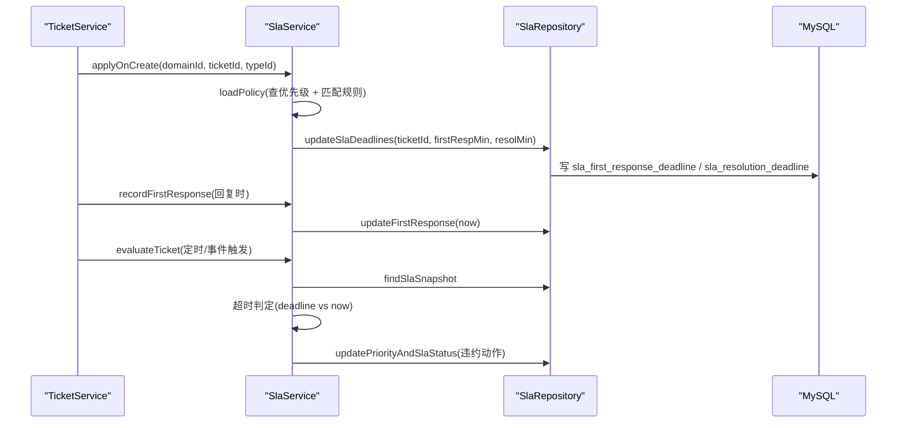
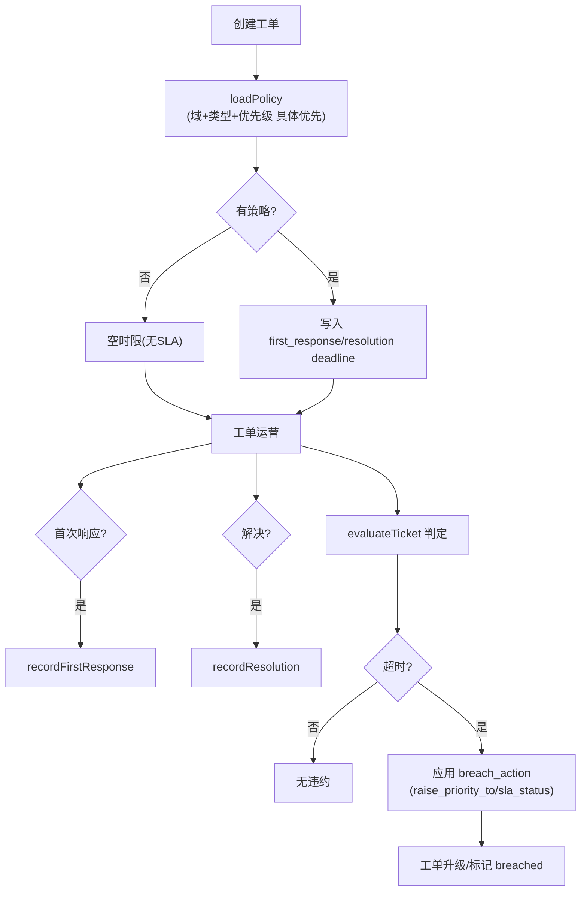
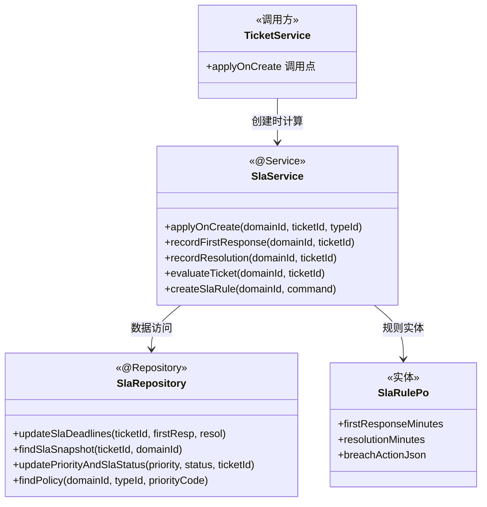

<cite>
- [UnionDesk/uniondesk-support/src/main/java/com/uniondesk/sla/core/SlaService.java](file://UnionDesk/uniondesk-support/src/main/java/com/uniondesk/sla/core/SlaService.java#L20-L67)
- [UnionDesk/uniondesk-support/src/main/java/com/uniondesk/sla/core/SlaService.java](file://UnionDesk/uniondesk-support/src/main/java/com/uniondesk/sla/core/SlaService.java#L132-L193)
- [UnionDesk/uniondesk-support/src/main/java/com/uniondesk/sla/core/SlaService.java](file://UnionDesk/uniondesk-support/src/main/java/com/uniondesk/sla/core/SlaService.java#L195-L229)
- [UnionDesk/uniondesk-support/src/main/java/com/uniondesk/sla/entity/SlaRulePo.java](file://UnionDesk/uniondesk-support/src/main/java/com/uniondesk/sla/entity/SlaRulePo.java#L5-L18)
- [UnionDesk/uniondesk-support/src/main/java/com/uniondesk/sla/entity/SlaCalendarPo.java](file://UnionDesk/uniondesk-support/src/main/java/com/uniondesk/sla/entity/SlaCalendarPo.java#L5-L12)
- [UnionDesk/uniondesk-support/src/main/java/com/uniondesk/sla/entity/SlaTicketPo.java](file://UnionDesk/uniondesk-support/src/main/java/com/uniondesk/sla/entity/SlaTicketPo.java#L5-L13)
- [UnionDesk/uniondesk-ticket/src/main/java/com/uniondesk/ticket/core/TicketService.java](file://UnionDesk/uniondesk-ticket/src/main/java/com/uniondesk/ticket/core/TicketService.java#L188-L189)
- [UnionDesk/uniondesk-ticket/src/main/resources/mapper/ticket/TicketMapper.xml](file://UnionDesk/uniondesk-ticket/src/main/resources/mapper/ticket/TicketMapper.xml#L80-L92)
</cite>

# UnionDesk SLA 服务

## 简介

本文档详解 SLA（Service Level Agreement）服务：SLA 规则（`SlaRule` 多维匹配）、工作日历（`SlaCalendar` 配置）、工单 SLA 计算（`SlaService.applyOnCreate` 写时限）、响应/解决时限记录（`recordFirstResponse`/`recordResolution`）、违约判定（`evaluateTicket` 超时检测 + 违约动作）。SLA 字段内嵌工单表，计算逻辑集中在 `SlaService`。

章节来源：
- [UnionDesk/uniondesk-support/src/main/java/com/uniondesk/sla/core/SlaService.java](file://UnionDesk/uniondesk-support/src/main/java/com/uniondesk/sla/core/SlaService.java#L20-L67)
- [UnionDesk/uniondesk-support/src/main/java/com/uniondesk/sla/entity/SlaRulePo.java](file://UnionDesk/uniondesk-support/src/main/java/com/uniondesk/sla/entity/SlaRulePo.java#L5-L18)

## 项目结构

SLA 服务组件：

```mermaid
graph TB
    S["SlaService<br/>规则CRUD+计算+违约"]
    R["SlaRulePo 规则<br/>(type+priority+calendar)"]
    C["SlaCalendarPo 工作日历"]
    T["SlaTicketPo 工单快照"]
    P["TicketSlaPolicyPo 策略"]
    TS["TicketService 调用方"]
    S --> R & C & T & P
    TS --> S : applyOnCreate/record/evaluate
    T --> TS : 内嵌工单字段
```

图表来源：
- [UnionDesk/uniondesk-support/src/main/java/com/uniondesk/sla/core/SlaService.java](file://UnionDesk/uniondesk-support/src/main/java/com/uniondesk/sla/core/SlaService.java#L22-L31)
- [UnionDesk/uniondesk-support/src/main/java/com/uniondesk/sla/entity/SlaTicketPo.java](file://UnionDesk/uniondesk-support/src/main/java/com/uniondesk/sla/entity/SlaTicketPo.java#L5-L13)

## 核心组件

**1. SlaService 规则管理**：`listSlaRules`（L43-50，分页）、`createSlaRule`（L52-66，rule 落库 + breachAction JSON 序列化）、`updateSlaRule`（L68-83）、`deleteSlaRule`（L124-130，影响行数校验）；工作日历 `listSlaCalendars`（L85-93）、`createSlaCalendar`（L95-103，config JSON）、`updateSlaCalendar`（L105-114）、`deleteSlaCalendar`（L116-122）。

**2. applyOnCreate 建单计算**：`applyOnCreate(businessDomainId, ticketId, ticketTypeId)`（L33-40）——`loadPolicy` 匹配策略（L180-193）→ `updateSlaDeadlines` 写入工单时限。

**3. 时限记录**：`recordFirstResponse`（L132-136，首次响应时间）、`recordResolution`（L138-142，解决时间）——由回复/完结流程调用。

**4. evaluateTicket 违约判定**：`evaluateTicket(businessDomainId, ticketId)`（L144-178）——读工单 SLA 快照（L146）→ 首次响应超时判定（deadline 非空 + 未响应 + 当前超时，L148-150）→ 解决超时判定（L151-153）→ 违约动作应用（`raise_priority_to` 提优先级、`sla_status` 改状态，L164-173）→ 更新工单（L175）。

**5. 实体**：`SlaRulePo`（L5-18：type/priority/calendar 匹配维度 + firstResponseMinutes/resolutionMinutes + breachActionJson）；`SlaCalendarPo`（L5-12：name + config JSON 承载工作日/节假日/时段）；`SlaTicketPo`（L5-13：工单 SLA 快照字段）；`TicketSlaPolicyPo`（策略查询结果）。

章节来源：
- [UnionDesk/uniondesk-support/src/main/java/com/uniondesk/sla/core/SlaService.java](file://UnionDesk/uniondesk-support/src/main/java/com/uniondesk/sla/core/SlaService.java#L33-L67)
- [UnionDesk/uniondesk-support/src/main/java/com/uniondesk/sla/core/SlaService.java](file://UnionDesk/uniondesk-support/src/main/java/com/uniondesk/sla/core/SlaService.java#L132-L193)
- [UnionDesk/uniondesk-support/src/main/java/com/uniondesk/sla/entity/SlaCalendarPo.java](file://UnionDesk/uniondesk-support/src/main/java/com/uniondesk/sla/entity/SlaCalendarPo.java#L5-L12)

## 架构总览

工单创建 → SLA 计算 → 超时判定的时序：



图表来源：
- [UnionDesk/uniondesk-support/src/main/java/com/uniondesk/sla/core/SlaService.java](file://UnionDesk/uniondesk-support/src/main/java/com/uniondesk/sla/core/SlaService.java#L33-L40)
- [UnionDesk/uniondesk-support/src/main/java/com/uniondesk/sla/core/SlaService.java](file://UnionDesk/uniondesk-support/src/main/java/com/uniondesk/sla/core/SlaService.java#L144-L178)

## 详细分析

**SLA 计算机制设计要点**：

1. **策略匹配「具体优先」**：`loadPolicy`（L180-193）——先查工单优先级（`findTicketPriority` L181），再按 `(business_domain_id, ticket_type_id, priority_code)` 找策略；无策略返回空时限（L186-188，工单无 SLA）；Mapper 侧 `breach_action_json` 子查询用「priority_level_id IS NOT NULL DESC, ticket_type_id IS NOT NULL DESC」具体优先排序（TicketMapper.xml L80-92）。
2. **时限写入工单行**：`updateSlaDeadlines` 直接写 `sla_first_response_deadline/sla_resolution_deadline`（内嵌字段，避免联表）；`SlaTicketPo` 即工单 SLA 快照投影（L5-13）。
3. **超时双判定**：`evaluateTicket`（L144-178）独立判定「首次响应超时」（L148-150）与「解决超时」（L151-153）——条件均为「deadline 非空 + 未完成 + now 超时」，未超时返回决策（L154-156）。
4. **违约动作可配置**：`breach_action_json` 支持 `raise_priority_to`（提升优先级）与 `sla_status`（标记 breached）（L164-173）——违约自动升级工单，`sla_status="breached"`（L159）。
5. **时间可测性**：`Clock` 注入（L24/27），测试可注入固定时钟；`recordFirstResponse/recordResolution` 用 `LocalDateTime.now(clock)`（L134/140）。
6. **工作日历配置化**：`SlaCalendarPo.config` JSON 承载工作日/节假日/工作时间段（L5-12）——时段计算逻辑按 config 解析（后续扩展），当前 MVP 以分钟数直算 + 日历兜底。
7. **事务边界**：建单计算/记录/违约判定均 `@Transactional`（L33/132/138/144），与工单主流程一致。



图表来源：
- [UnionDesk/uniondesk-support/src/main/java/com/uniondesk/sla/core/SlaService.java](file://UnionDesk/uniondesk-support/src/main/java/com/uniondesk/sla/core/SlaService.java#L33-L40)
- [UnionDesk/uniondesk-support/src/main/java/com/uniondesk/sla/core/SlaService.java](file://UnionDesk/uniondesk-support/src/main/java/com/uniondesk/sla/core/SlaService.java#L144-L178)
- [UnionDesk/uniondesk-ticket/src/main/resources/mapper/ticket/TicketMapper.xml](file://UnionDesk/uniondesk-ticket/src/main/resources/mapper/ticket/TicketMapper.xml#L80-L92)（具体优先子查询）

## 数据模型

SLA 相关实体：

```mermaid
erDiagram
    SLA_RULE ||--o{ SLA_CALENDAR : "calendar_id"
    SLA_RULE ||--o{ TICKET_TYPE : "ticket_type_id"
    SLA_RULE ||--o{ TICKET_PRIORITY_LEVEL : "priority_level_id"
    TICKET ||--o{ SLA_TICKET : "快照投影"
    SLA_RULE {
        bigint id PK
        bigint business_domain_id
        bigint ticket_type_id "可空通配"
        bigint priority_level_id "可空通配"
        bigint calendar_id
        int first_response_minutes
        int resolution_minutes
        json breach_action_json
    }
    SLA_CALENDAR {
        bigint id PK
        bigint business_domain_id
        string name
        json config "工作日/节假日/时段"
    }
    SLA_TICKET {
        string priority
        string sla_status
        datetime sla_first_response_deadline
        datetime sla_resolution_deadline
        datetime sla_first_responded_at
        datetime sla_resolved_at
    }
```



图表来源：
- [UnionDesk/uniondesk-support/src/main/java/com/uniondesk/sla/entity/SlaRulePo.java](file://UnionDesk/uniondesk-support/src/main/java/com/uniondesk/sla/entity/SlaRulePo.java#L5-L18)
- [UnionDesk/uniondesk-support/src/main/java/com/uniondesk/sla/entity/SlaCalendarPo.java](file://UnionDesk/uniondesk-support/src/main/java/com/uniondesk/sla/entity/SlaCalendarPo.java#L5-L12)
- [UnionDesk/uniondesk-support/src/main/java/com/uniondesk/sla/entity/SlaTicketPo.java](file://UnionDesk/uniondesk-support/src/main/java/com/uniondesk/sla/entity/SlaTicketPo.java#L5-L13)

## 依赖关系分析



图表来源：
- [UnionDesk/uniondesk-support/src/main/java/com/uniondesk/sla/core/SlaService.java](file://UnionDesk/uniondesk-support/src/main/java/com/uniondesk/sla/core/SlaService.java#L22-L31)
- [UnionDesk/uniondesk-support/src/main/java/com/uniondesk/sla/core/SlaService.java](file://UnionDesk/uniondesk-support/src/main/java/com/uniondesk/sla/core/SlaService.java#L180-L193)
- [UnionDesk/uniondesk-ticket/src/main/java/com/uniondesk/ticket/core/TicketService.java](file://UnionDesk/uniondesk-ticket/src/main/java/com/uniondesk/ticket/core/TicketService.java#L188-L189)

## 性能与安全考虑

- **性能**：SLA 字段内嵌工单表避免联表；策略匹配走 `idx_sla_rule_domain_type`；违约判定单行快照查询；`breach_action_json` 惰性解析。
- **安全**：规则/日历按 `business_domain_id` 隔离（CRUD 均带域校验）；JSON 解析容错（`parseMap` 异常兜底）；违约动作只升不降（`raise_priority_to` 显式配置）。
- **一致性**：建单计算与工单创建同事务；违约判定 `@Transactional` 原子更新；`Clock` 注入保证时间可测。
- **可观测**：`sla_status`（tracking/breached）随工单可见；违约决策返回 `SlaBreachDecision` 供调用方记录。

章节来源：
- [UnionDesk/uniondesk-support/src/main/java/com/uniondesk/sla/core/SlaService.java](file://UnionDesk/uniondesk-support/src/main/java/com/uniondesk/sla/core/SlaService.java#L33-L40)
- [UnionDesk/uniondesk-support/src/main/java/com/uniondesk/sla/core/SlaService.java](file://UnionDesk/uniondesk-support/src/main/java/com/uniondesk/sla/core/SlaService.java#L144-L178)

## 故障排查指南

| 现象 | 原因 | 处理建议 |
| --- | --- | --- |
| 工单无 SLA 时限 | 无匹配规则（策略查空返回空时限） | 检查 `sla_rule` 配置（type/priority 维度）；确认优先级码 |
| SLA 未自动升级 | `evaluateTicket` 未触发或 `breach_action_json` 为空 | 检查定时/事件触发点；配置 `raise_priority_to` |
| 首次响应后仍判超时 | `recordFirstResponse` 未调用或快照未更新 | 检查回复流程调用点；核对 `sla_first_responded_at` |
| 规则删除失败「not found」 | ruleId 与域不匹配（域隔离） | 核对 `business_domain_id`；确认 ID |
| 违约状态显示异常 | `sla_status` 被其他流程覆盖 | 检查状态更新顺序；确认违约动作配置 |

章节来源：
- [UnionDesk/uniondesk-support/src/main/java/com/uniondesk/sla/core/SlaService.java](file://UnionDesk/uniondesk-support/src/main/java/com/uniondesk/sla/core/SlaService.java#L144-L178)
- [UnionDesk/uniondesk-support/src/main/java/com/uniondesk/sla/core/SlaService.java](file://UnionDesk/uniondesk-support/src/main/java/com/uniondesk/sla/core/SlaService.java#L124-L130)

## 结论

SLA 服务以「**规则多维匹配、时限内嵌工单、违约动作可配置**」为核心：`SlaRule` 按域+类型+优先级（可空通配 + 具体优先）匹配策略，`applyOnCreate` 建单即写时限，`recordFirstResponse/recordResolution` 记录完成时间，`evaluateTicket` 独立判定双超时并应用 `breach_action`（提优先级/标 breached）。SLA 与工单主链路解耦（独立 Service + 内嵌字段），既保证计算集中又保持调用透明。

章节来源：
- [UnionDesk/uniondesk-support/src/main/java/com/uniondesk/sla/core/SlaService.java](file://UnionDesk/uniondesk-support/src/main/java/com/uniondesk/sla/core/SlaService.java#L33-L193)
- [UnionDesk/uniondesk-support/src/main/java/com/uniondesk/sla/entity/SlaRulePo.java](file://UnionDesk/uniondesk-support/src/main/java/com/uniondesk/sla/entity/SlaRulePo.java#L5-L18)

## 附录

SLA 验证命令：

```bash
# 1. 创建工作日历
curl -X POST http://127.0.0.1:8080/api/v1/domains/1/sla-calendars \
  -H "Authorization: Bearer <token>" -H "Content-Type: application/json" \
  -d '{"name":"标准日历","config":{"workdays":[1,2,3,4,5],"hours":["09:00-18:00"]}}'

# 2. 创建 SLA 规则（域+类型+优先级）
curl -X POST http://127.0.0.1:8080/api/v1/domains/1/sla-rules \
  -H "Authorization: Bearer <token>" -H "Content-Type: application/json" \
  -d '{"name":"高优工单","ticketTypeId":5,"priorityLevelId":1,"calendarId":1,
       "firstResponseMinutes":30,"resolutionMinutes":240,
       "breachAction":{"raise_priority_to":"urgent","sla_status":"breached"}}'

# 3. 触发违约判定（查看工单 SLA 状态）
curl -X POST http://127.0.0.1:8080/api/v1/domains/1/tickets/1001/sla/evaluate \
  -H "Authorization: Bearer <token>"
```

工单 SLA 字段查询：

```sql
SELECT ticket_no, status, priority, sla_status,
       sla_first_response_deadline, sla_first_responded_at,
       sla_resolution_deadline, sla_resolved_at
FROM ticket
WHERE id = 1001;
```

章节来源：
- [UnionDesk/uniondesk-support/src/main/java/com/uniondesk/sla/core/SlaService.java](file://UnionDesk/uniondesk-support/src/main/java/com/uniondesk/sla/core/SlaService.java#L52-L114)
- [UnionDesk/uniondesk-support/src/main/java/com/uniondesk/sla/entity/SlaTicketPo.java](file://UnionDesk/uniondesk-support/src/main/java/com/uniondesk/sla/entity/SlaTicketPo.java#L5-L13)
