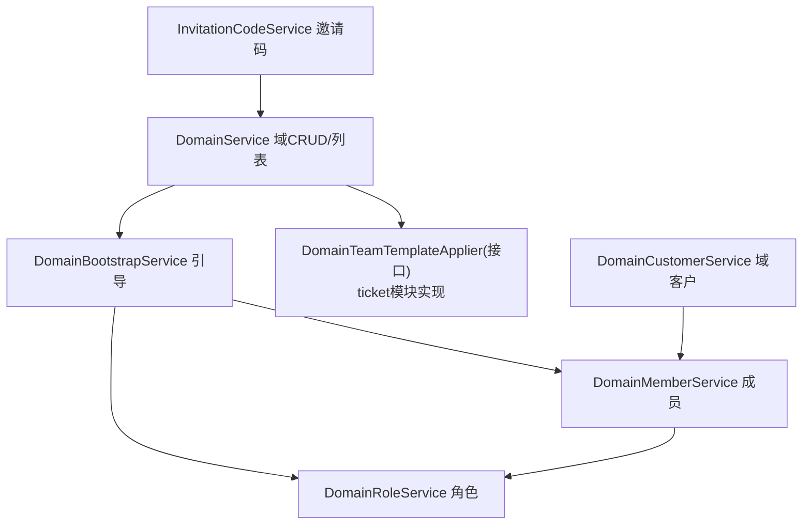
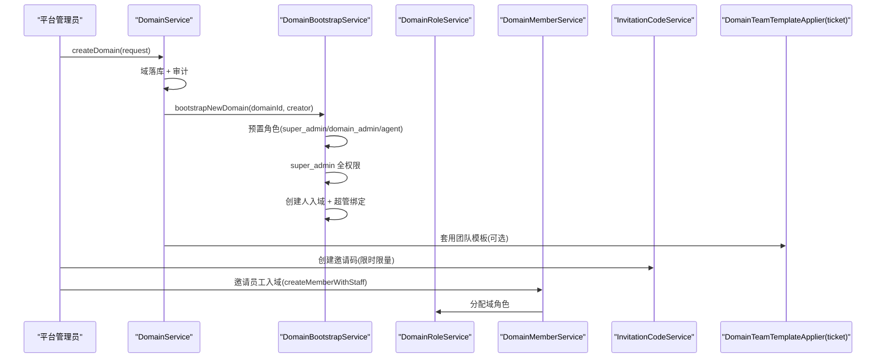
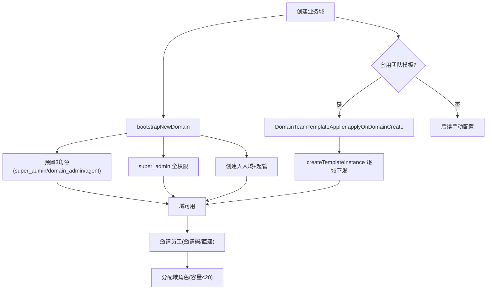
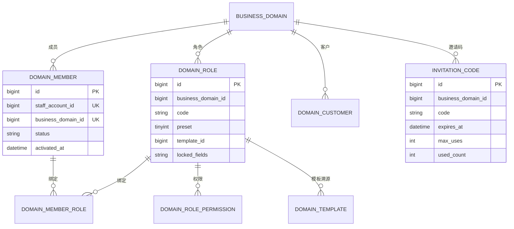
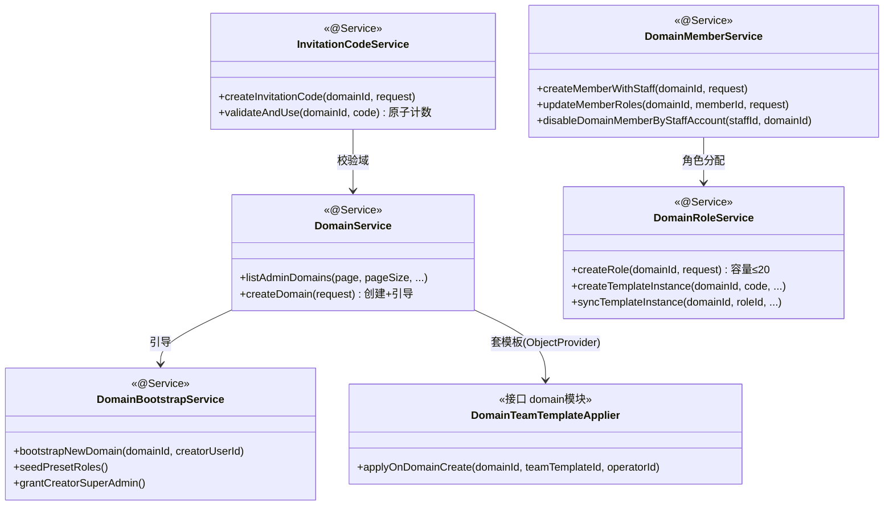

<cite>
- [UnionDesk/uniondesk-domain/src/main/java/com/uniondesk/domain/core/DomainService.java](file://UnionDesk/uniondesk-domain/src/main/java/com/uniondesk/domain/core/DomainService.java#L30-L86)
- [UnionDesk/uniondesk-domain/src/main/java/com/uniondesk/domain/core/DomainBootstrapService.java](file://UnionDesk/uniondesk-domain/src/main/java/com/uniondesk/domain/core/DomainBootstrapService.java#L8-L28)
- [UnionDesk/uniondesk-domain/src/main/java/com/uniondesk/domain/core/DomainBootstrapService.java](file://UnionDesk/uniondesk-domain/src/main/java/com/uniondesk/domain/core/DomainBootstrapService.java#L30-L78)
- [UnionDesk/uniondesk-domain/src/main/java/com/uniondesk/domain/core/DomainMemberService.java](file://UnionDesk/uniondesk-domain/src/main/java/com/uniondesk/domain/core/DomainMemberService.java#L50-L54)
- [UnionDesk/uniondesk-domain/src/main/java/com/uniondesk/domain/core/DomainMemberService.java](file://UnionDesk/uniondesk-domain/src/main/java/com/uniondesk/domain/core/DomainMemberService.java#L78-L95)
- [UnionDesk/uniondesk-domain/src/main/java/com/uniondesk/domain/core/DomainRoleService.java](file://UnionDesk/uniondesk-domain/src/main/java/com/uniondesk/domain/core/DomainRoleService.java#L23-L26)
- [UnionDesk/uniondesk-domain/src/main/java/com/uniondesk/domain/core/DomainRoleService.java](file://UnionDesk/uniondesk-domain/src/main/java/com/uniondesk/domain/core/DomainRoleService.java#L110-L166)
- [UnionDesk/uniondesk-domain/src/main/java/com/uniondesk/domain/core/InvitationCodeService.java](file://UnionDesk/uniondesk-domain/src/main/java/com/uniondesk/domain/core/InvitationCodeService.java#L16-L21)
- [UnionDesk/uniondesk-domain/src/main/java/com/uniondesk/domain/core/InvitationCodeService.java](file://UnionDesk/uniondesk-domain/src/main/java/com/uniondesk/domain/core/InvitationCodeService.java#L36-L64)
- [UnionDesk/uniondesk-domain/src/main/java/com/uniondesk/domain/core/DomainTeamTemplateApplier.java](file://UnionDesk/uniondesk-domain/src/main/java/com/uniondesk/domain/core/DomainTeamTemplateApplier.java#L3-L9)
</cite>

# UnionDesk 业务域管理

## 简介

本文档详解业务域（租户）管理功能：域创建与引导（`DomainBootstrapService` 预置角色/权限/超管）、域配置、域成员与角色分配（`DomainMemberService`/`DomainRoleService`）、域客户管理、邀请码（`InvitationCodeService`）、团队模板应用（`DomainTeamTemplateApplier` 接口 + ticket 模块实现）。业务域是数据隔离与权限作用域的基本单元。

章节来源：
- [UnionDesk/uniondesk-domain/src/main/java/com/uniondesk/domain/core/DomainService.java](file://UnionDesk/uniondesk-domain/src/main/java/com/uniondesk/domain/core/DomainService.java#L30-L86)
- [UnionDesk/uniondesk-domain/src/main/java/com/uniondesk/domain/core/DomainBootstrapService.java](file://UnionDesk/uniondesk-domain/src/main/java/com/uniondesk/domain/core/DomainBootstrapService.java#L8-L28)

## 项目结构

业务域管理组件：



图表来源：
- [UnionDesk/uniondesk-domain/src/main/java/com/uniondesk/domain/core/DomainService.java](file://UnionDesk/uniondesk-domain/src/main/java/com/uniondesk/domain/core/DomainService.java#L35-L55)
- [UnionDesk/uniondesk-domain/src/main/java/com/uniondesk/domain/core/DomainTeamTemplateApplier.java](file://UnionDesk/uniondesk-domain/src/main/java/com/uniondesk/domain/core/DomainTeamTemplateApplier.java#L3-L9)

## 核心组件

**1. DomainService**：域列表（`listAdminDomains` 分页 + `listCustomerDomains` 精简，L57-86）、域详情（`getDomain` L88-90）、创建/更新/删除（含审计 `AuditLogWriter`）。

**2. DomainBootstrapService 引导**：`bootstrapNewDomain(domainId, creatorUserId)`（L22-28）四步——`seedPresetRoles`（super_admin/domain_admin/agent 三预置角色，L11-14、L30-34）→ `seedSuperAdminAllPermissionItems`（super_admin 挂全部权限，L71-74）→ `resolveStaffAccountId`（创建人账号解析，L36-55）→ `grantCreatorSuperAdmin`（创建人入域+超管绑定，L57-69）；全程 IfNotExists 幂等。

**3. DomainMemberService 成员**：`listMembers`（L50）、`createMember`（L79）、`createMemberWithStaff`（L113，员工+成员一起建）、`updateMemberStatus`（L140，启停用）、`disableDomainMemberByStaffAccount`（L180，按员工账号停用）、`updateMemberRoles`（L204，角色分配）、`deleteMember`（L223）。

**4. DomainRoleService 角色**：`listRoles/createRole/updateRole`（L47-70）；`getRolePermissions/updateRolePermissions`（L81-91）；模板实例：`createTemplateInstance`（L118-136，域角色实例+权限包复制+容量校验 `MAX_CUSTOM_ROLES_PER_DOMAIN=20`，L26/162-166）、`syncTemplateInstance`（L142-153，模板版本同步）；`deleteRole`（L190）；`isLockedField`（L168-179）锁定字段检查（模板下发角色权限包不可改）。

**5. InvitationCodeService 邀请码**：`listInvitationCodes`（L26）、`createInvitationCode`（L37）、`deleteInvitationCode`（L55）、`validateAndUse`（L64，校验有效期/用量并计数）。

**6. DomainTeamTemplateApplier 模板接口**：接口定义在 domain 模块（L6-9），由 ticket 模块实现——「建域时可选套用团队模板」，避免 domain → ticket 循环依赖。

**7. DomainCustomerService 域客户**：客户入域管理（注册/批量/激活/禁用）。

章节来源：
- [UnionDesk/uniondesk-domain/src/main/java/com/uniondesk/domain/core/DomainBootstrapService.java](file://UnionDesk/uniondesk-domain/src/main/java/com/uniondesk/domain/core/DomainBootstrapService.java#L22-L78)
- [UnionDesk/uniondesk-domain/src/main/java/com/uniondesk/domain/core/DomainRoleService.java](file://UnionDesk/uniondesk-domain/src/main/java/com/uniondesk/domain/core/DomainRoleService.java#L118-L166)
- [UnionDesk/uniondesk-domain/src/main/java/com/uniondesk/domain/core/InvitationCodeService.java](file://UnionDesk/uniondesk-domain/src/main/java/com/uniondesk/domain/core/InvitationCodeService.java#L36-L64)

## 架构总览

创建业务域 → 引导初始化 → 邀请成员/客户 → 运营的时序：



图表来源：
- [UnionDesk/uniondesk-domain/src/main/java/com/uniondesk/domain/core/DomainBootstrapService.java](file://UnionDesk/uniondesk-domain/src/main/java/com/uniondesk/domain/core/DomainBootstrapService.java#L22-L78)
- [UnionDesk/uniondesk-domain/src/main/java/com/uniondesk/domain/core/DomainTeamTemplateApplier.java](file://UnionDesk/uniondesk-domain/src/main/java/com/uniondesk/domain/core/DomainTeamTemplateApplier.java#L3-L9)

## 详细分析

**业务域管理设计要点**：

1. **建域即引导**：`bootstrapNewDomain` 保证「域创建 → 预置角色 → 权限 → 超管」原子完成，新域开箱即用；幂等写入（IfNotExists）支持重复调用。
2. **角色容量与模板锁**：自定义角色上限 20（L26/162-166）；模板下发角色记录 `template_id/template_version/locked_fields`，`isLockedField`（L168-179）解析 JSON 锁定字段列表——锁定字段（如权限包）域端不可改（`DomainErrorCodes.ROLE_TEMPLATE_LOCKED_FIELD 40302`）。
3. **模板双向同步**：`createTemplateInstance` 下发新实例（逐域独立事务）；`syncTemplateInstance` 把模板当前版本与权限包同步到已下发实例——「模板升级 → 逐域同步」的运营模式。
4. **成员双通道**：`createMember`（已有员工入域）与 `createMemberWithStaff`（新员工+成员一体创建）；`disableDomainMemberByStaffAccount` 支持按员工账号批量停用（离职联动）。
5. **邀请码风控**：`validateAndUse` 校验 `expires_at/max_uses/used_count/status` 并原子计数（L64），防超额使用。
6. **解耦模板实现**：`DomainTeamTemplateApplier` 接口在 domain 模块定义、ticket 模块实现，`DomainService` 用 `ObjectProvider` 注入——「domain 不知道 ticket，ticket 扩展 domain」的依赖倒置。
7. **审计贯穿**：域创建/更新/角色变更均写审计（`AuditLogWriter` + `AuditActionCodes`），可追溯运营操作。



图表来源：
- [UnionDesk/uniondesk-domain/src/main/java/com/uniondesk/domain/core/DomainBootstrapService.java](file://UnionDesk/uniondesk-domain/src/main/java/com/uniondesk/domain/core/DomainBootstrapService.java#L22-L78)
- [UnionDesk/uniondesk-domain/src/main/java/com/uniondesk/domain/core/DomainRoleService.java](file://UnionDesk/uniondesk-domain/src/main/java/com/uniondesk/domain/core/DomainRoleService.java#L117-L166)

## 数据模型

业务域管理相关实体：



图表来源：
- [UnionDesk/uniondesk-domain/src/main/java/com/uniondesk/domain/core/DomainRoleService.java](file://UnionDesk/uniondesk-domain/src/main/java/com/uniondesk/domain/core/DomainRoleService.java#L118-L153)
- [UnionDesk/uniondesk-domain/src/main/java/com/uniondesk/domain/core/InvitationCodeService.java](file://UnionDesk/uniondesk-domain/src/main/java/com/uniondesk/domain/core/InvitationCodeService.java#L37-L64)

## 依赖关系分析



图表来源：
- [UnionDesk/uniondesk-domain/src/main/java/com/uniondesk/domain/core/DomainService.java](file://UnionDesk/uniondesk-domain/src/main/java/com/uniondesk/domain/core/DomainService.java#L42-L55)
- [UnionDesk/uniondesk-domain/src/main/java/com/uniondesk/domain/core/DomainTeamTemplateApplier.java](file://UnionDesk/uniondesk-domain/src/main/java/com/uniondesk/domain/core/DomainTeamTemplateApplier.java#L3-L9)
- [UnionDesk/uniondesk-domain/src/main/java/com/uniondesk/domain/core/InvitationCodeService.java](file://UnionDesk/uniondesk-domain/src/main/java/com/uniondesk/domain/core/InvitationCodeService.java#L21-L21)

## 性能与安全考虑

- **性能**：`listAdminDomains` 分页双查 + LEFT JOIN 用户名投影（见查询模式）；模板逐域下发独立事务避免大事务。
- **安全**：域即隔离边界（所有查询强制 `business_domain_id`）；邀请码限时限量防滥用；模板锁定字段防域端越权修改（40302）；角色容量上限防资源滥用。
- **一致性**：引导幂等（IfNotExists）；`validateAndUse` 原子计数防并发超用；模板同步版本化可追溯。
- **审计**：域/角色变更写审计（操作者/动作/目标），支持运营追溯。

章节来源：
- [UnionDesk/uniondesk-domain/src/main/java/com/uniondesk/domain/core/DomainRoleService.java](file://UnionDesk/uniondesk-domain/src/main/java/com/uniondesk/domain/core/DomainRoleService.java#L162-L166)
- [UnionDesk/uniondesk-domain/src/main/java/com/uniondesk/domain/core/InvitationCodeService.java](file://UnionDesk/uniondesk-domain/src/main/java/com/uniondesk/domain/core/InvitationCodeService.java#L63-L64)

## 故障排查指南

| 现象 | 原因 | 处理建议 |
| --- | --- | --- |
| 新域无预置角色 | `bootstrapNewDomain` 未调用或幂等条件异常 | 检查建域调用链；核对 `insertRoleIfNotExists` |
| 创建自定义角色失败 | 已达 20 个自定义角色上限 | 清理未用角色或提高 `MAX_CUSTOM_ROLES_PER_DOMAIN` |
| 模板角色权限被改 | `locked_fields` 包含权限包字段但被绕过 | 检查 `isLockedField` 校验；确认前端隐藏编辑入口 |
| 邀请码失效 | `expires_at` 过期或 `used_count>=max_uses` | 核对邀请码状态；重新生成 |
| 员工无法登录域 | `domain_member` 状态非 active 或角色绑定缺失 | 检查成员状态与 `domain_member_role` |

章节来源：
- [UnionDesk/uniondesk-domain/src/main/java/com/uniondesk/domain/core/DomainBootstrapService.java](file://UnionDesk/uniondesk-domain/src/main/java/com/uniondesk/domain/core/DomainBootstrapService.java#L30-L34)
- [UnionDesk/uniondesk-domain/src/main/java/com/uniondesk/domain/core/DomainRoleService.java](file://UnionDesk/uniondesk-domain/src/main/java/com/uniondesk/domain/core/DomainRoleService.java#L162-L166)

## 结论

业务域管理以「**建域即引导、角色模板化、成员双通道、邀请码风控**」为核心：`DomainBootstrapService` 保证新域开箱即用（预置角色+超管），`DomainRoleService` 以容量上限与模板锁定字段治理角色，`DomainMemberService` 支持员工/客户双通道入域，`InvitationCodeService` 限时限量防滥用，`DomainTeamTemplateApplier` 接口倒置实现模板能力扩展。业务域是 UnionDesk 多租户运营的基座。

章节来源：
- [UnionDesk/uniondesk-domain/src/main/java/com/uniondesk/domain/core/DomainBootstrapService.java](file://UnionDesk/uniondesk-domain/src/main/java/com/uniondesk/domain/core/DomainBootstrapService.java#L22-L78)
- [UnionDesk/uniondesk-domain/src/main/java/com/uniondesk/domain/core/DomainRoleService.java](file://UnionDesk/uniondesk-domain/src/main/java/com/uniondesk/domain/core/DomainRoleService.java#L117-L166)

## 附录

业务域管理命令：

```bash
# 1. 创建业务域（触发引导）
curl -X POST http://127.0.0.1:8080/api/v1/domains \
  -H "Authorization: Bearer <token>" -H "Content-Type: application/json" \
  -d '{"code":"demo2","name":"演示域2","visibility_policy_codes":["public"],"registration_enabled":"true","invitation_enabled":"true"}'

# 2. 创建邀请码
curl -X POST http://127.0.0.1:8080/api/v1/domains/2/invitation-codes \
  -H "Authorization: Bearer <token>" -H "Content-Type: application/json" \
  -d '{"channel":"wechat","expiresAt":"2026-09-01T00:00:00","maxUses":50}'

# 3. 员工入域
curl -X POST http://127.0.0.1:8080/api/v1/domains/2/members \
  -H "Authorization: Bearer <token>" -H "Content-Type: application/json" \
  -d '{"staffAccountId":1002,"roles":[{"roleId":5}]}'

# 4. 域角色列表
curl http://127.0.0.1:8080/api/v1/domains/2/roles -H "Authorization: Bearer <token>"
```

章节来源：
- [UnionDesk/uniondesk-domain/src/main/java/com/uniondesk/domain/core/DomainService.java](file://UnionDesk/uniondesk-domain/src/main/java/com/uniondesk/domain/core/DomainService.java#L57-L86)
- [UnionDesk/uniondesk-domain/src/main/java/com/uniondesk/domain/core/DomainMemberService.java](file://UnionDesk/uniondesk-domain/src/main/java/com/uniondesk/domain/core/DomainMemberService.java#L78-L95)
- [UnionDesk/uniondesk-domain/src/main/java/com/uniondesk/domain/core/InvitationCodeService.java](file://UnionDesk/uniondesk-domain/src/main/java/com/uniondesk/domain/core/InvitationCodeService.java#L36-L64)
