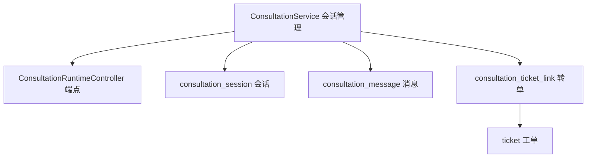
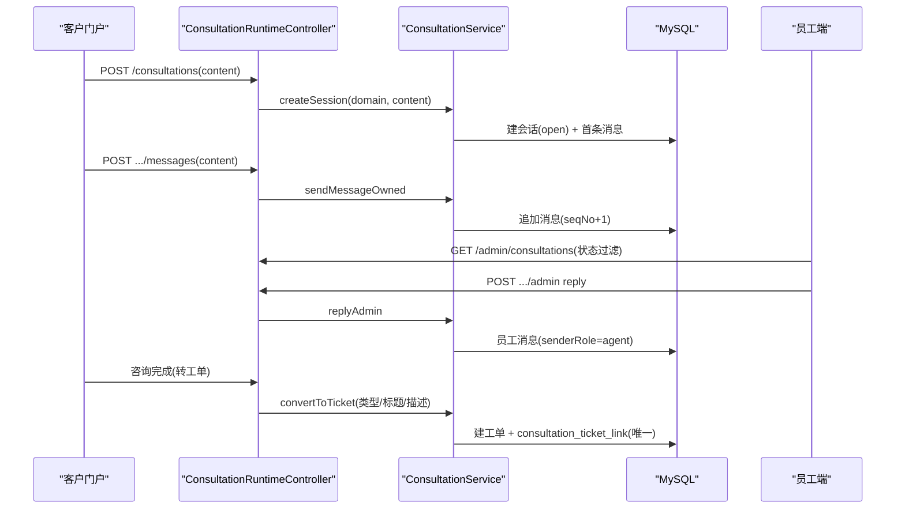
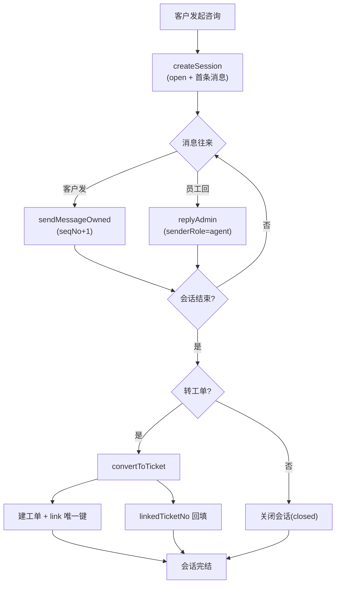
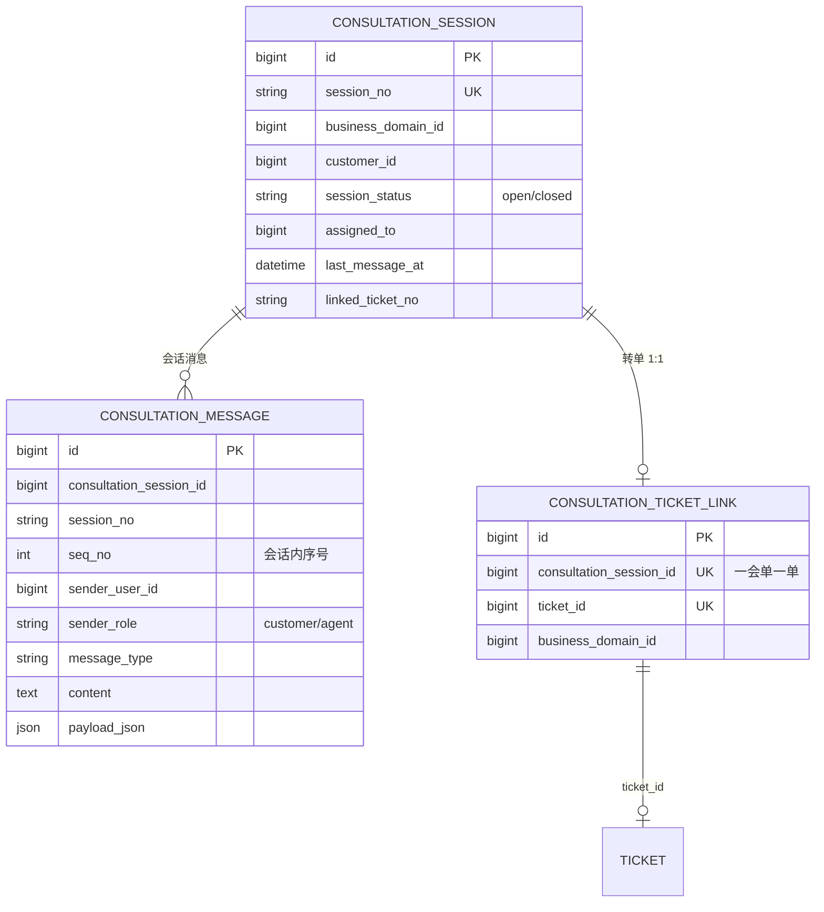
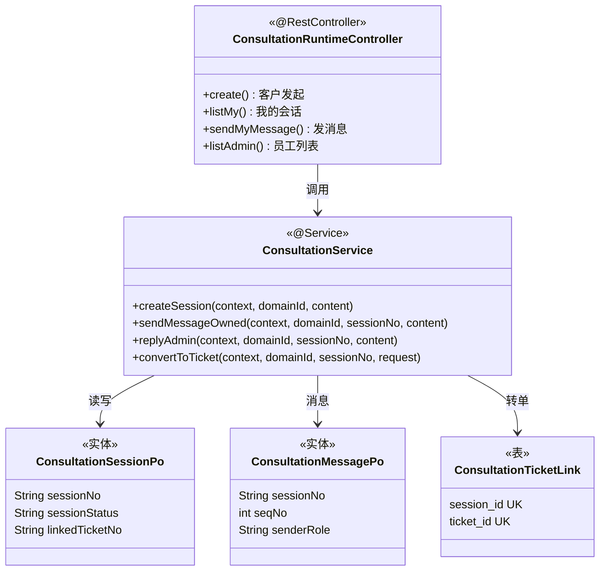

<cite>
- [UnionDesk/uniondesk-ticket/src/main/java/com/uniondesk/consultation/core/ConsultationService.java](file://UnionDesk/uniondesk-ticket/src/main/java/com/uniondesk/consultation/core/ConsultationService.java#L26-L33)
- [UnionDesk/uniondesk-ticket/src/main/java/com/uniondesk/consultation/core/ConsultationService.java](file://UnionDesk/uniondesk-ticket/src/main/java/com/uniondesk/consultation/core/ConsultationService.java#L90-L91)
- [UnionDesk/uniondesk-ticket/src/main/java/com/uniondesk/consultation/core/ConsultationService.java](file://UnionDesk/uniondesk-ticket/src/main/java/com/uniondesk/consultation/core/ConsultationService.java#L118-L166)
- [UnionDesk/uniondesk-ticket/src/main/java/com/uniondesk/consultation/core/ConsultationService.java](file://UnionDesk/uniondesk-ticket/src/main/java/com/uniondesk/consultation/core/ConsultationService.java#L208-L208)
- [UnionDesk/uniondesk-ticket/src/main/java/com/uniondesk/consultation/entity/ConsultationSessionPo.java](file://UnionDesk/uniondesk-ticket/src/main/java/com/uniondesk/consultation/entity/ConsultationSessionPo.java#L5-L19)
- [UnionDesk/uniondesk-ticket/src/main/java/com/uniondesk/consultation/entity/ConsultationMessagePo.java](file://UnionDesk/uniondesk-ticket/src/main/java/com/uniondesk/consultation/entity/ConsultationMessagePo.java#L5-L18)
- [UnionDesk/uniondesk-ticket/src/main/java/com/uniondesk/consultation/web/ConsultationRuntimeController.java](file://UnionDesk/uniondesk-ticket/src/main/java/com/uniondesk/consultation/web/ConsultationRuntimeController.java#L27-L87)
- [UnionDesk/uniondesk-app/src/main/resources/db/migration/current/V202605200002__rebaseline_current_schema.sql](file://UnionDesk/uniondesk-app/src/main/resources/db/migration/current/V202605200002__rebaseline_current_schema.sql#L1005-L1021)
</cite>

# UnionDesk 在线咨询会话

## 简介

本文档详解在线咨询会话：咨询会话（`ConsultationSessionPo` 会话实体 + 状态机）、消息（`ConsultationMessagePo` 序号化消息）、会话管理（`ConsultationService` 创建/列表/消息/回复/转工单）、运行接口（`ConsultationRuntimeController` 客户与员工双端点）。在线咨询是客户在提单前的轻量触达通道，可平滑转化为工单。

章节来源：
- [UnionDesk/uniondesk-ticket/src/main/java/com/uniondesk/consultation/core/ConsultationService.java](file://UnionDesk/uniondesk-ticket/src/main/java/com/uniondesk/consultation/core/ConsultationService.java#L26-L33)
- [UnionDesk/uniondesk-ticket/src/main/java/com/uniondesk/consultation/entity/ConsultationSessionPo.java](file://UnionDesk/uniondesk-ticket/src/main/java/com/uniondesk/consultation/entity/ConsultationSessionPo.java#L5-L19)

## 项目结构

在线咨询组件：



图表来源：
- [UnionDesk/uniondesk-ticket/src/main/java/com/uniondesk/consultation/core/ConsultationService.java](file://UnionDesk/uniondesk-ticket/src/main/java/com/uniondesk/consultation/core/ConsultationService.java#L26-L91)
- [UnionDesk/uniondesk-app/src/main/resources/db/migration/current/V202605200002__rebaseline_current_schema.sql](file://UnionDesk/uniondesk-app/src/main/resources/db/migration/current/V202605200002__rebaseline_current_schema.sql#L1005-L1021)

## 核心组件

**1. ConsultationService 会话管理**：
- 常量：`SESSION_STATUS_OPEN/CLOSED`（L28-29）、`SENDER_ROLE_CUSTOMER/AGENT`（L30-31）、单号日期格式（L33）。
- `createSession(context, domainId, content)`（L90-91）：客户发起会话（首条消息）。
- 列表：`listMySessions`（L118，客户自己的会话）、`listAdminSessions`（L126，员工分页 + 状态过滤）。
- 消息：`listMessagesOwned`（L136，客户查看自己的消息）、`listAdminMessages`（L143，员工查看）。
- 发送：`sendMessageOwned`（L148-149，客户发消息）、`replyAdmin`（L156-157，员工回复）。
- 转工单：`convertToTicket(context, domainId, sessionNo, request)`（L165-166）+ `ConvertTicketRequest(ticketTypeId/title/description/priority)`（L208）。

**2. ConsultationSessionPo 会话实体**：`sessionNo`（业务单号）/`businessDomainId`/`customerId`/`sessionStatus`/`assignedTo`/`lastMessageAt`/`closedAt`/`messageCount`/`linkedTicketNo`（L5-19）——会话聚合状态与统计。

**3. ConsultationMessagePo 消息实体**：`sessionNo` + `seqNo`（会话内序号）/`senderUserId`/`senderRole`（customer/agent）/`messageType`/`content`/`payloadJson`（L5-18）——消息有序可追溯。

**4. ConsultationRuntimeController 端点**：客户端点 `POST /domains/{domain_id}/consultations`（L45-48）、`GET .../consultations/my`（L55-57）、`GET .../my/{session_no}/messages`（L63-65）、`POST .../my/{session_no}/messages`（L72-75）；员工端点 `GET /admin/domains/{domain_id}/consultations`（L85-87）——`@NotBlank` 校验内容（L30-33）。

**5. consultation_ticket_link 转单关联**：唯一键约束「一会单一单」（DDL L1013-1014）——会话转工单后不可重复转。

章节来源：
- [UnionDesk/uniondesk-ticket/src/main/java/com/uniondesk/consultation/core/ConsultationService.java](file://UnionDesk/uniondesk-ticket/src/main/java/com/uniondesk/consultation/core/ConsultationService.java#L90-L166)
- [UnionDesk/uniondesk-ticket/src/main/java/com/uniondesk/consultation/entity/ConsultationSessionPo.java](file://UnionDesk/uniondesk-ticket/src/main/java/com/uniondesk/consultation/entity/ConsultationSessionPo.java#L5-L19)
- [UnionDesk/uniondesk-ticket/src/main/java/com/uniondesk/consultation/web/ConsultationRuntimeController.java](file://UnionDesk/uniondesk-ticket/src/main/java/com/uniondesk/consultation/web/ConsultationRuntimeController.java#L45-L87)

## 架构总览

客户咨询 → 员工回复 → 转工单的时序：



图表来源：
- [UnionDesk/uniondesk-ticket/src/main/java/com/uniondesk/consultation/core/ConsultationService.java](file://UnionDesk/uniondesk-ticket/src/main/java/com/uniondesk/consultation/core/ConsultationService.java#L90-L166)
- [UnionDesk/uniondesk-ticket/src/main/java/com/uniondesk/consultation/web/ConsultationRuntimeController.java](file://UnionDesk/uniondesk-ticket/src/main/java/com/uniondesk/consultation/web/ConsultationRuntimeController.java#L45-L87)

## 详细分析

**会话机制设计要点**：

1. **会话状态机**：`SESSION_STATUS_OPEN/CLOSED`（L28-29）——创建即 open；关闭（closedAt）后只读；`assignedTo` 记录接待员工。
2. **消息序号化**：`ConsultationMessagePo.seqNo` 会话内递增序号（L11）——消息顺序不依赖时间戳，保证时序一致；`senderRole` 区分 customer/agent 发言方向（L30-31）。
3. **双视角查询**：客户 `listMessagesOwned`（L136）只能看自己的会话消息（归属校验）；员工 `listAdminMessages/listAdminSessions`（L126/143）按域管理——权限隔离清晰。
4. **转工单能力**：`convertToTicket`（L165-166）携带工单要素（类型/标题/描述/优先级，L208）创建工单并写 `consultation_ticket_link`——「一会单一单」唯一键（DDL L1013-1014）防重复转单；`linkedTicketNo` 回填会话（L19）。
5. **消息内容校验**：`@NotBlank`（L30-33）前置拦截空消息；`payloadJson` 承载扩展载荷（如附件/卡片）。
6. **单号生成**：`SESSION_NO_DATE_FORMAT("yyyyMMdd")`（L33）日期前缀单号，按日可读可溯。



图表来源：
- [UnionDesk/uniondesk-ticket/src/main/java/com/uniondesk/consultation/core/ConsultationService.java](file://UnionDesk/uniondesk-ticket/src/main/java/com/uniondesk/consultation/core/ConsultationService.java#L90-L166)
- [UnionDesk/uniondesk-app/src/main/resources/db/migration/current/V202605200002__rebaseline_current_schema.sql](file://UnionDesk/uniondesk-app/src/main/resources/db/migration/current/V202605200002__rebaseline_current_schema.sql#L1005-L1021)

## 数据模型

咨询会话实体：



图表来源：
- [UnionDesk/uniondesk-ticket/src/main/java/com/uniondesk/consultation/entity/ConsultationSessionPo.java](file://UnionDesk/uniondesk-ticket/src/main/java/com/uniondesk/consultation/entity/ConsultationSessionPo.java#L5-L19)
- [UnionDesk/uniondesk-ticket/src/main/java/com/uniondesk/consultation/entity/ConsultationMessagePo.java](file://UnionDesk/uniondesk-ticket/src/main/java/com/uniondesk/consultation/entity/ConsultationMessagePo.java#L5-L18)
- [UnionDesk/uniondesk-app/src/main/resources/db/migration/current/V202605200002__rebaseline_current_schema.sql](file://UnionDesk/uniondesk-app/src/main/resources/db/migration/current/V202605200002__rebaseline_current_schema.sql#L1005-L1021)

## 依赖关系分析



图表来源：
- [UnionDesk/uniondesk-ticket/src/main/java/com/uniondesk/consultation/core/ConsultationService.java](file://UnionDesk/uniondesk-ticket/src/main/java/com/uniondesk/consultation/core/ConsultationService.java#L26-L91)
- [UnionDesk/uniondesk-ticket/src/main/java/com/uniondesk/consultation/web/ConsultationRuntimeController.java](file://UnionDesk/uniondesk-ticket/src/main/java/com/uniondesk/consultation/web/ConsultationRuntimeController.java#L27-L38)

## 性能与安全考虑

- **性能**：消息按 `(session_no, seq_no)` 有序读取；会话列表按客户/域索引；`messageCount` 冗余避免 COUNT 查询。
- **安全**：客户视角归属校验（`listMessagesOwned/sendMessageOwned` 只允许本人会话）；员工端点按域隔离 + 权限码；`@NotBlank` 防空消息注入。
- **一致性**：转单「一会单一单」唯一键防重复；消息 `seqNo` 序号化保时序；转单与工单创建同事务。
- **可追溯**：`sessionNo` 业务单号 + `linkedTicketNo` 双向关联——咨询 → 工单全链路可追溯。

章节来源：
- [UnionDesk/uniondesk-ticket/src/main/java/com/uniondesk/consultation/core/ConsultationService.java](file://UnionDesk/uniondesk-ticket/src/main/java/com/uniondesk/consultation/core/ConsultationService.java#L118-L166)
- [UnionDesk/uniondesk-app/src/main/resources/db/migration/current/V202605200002__rebaseline_current_schema.sql](file://UnionDesk/uniondesk-app/src/main/resources/db/migration/current/V202605200002__rebaseline_current_schema.sql#L1013-L1014)

## 故障排查指南

| 现象 | 原因 | 处理建议 |
| --- | --- | --- |
| 客户看不到会话消息 | 会话归属与客户不匹配（越权拦截） | 检查 `customerId` 归属；确认会话未关闭 |
| 消息顺序错乱 | seqNo 未递增或并发写入 | 检查序号生成逻辑；确认同事务追加 |
| 转单失败「已转单」 | `consultation_ticket_link` 唯一键冲突 | 查询 link 记录；确认会话未重复转 |
| 员工看不到会话 | 域不匹配或状态过滤错误 | 检查 `business_domain_id` 与 status 参数 |
| 空消息被拒 | `@NotBlank` 校验生效 | 前端防空提交；检查 content 传参 |

章节来源：
- [UnionDesk/uniondesk-ticket/src/main/java/com/uniondesk/consultation/core/ConsultationService.java](file://UnionDesk/uniondesk-ticket/src/main/java/com/uniondesk/consultation/core/ConsultationService.java#L136-L166)
- [UnionDesk/uniondesk-ticket/src/main/java/com/uniondesk/consultation/web/ConsultationRuntimeController.java](file://UnionDesk/uniondesk-ticket/src/main/java/com/uniondesk/consultation/web/ConsultationRuntimeController.java#L30-L33)

## 结论

在线咨询会话以「**会话状态机、消息序号化、双视角隔离、转单唯一化**」为核心：会话 open/closed 状态机 + 接待员工指派，消息 `seqNo` 序号保时序，客户/员工双视角权限隔离，`consultation_ticket_link` 唯一键保证「一会单一单」。在线咨询是客户触达的轻量入口，与工单体系平滑衔接、全程可追溯。

章节来源：
- [UnionDesk/uniondesk-ticket/src/main/java/com/uniondesk/consultation/core/ConsultationService.java](file://UnionDesk/uniondesk-ticket/src/main/java/com/uniondesk/consultation/core/ConsultationService.java#L26-L166)
- [UnionDesk/uniondesk-ticket/src/main/java/com/uniondesk/consultation/entity/ConsultationSessionPo.java](file://UnionDesk/uniondesk-ticket/src/main/java/com/uniondesk/consultation/entity/ConsultationSessionPo.java#L5-L19)

## 附录

咨询验证命令：

```bash
# 1. 客户发起咨询（创建会话 + 首条消息）
curl -X POST http://127.0.0.1:8080/api/v1/domains/1/consultations \
  -H "Authorization: Bearer <customer-token>" -H "Content-Type: application/json" \
  -d '{"content":"我想咨询退款流程"}'

# 2. 客户发消息
curl -X POST http://127.0.0.1:8080/api/v1/domains/1/consultations/my/CS202608130001/messages \
  -H "Authorization: Bearer <customer-token>" -H "Content-Type: application/json" \
  -d '{"content":"补充：订单号 12345"}'

# 3. 员工查看会话列表
curl "http://127.0.0.1:8080/api/v1/admin/domains/1/consultations?page=1&page_size=20&status=open" \
  -H "Authorization: Bearer <token>"

# 4. 转工单
curl -X POST http://127.0.0.1:8080/api/v1/admin/domains/1/consultations/CS202608130001/convert \
  -H "Authorization: Bearer <token>" -H "Content-Type: application/json" \
  -d '{"ticketTypeId":5,"title":"退款咨询","description":"客户咨询退款流程","priority":"normal"}'
```

章节来源：
- [UnionDesk/uniondesk-ticket/src/main/java/com/uniondesk/consultation/web/ConsultationRuntimeController.java](file://UnionDesk/uniondesk-ticket/src/main/java/com/uniondesk/consultation/web/ConsultationRuntimeController.java#L45-L87)
- [UnionDesk/uniondesk-ticket/src/main/java/com/uniondesk/consultation/core/ConsultationService.java](file://UnionDesk/uniondesk-ticket/src/main/java/com/uniondesk/consultation/core/ConsultationService.java#L165-L208)
