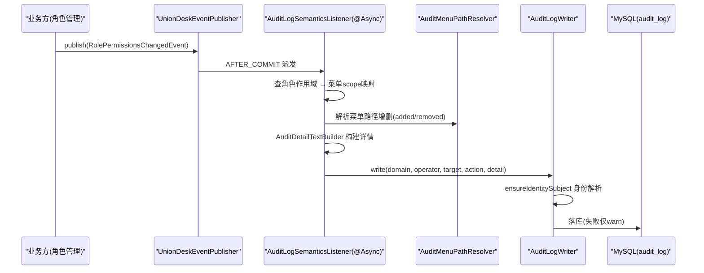
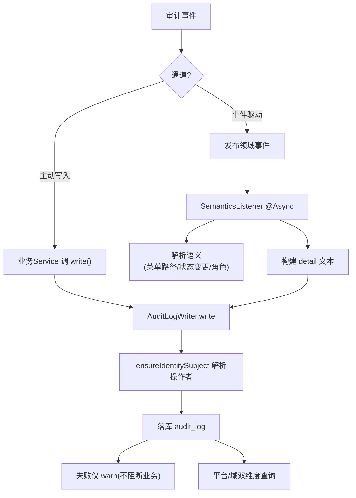
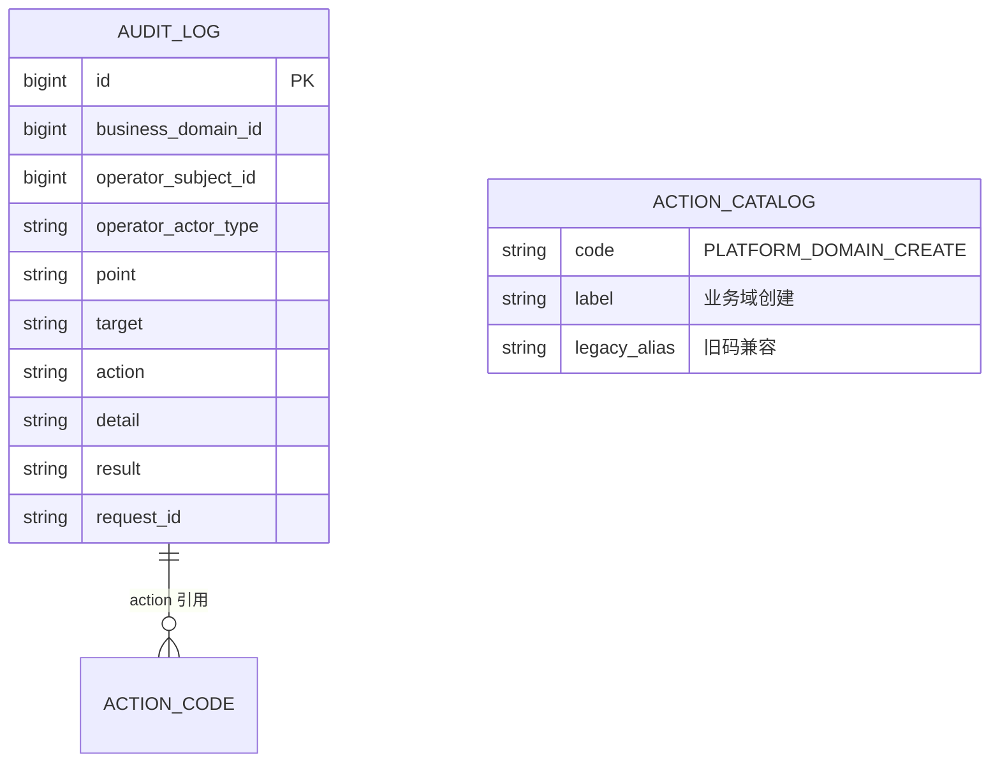
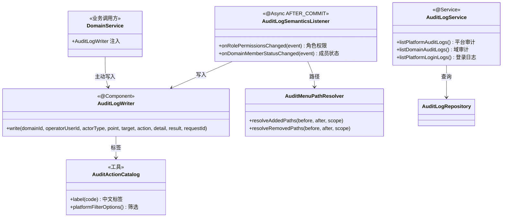

<cite>
- [UnionDesk/uniondesk-support/src/main/java/com/uniondesk/audit/semantics/AuditLogWriter.java](file://UnionDesk/uniondesk-support/src/main/java/com/uniondesk/audit/semantics/AuditLogWriter.java#L10-L51)
- [UnionDesk/uniondesk-support/src/main/java/com/uniondesk/audit/semantics/AuditLogSemanticsListener.java](file://UnionDesk/uniondesk-support/src/main/java/com/uniondesk/audit/semantics/AuditLogSemanticsListener.java#L20-L64)
- [UnionDesk/uniondesk-common/src/main/java/com/uniondesk/common/audit/AuditActionCatalog.java](file://UnionDesk/uniondesk-common/src/main/java/com/uniondesk/common/audit/AuditActionCatalog.java#L8-L58)
- [UnionDesk/uniondesk-support/src/main/java/com/uniondesk/audit/core/AuditLogService.java](file://UnionDesk/uniondesk-support/src/main/java/com/uniondesk/audit/core/AuditLogService.java#L16-L25)
- [UnionDesk/uniondesk-support/src/main/java/com/uniondesk/audit/web/AuditLogController.java](file://UnionDesk/uniondesk-support/src/main/java/com/uniondesk/audit/web/AuditLogController.java#L16-L27)
- [UnionDesk/uniondesk-support/src/main/java/com/uniondesk/audit/entity/AuditLogWritePo.java](file://UnionDesk/uniondesk-support/src/main/java/com/uniondesk/audit/entity/AuditLogWritePo.java#L3-L14)
- [UnionDesk/uniondesk-domain/src/main/java/com/uniondesk/domain/core/DomainService.java](file://UnionDesk/uniondesk-domain/src/main/java/com/uniondesk/domain/core/DomainService.java#L8-L12)
</cite>

# UnionDesk 审计日志

## 简介

本文档详解审计日志机制：审计动作目录（`AuditActionCatalog` 动作码→中文标签 + 别名兼容）、审计写入（`AuditLogWriter` 统一写入管道 + 身份解析）、语义监听（`AuditLogSemanticsListener` 事件驱动审计 + 菜单路径解析）、查询服务（`AuditLogService` 平台/域双维度 + 登录日志）。审计是安全合规与运营追溯的基石。

章节来源：
- [UnionDesk/uniondesk-support/src/main/java/com/uniondesk/audit/semantics/AuditLogWriter.java](file://UnionDesk/uniondesk-support/src/main/java/com/uniondesk/audit/semantics/AuditLogWriter.java#L10-L51)
- [UnionDesk/uniondesk-common/src/main/java/com/uniondesk/common/audit/AuditActionCatalog.java](file://UnionDesk/uniondesk-common/src/main/java/com/uniondesk/common/audit/AuditActionCatalog.java#L8-L58)

## 项目结构

审计组件：

```mermaid
graph TB
    W["AuditLogWriter 写入管道"]
    CAT["AuditActionCatalog 动作目录"]
    CODES["AuditActionCodes 动作码"]
    LIS["AuditLogSemanticsListener 语义监听"]
    MPR["AuditMenuPathResolver 菜单路径"]
    SVC["AuditLogService 查询"]
    CT["AuditLogController 端点"]
    W --> CAT : 标签
    LIS --> W : 事件驱动写入
    LIS --> MPR
    SVC --> CT
    DOM["DomainService 等业务方"] --> W : 主动写入
```

图表来源：
- [UnionDesk/uniondesk-support/src/main/java/com/uniondesk/audit/semantics/AuditLogWriter.java](file://UnionDesk/uniondesk-support/src/main/java/com/uniondesk/audit/semantics/AuditLogWriter.java#L10-L23)
- [UnionDesk/uniondesk-support/src/main/java/com/uniondesk/audit/semantics/AuditLogSemanticsListener.java](file://UnionDesk/uniondesk-support/src/main/java/com/uniondesk/audit/semantics/AuditLogSemanticsListener.java#L20-L34)

## 核心组件

**1. AuditLogWriter 写入管道**：`write(businessDomainId, operatorUserId, operatorActorType, point, target, action, detail, result, requestId)`（L25-50）——身份解析（`identityResolutionRepository.ensureIdentitySubject` L38）→ 组装 `AuditLogWritePo` → 落库；写入失败仅 warn 不抛（L47-49，审计不阻断业务）。

**2. AuditActionCatalog 动作目录**：动作码→中文标签映射（L16-28：业务域创建/更新/状态变更/删除、角色权限更新、域成员新增/角色变更/移除、域角色增改删等）；`alias` 兼容旧动作码（L30-33，LEGACY_DOMAIN_CREATE → PLATFORM_DOMAIN_CREATE）；`label()` 兜底（L39-44）；`platformFilterOptions()` 平台筛选选项（L50-58）。

**3. AuditLogSemanticsListener 语义监听**：`@Async @TransactionalEventListener(AFTER_COMMIT)` 消费领域事件——`RolePermissionsChangedEvent`（L38-64：角色作用域 → 菜单 scope 映射 → 菜单路径增删解析（`resolveAddedPaths/RemovedPaths`）→ `AuditDetailTextBuilder` 构建详情 → 写入）；`DomainMemberStatusChangedEvent`（L66-80，成员状态变更详情）。

**4. AuditLogService 查询**：`@Transactional(readOnly=true)`（L16-17）——`listPlatformAuditLogs`（L25/37，平台维度）、`listDomainAuditLogs`（L77，域维度）、`listDomainLoginLogs`（L90）、`listPlatformLoginLogs`（L108/121/138）——审计日志与登录日志双查询。

**5. AuditLogController 端点**：`/api/v1/admin/audit-logs`（L25-27 平台审计）、`/api/v1/admin/domains/{domainId}/audit-logs`（L45-50 域审计）——分页返回 `PageResult<AuditLogView>`。

**6. AuditLogWritePo 审计实体**：`businessDomainId/operatorSubjectId/operatorActorType/point/target/action/detail/result/requestId`（L3-14）——语义化字段支撑多维检索。

章节来源：
- [UnionDesk/uniondesk-support/src/main/java/com/uniondesk/audit/semantics/AuditLogWriter.java](file://UnionDesk/uniondesk-support/src/main/java/com/uniondesk/audit/semantics/AuditLogWriter.java#L25-L51)
- [UnionDesk/uniondesk-common/src/main/java/com/uniondesk/common/audit/AuditActionCatalog.java](file://UnionDesk/uniondesk-common/src/main/java/com/uniondesk/common/audit/AuditActionCatalog.java#L16-L58)
- [UnionDesk/uniondesk-support/src/main/java/com/uniondesk/audit/core/AuditLogService.java](file://UnionDesk/uniondesk-support/src/main/java/com/uniondesk/audit/core/AuditLogService.java#L16-L25)

## 架构总览

一次角色权限变更的审计链路：



图表来源：
- [UnionDesk/uniondesk-support/src/main/java/com/uniondesk/audit/semantics/AuditLogSemanticsListener.java](file://UnionDesk/uniondesk-support/src/main/java/com/uniondesk/audit/semantics/AuditLogSemanticsListener.java#L36-L64)
- [UnionDesk/uniondesk-support/src/main/java/com/uniondesk/audit/semantics/AuditLogWriter.java](file://UnionDesk/uniondesk-support/src/main/java/com/uniondesk/audit/semantics/AuditLogWriter.java#L25-L50)

## 详细分析

**审计机制设计要点**：

1. **双写入通道**：①业务方主动写入（`DomainService` 等注入 `AuditLogWriter`，见 L8-12 依赖）②事件驱动写入（`AuditLogSemanticsListener` 消费领域事件）——主动场景写「操作本身」，事件场景写「变更语义」。
2. **语义化字段**：`AuditLogWritePo` 的 `point`（发生点）/`target`（目标对象，经 `AuditTargetFormatter` 格式化）/`action`（动作码）/`detail`（详情文本，经 `AuditDetailTextBuilder` 构建）/`result`/`requestId`——按「谁在哪个域对什么做了什么」检索。
3. **动作目录集中**：`AuditActionCodes` 定义动作码常量，`AuditActionCatalog` 映射中文标签（L16-28）+ 旧码别名（L30-33）——历史数据兼容展示，前端筛选选项统一（L50-58）。
4. **菜单路径级审计**：角色权限变更时 `AuditMenuPathResolver` 解析增删的菜单路径（L43-44），详情含具体路径——「改了什么」精确到菜单项。
5. **异步 + 事务提交后**：监听器 `@Async AFTER_COMMIT`（L36-37）——主事务成功才审计、不阻塞主链路；写入失败仅 warn（L47-49）——审计不阻断业务。
6. **登录日志统一**：`listDomainLoginLogs/listPlatformLoginLogs`（L90/108）与审计日志同服务查询，登录审计见认证文档。



图表来源：
- [UnionDesk/uniondesk-support/src/main/java/com/uniondesk/audit/semantics/AuditLogWriter.java](file://UnionDesk/uniondesk-support/src/main/java/com/uniondesk/audit/semantics/AuditLogWriter.java#L25-L50)
- [UnionDesk/uniondesk-support/src/main/java/com/uniondesk/audit/semantics/AuditLogSemanticsListener.java](file://UnionDesk/uniondesk-support/src/main/java/com/uniondesk/audit/semantics/AuditLogSemanticsListener.java#L36-L64)

## 数据模型

审计相关实体：



图表来源：
- [UnionDesk/uniondesk-support/src/main/java/com/uniondesk/audit/entity/AuditLogWritePo.java](file://UnionDesk/uniondesk-support/src/main/java/com/uniondesk/audit/entity/AuditLogWritePo.java#L3-L14)
- [UnionDesk/uniondesk-common/src/main/java/com/uniondesk/common/audit/AuditActionCatalog.java](file://UnionDesk/uniondesk-common/src/main/java/com/uniondesk/common/audit/AuditActionCatalog.java#L13-L34)

## 依赖关系分析



图表来源：
- [UnionDesk/uniondesk-support/src/main/java/com/uniondesk/audit/semantics/AuditLogWriter.java](file://UnionDesk/uniondesk-support/src/main/java/com/uniondesk/audit/semantics/AuditLogWriter.java#L18-L23)
- [UnionDesk/uniondesk-support/src/main/java/com/uniondesk/audit/semantics/AuditLogSemanticsListener.java](file://UnionDesk/uniondesk-support/src/main/java/com/uniondesk/audit/semantics/AuditLogSemanticsListener.java#L27-L34)
- [UnionDesk/uniondesk-domain/src/main/java/com/uniondesk/domain/core/DomainService.java](file://UnionDesk/uniondesk-domain/src/main/java/com/uniondesk/domain/core/DomainService.java#L8-L12)

## 性能与安全考虑

- **性能**：审计异步写入（事件通道 @Async）不阻塞主事务；查询走 `PageResult` 分页；`@Transactional(readOnly=true)` 读优化。
- **安全**：审计不阻断业务（失败仅 warn）——避免审计故障拖垮主链路；操作者经身份解析（`ensureIdentitySubject`）统一；动作码集中管理防字符串漂移。
- **合规**：登录日志 + 操作审计双轨全记录；`requestId` 串联一次请求；菜单路径级审计精确到变更项。
- **可观测**：`AuditLogService` 平台/域双维度查询支撑运营审计；动作目录中文标签提升可读性。

章节来源：
- [UnionDesk/uniondesk-support/src/main/java/com/uniondesk/audit/semantics/AuditLogWriter.java](file://UnionDesk/uniondesk-support/src/main/java/com/uniondesk/audit/semantics/AuditLogWriter.java#L47-L49)
- [UnionDesk/uniondesk-support/src/main/java/com/uniondesk/audit/core/AuditLogService.java](file://UnionDesk/uniondesk-support/src/main/java/com/uniondesk/audit/core/AuditLogService.java#L16-L25)

## 故障排查指南

| 现象 | 原因 | 处理建议 |
| --- | --- | --- |
| 审计日志缺失 | 事件未发布或监听器异常被吞 | 检查事件发布点与 `@Async`；查看日志 warn 记录 |
| 动作显示为原始码 | 动作码未注册到 `AuditActionCatalog` | 注册新动作码 + 中文标签；旧码用 alias 兼容 |
| 角色权限变更无审计 | `RolePermissionsChangedEvent` 未发布或路径增删为空 | 检查事件发布；确认 `resolveAddedPaths` 输入 |
| 审计查询慢 | 日志表膨胀无索引 | 按 `(business_domain_id, created_at)` 规划索引；归档旧数据 |
| 登录日志与审计不同步 | 登录审计通道异常 | 检查 `LoginAuditService` 与登录链路 |

章节来源：
- [UnionDesk/uniondesk-common/src/main/java/com/uniondesk/common/audit/AuditActionCatalog.java](file://UnionDesk/uniondesk-common/src/main/java/com/uniondesk/common/audit/AuditActionCatalog.java#L39-L44)
- [UnionDesk/uniondesk-support/src/main/java/com/uniondesk/audit/semantics/AuditLogSemanticsListener.java](file://UnionDesk/uniondesk-support/src/main/java/com/uniondesk/audit/semantics/AuditLogSemanticsListener.java#L45-L47)

## 结论

审计日志以「**动作目录集中、双通道写入、事件语义化、异步不阻断**」为核心：`AuditActionCatalog` 收敛动作码与中文标签（含旧码别名），`AuditLogWriter` 统一写入管道（身份解析 + 失败容忍），`AuditLogSemanticsListener` 事件驱动写入语义化详情（含菜单路径级变更），`AuditLogService` 提供平台/域双维度查询。审计与登录日志双轨覆盖，是安全合规与运营追溯的完整底座。

章节来源：
- [UnionDesk/uniondesk-support/src/main/java/com/uniondesk/audit/semantics/AuditLogWriter.java](file://UnionDesk/uniondesk-support/src/main/java/com/uniondesk/audit/semantics/AuditLogWriter.java#L10-L51)
- [UnionDesk/uniondesk-support/src/main/java/com/uniondesk/audit/semantics/AuditLogSemanticsListener.java](file://UnionDesk/uniondesk-support/src/main/java/com/uniondesk/audit/semantics/AuditLogSemanticsListener.java#L20-L80)

## 附录

审计验证命令：

```bash
# 1. 平台审计日志
curl "http://127.0.0.1:8080/api/v1/admin/audit-logs?page=1&page_size=20" \
  -H "Authorization: Bearer <token>"

# 2. 域审计日志
curl "http://127.0.0.1:8080/api/v1/admin/domains/1/audit-logs?page=1&page_size=20" \
  -H "Authorization: Bearer <token>"

# 3. 按动作筛选（平台）
curl "http://127.0.0.1:8080/api/v1/admin/audit-logs?action=PLATFORM_DOMAIN_CREATE" \
  -H "Authorization: Bearer <token>"

# 4. 审计动作目录
curl http://127.0.0.1:8080/api/v1/admin/audit-actions -H "Authorization: Bearer <token>"
```

审计详情结构示例：

```json
{
  "id": 1001,
  "businessDomainId": 1,
  "operatorSubjectId": 1001,
  "operatorActorType": "staff",
  "point": "domain",
  "target": "业务域[demo]",
  "action": "PLATFORM_DOMAIN_CREATE",
  "detail": "创建业务域 demo（演示域）",
  "result": "success",
  "requestId": "REQ-20260813-001",
  "createdAt": "2026-08-13T10:00:00"
}
```

章节来源：
- [UnionDesk/uniondesk-support/src/main/java/com/uniondesk/audit/web/AuditLogController.java](file://UnionDesk/uniondesk-support/src/main/java/com/uniondesk/audit/web/AuditLogController.java#L16-L27)
- [UnionDesk/uniondesk-support/src/main/java/com/uniondesk/audit/entity/AuditLogWritePo.java](file://UnionDesk/uniondesk-support/src/main/java/com/uniondesk/audit/entity/AuditLogWritePo.java#L3-L14)
