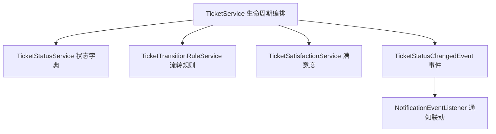
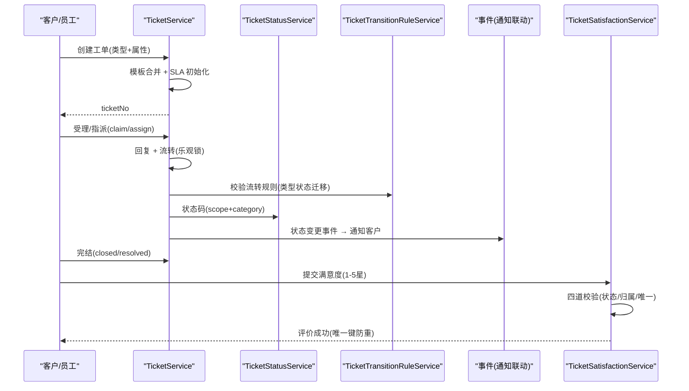
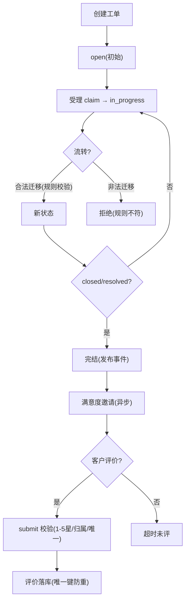
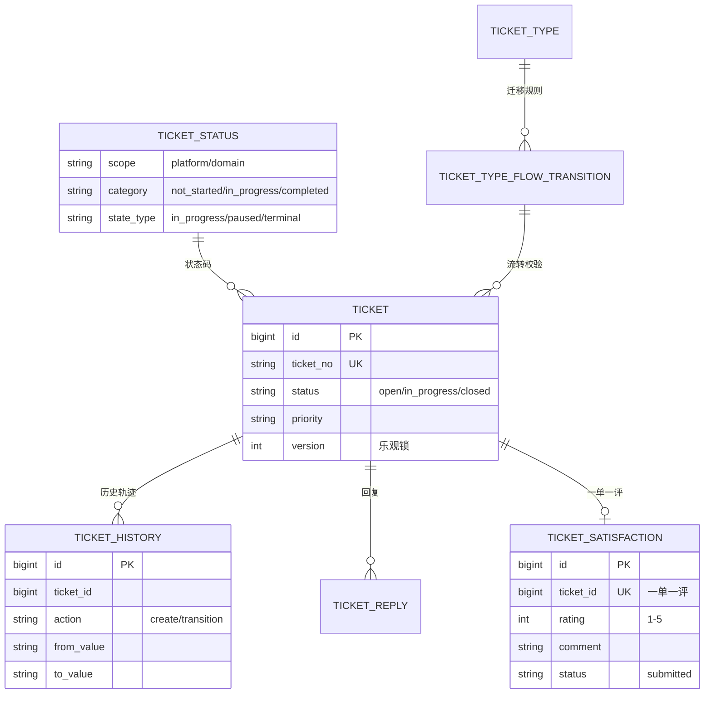
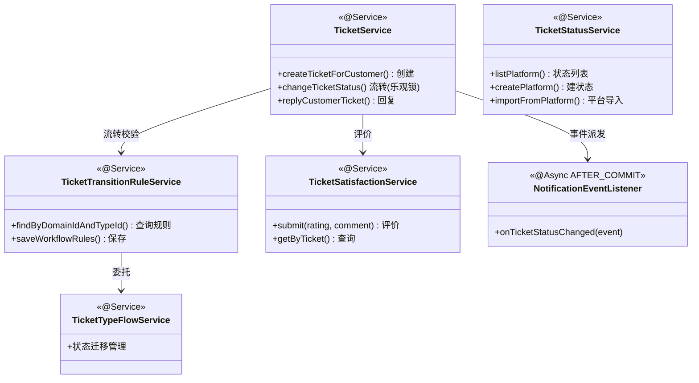

<cite>
- [UnionDesk/uniondesk-ticket/src/main/java/com/uniondesk/ticket/core/TicketService.java](file://UnionDesk/uniondesk-ticket/src/main/java/com/uniondesk/ticket/core/TicketService.java#L124-L192)
- [UnionDesk/uniondesk-ticket/src/main/java/com/uniondesk/ticket/core/TicketService.java](file://UnionDesk/uniondesk-ticket/src/main/java/com/uniondesk/ticket/core/TicketService.java#L194-L198)
- [UnionDesk/uniondesk-ticket/src/main/java/com/uniondesk/ticket/core/TicketStatusService.java](file://UnionDesk/uniondesk-ticket/src/main/java/com/uniondesk/ticket/core/TicketStatusService.java#L17-L46)
- [UnionDesk/uniondesk-ticket/src/main/java/com/uniondesk/ticket/core/TicketStatusService.java](file://UnionDesk/uniondesk-ticket/src/main/java/com/uniondesk/ticket/core/TicketStatusService.java#L48-L49)
- [UnionDesk/uniondesk-ticket/src/main/java/com/uniondesk/ticket/core/TicketTransitionRuleService.java](file://UnionDesk/uniondesk-ticket/src/main/java/com/uniondesk/ticket/core/TicketTransitionRuleService.java#L12-L39)
- [UnionDesk/uniondesk-ticket/src/main/java/com/uniondesk/ticket/core/TicketSatisfactionService.java](file://UnionDesk/uniondesk-ticket/src/main/java/com/uniondesk/ticket/core/TicketSatisfactionService.java#L19-L66)
- [UnionDesk/uniondesk-ticket/src/main/java/com/uniondesk/ticket/entity/TicketStatusPo.java](file://UnionDesk/uniondesk-ticket/src/main/java/com/uniondesk/ticket/entity/TicketStatusPo.java#L5-L34)
- [UnionDesk/uniondesk-support/src/main/java/com/uniondesk/notification/event/NotificationEventListener.java](file://UnionDesk/uniondesk-support/src/main/java/com/uniondesk/notification/event/NotificationEventListener.java#L19-L38)
</cite>

# UnionDesk 工单生命周期与状态机

## 简介

本文档详解工单全生命周期与状态机机制：创建（含模板合并/SLA 初始化）、受理/指派、回复、状态流转（`TicketStatusService` 状态字典 + `TicketTransitionRuleService` 流转规则）、完结、满意度评价（`TicketSatisfactionService` 一单一评）；事件驱动旁路（`TicketStatusChangedEvent` → 通知/审计异步联动）。

章节来源：
- [UnionDesk/uniondesk-ticket/src/main/java/com/uniondesk/ticket/core/TicketService.java](file://UnionDesk/uniondesk-ticket/src/main/java/com/uniondesk/ticket/core/TicketService.java#L124-L192)
- [UnionDesk/uniondesk-ticket/src/main/java/com/uniondesk/ticket/core/TicketSatisfactionService.java](file://UnionDesk/uniondesk-ticket/src/main/java/com/uniondesk/ticket/core/TicketSatisfactionService.java#L19-L66)

## 项目结构

生命周期相关组件：



图表来源：
- [UnionDesk/uniondesk-ticket/src/main/java/com/uniondesk/ticket/core/TicketService.java](file://UnionDesk/uniondesk-ticket/src/main/java/com/uniondesk/ticket/core/TicketService.java#L52-L77)
- [UnionDesk/uniondesk-support/src/main/java/com/uniondesk/notification/event/NotificationEventListener.java](file://UnionDesk/uniondesk-support/src/main/java/com/uniondesk/notification/event/NotificationEventListener.java#L10-L38)

## 核心组件

**1. TicketService 生命周期编排**：
- 创建：`createTicketForCustomer`（L131-192）——域校验 → 单号生成 → 表单剥离 → 描述模板 → 优先级解析 → 模板合并 → 落库 → 历史 → 附件/观察者 → SLA → 通知。
- 流转：`changeTicketStatus`（L194-198）——version 乐观锁校验 → 状态校验 → 更新 → 事件发布。
- 受理/指派：`updateClaim`/`updateAssign`（仓储层，乐观锁版本）。

**2. TicketStatusService 状态字典**：平台/域双 scope 的 `listPlatform/createPlatform/updatePlatform/deletePlatform`（L30-123）与 `listDomain/createDomain/updateDomain/deleteDomain`（L134-233）、`importFromPlatform`（L245，平台状态导入域）；`VALID_CATEGORIES` 校验（L19-22，not_started/in_progress/completed）；小数据量免分页（`NO_PAGINATION_THRESHOLD`，L34）。

**3. TicketTransitionRuleService 流转规则**：`findByDomainIdAndTypeId`（L20）查询类型流转规则；`saveWorkflowRules`（L25）保存；`deleteByDomainIdAndTypeId(AndStateCode)`（L34/39）删除——委托 `TicketTypeFlowService` 管理状态迁移表。

**4. TicketSatisfactionService 满意度**：`submit`（L36-66）四道校验——评分 1-5（L43-45）→ 工单存在且属域（L46）→ 本人工单（`requireTicketOwner` L47）→ 状态 closed/resolved（`EVALUABLE_STATUSES` L21/48-50）→ 未评价（L51-53）；`DuplicateKeyException` 兜底防并发重评（L60-64）。

**5. TicketStatusChangedEvent 事件**：状态变更发布，`NotificationEventListener`（AFTER_COMMIT + @Async）消费——状态通知 + closed 时满意度邀请（L31-37）。

章节来源：
- [UnionDesk/uniondesk-ticket/src/main/java/com/uniondesk/ticket/core/TicketService.java](file://UnionDesk/uniondesk-ticket/src/main/java/com/uniondesk/ticket/core/TicketService.java#L124-L198)
- [UnionDesk/uniondesk-ticket/src/main/java/com/uniondesk/ticket/core/TicketStatusService.java](file://UnionDesk/uniondesk-ticket/src/main/java/com/uniondesk/ticket/core/TicketStatusService.java#L17-L49)
- [UnionDesk/uniondesk-ticket/src/main/java/com/uniondesk/ticket/core/TicketSatisfactionService.java](file://UnionDesk/uniondesk-ticket/src/main/java/com/uniondesk/ticket/core/TicketSatisfactionService.java#L36-L66)

## 架构总览

工单从创建到评价的完整生命周期时序：



图表来源：
- [UnionDesk/uniondesk-ticket/src/main/java/com/uniondesk/ticket/core/TicketService.java](file://UnionDesk/uniondesk-ticket/src/main/java/com/uniondesk/ticket/core/TicketService.java#L124-L198)
- [UnionDesk/uniondesk-ticket/src/main/java/com/uniondesk/ticket/core/TicketSatisfactionService.java](file://UnionDesk/uniondesk-ticket/src/main/java/com/uniondesk/ticket/core/TicketSatisfactionService.java#L36-L66)

## 详细分析

**生命周期机制设计要点**：

1. **状态字典常量体系**：`TicketStatusPo` 常量（L7-16）定义 scope（platform/domain）、category（not_started/in_progress/completed）、state_type（in_progress/paused/terminal）；数据库存字符串码，`TicketStatusService.VALID_CATEGORIES` 校验输入（L19-22）；平台状态可导入域（`importFromPlatform` L245）实现模板化。
2. **流转规则校验**：`TicketTransitionRuleService` 委托 `TicketTypeFlowService`——状态迁移（from→to）由 `ticket_type_flow_transition` 表定义，流转前校验目标状态合法性（防跳态/逆流）。
3. **乐观锁贯穿**：`changeTicketStatus` 先比 version（L196-198）再更新；`updateClaim/updateAssign` 仓储层带 version 条件（见 Mapper 层）——并发操作失败即提示「请刷新」。
4. **事件驱动旁路**：状态变更 `publish(TicketStatusChangedEvent)`；监听器 AFTER_COMMIT + @Async（L19-21）——主事务成功才通知；closed 状态额外发满意度邀请（L31-37）。
5. **满意度四道校验 + 双保险**：评分范围、工单归属、本人所有、状态可评、唯一性五层校验（L43-53）；数据库 `uk_satisfaction_ticket` 唯一键 + `DuplicateKeyException` 兜底（L60-64）——业务与数据库双层防重评。
6. **历史轨迹**：每次变更 `recordHistory`（create/流转/回复），`ticket_history` 升序还原时间线（见查询模式）。
7. **SLA 贯穿**：创建时 `applyOnCreate` 写入时限字段；流转更新 SLA 状态（`sla_status` tracking/breached 等）。



图表来源：
- [UnionDesk/uniondesk-ticket/src/main/java/com/uniondesk/ticket/core/TicketService.java](file://UnionDesk/uniondesk-ticket/src/main/java/com/uniondesk/ticket/core/TicketService.java#L194-L198)
- [UnionDesk/uniondesk-ticket/src/main/java/com/uniondesk/ticket/core/TicketSatisfactionService.java](file://UnionDesk/uniondesk-ticket/src/main/java/com/uniondesk/ticket/core/TicketSatisfactionService.java#L43-L64)
- [UnionDesk/uniondesk-ticket/src/main/java/com/uniondesk/ticket/entity/TicketStatusPo.java](file://UnionDesk/uniondesk-ticket/src/main/java/com/uniondesk/ticket/entity/TicketStatusPo.java#L7-L16)

## 数据模型

生命周期相关实体：



图表来源：
- [UnionDesk/uniondesk-ticket/src/main/java/com/uniondesk/ticket/core/TicketSatisfactionService.java](file://UnionDesk/uniondesk-ticket/src/main/java/com/uniondesk/ticket/core/TicketSatisfactionService.java#L54-L65)
- [UnionDesk/uniondesk-ticket/src/main/java/com/uniondesk/ticket/entity/TicketStatusPo.java](file://UnionDesk/uniondesk-ticket/src/main/java/com/uniondesk/ticket/entity/TicketStatusPo.java#L5-L34)

## 依赖关系分析



图表来源：
- [UnionDesk/uniondesk-ticket/src/main/java/com/uniondesk/ticket/core/TicketTransitionRuleService.java](file://UnionDesk/uniondesk-ticket/src/main/java/com/uniondesk/ticket/core/TicketTransitionRuleService.java#L12-L16)
- [UnionDesk/uniondesk-ticket/src/main/java/com/uniondesk/ticket/core/TicketSatisfactionService.java](file://UnionDesk/uniondesk-ticket/src/main/java/com/uniondesk/ticket/core/TicketSatisfactionService.java#L23-L34)
- [UnionDesk/uniondesk-support/src/main/java/com/uniondesk/notification/event/NotificationEventListener.java](file://UnionDesk/uniondesk-support/src/main/java/com/uniondesk/notification/event/NotificationEventListener.java#L19-L38)

## 性能与安全考虑

- **性能**：小状态集免分页（`NO_PAGINATION_THRESHOLD` L34）；历史/回复按 `(ticket_id, created_at)` 索引；事件异步消费不阻塞主链路。
- **安全**：域隔离强制（`business_domain_id` 双条件查询）；满意度归属校验（`requireTicketOwner`）防越权评价；状态 category 白名单校验防非法状态注入。
- **一致性**：乐观锁 version 防并发流转冲突；唯一键防重复评价（业务+DB 双保险）；事件 AFTER_COMMIT 保证主事务成功才联动。
- **可追溯**：`ticket_history` 记录每次变更（from/to 值 + 操作者），配合审计日志完整还原工单轨迹。

章节来源：
- [UnionDesk/uniondesk-ticket/src/main/java/com/uniondesk/ticket/core/TicketSatisfactionService.java](file://UnionDesk/uniondesk-ticket/src/main/java/com/uniondesk/ticket/core/TicketSatisfactionService.java#L43-L64)
- [UnionDesk/uniondesk-ticket/src/main/java/com/uniondesk/ticket/core/TicketStatusService.java](file://UnionDesk/uniondesk-ticket/src/main/java/com/uniondesk/ticket/core/TicketStatusService.java#L34-L42)

## 故障排查指南

| 现象 | 原因 | 处理建议 |
| --- | --- | --- |
| 流转被拒「工单已被他人修改」 | version 乐观锁冲突 | 前端刷新重载；确认 version 传递 |
| 流转提示非法迁移 | 迁移规则（transition）未配置或目标状态非法 | 检查 `ticket_type_flow_transition`；用 `saveWorkflowRules` 补规则 |
| 满意度提交失败「工单未关闭」 | 状态不在 closed/resolved | 检查 `EVALUABLE_STATUSES`；确认完结状态码 |
| 满意度重复提交报错 | 已评价（唯一键兜底） | 查询 `ticket_satisfaction`；前端隐藏已评入口 |
| closed 后客户未收到邀请 | 事件监听异步失败或模板缺失 | 检查 `notification_log`；核对满意度邀请模板 |

章节来源：
- [UnionDesk/uniondesk-ticket/src/main/java/com/uniondesk/ticket/core/TicketSatisfactionService.java](file://UnionDesk/uniondesk-ticket/src/main/java/com/uniondesk/ticket/core/TicketSatisfactionService.java#L48-L64)
- [UnionDesk/uniondesk-support/src/main/java/com/uniondesk/notification/event/NotificationEventListener.java](file://UnionDesk/uniondesk-support/src/main/java/com/uniondesk/notification/event/NotificationEventListener.java#L31-L37)

## 结论

工单生命周期以「**创建即初始化、流转规则化、完结可评价、事件驱动旁路**」为设计主线：创建时合并模板并初始化 SLA；流转经迁移规则校验 + 乐观锁并发控制；closed/resolved 后客户可评价（一单一评双保险）；状态变更经事件异步触发通知与满意度邀请。全链路写历史、可追溯、可审计。

章节来源：
- [UnionDesk/uniondesk-ticket/src/main/java/com/uniondesk/ticket/core/TicketService.java](file://UnionDesk/uniondesk-ticket/src/main/java/com/uniondesk/ticket/core/TicketService.java#L124-L198)
- [UnionDesk/uniondesk-ticket/src/main/java/com/uniondesk/ticket/core/TicketSatisfactionService.java](file://UnionDesk/uniondesk-ticket/src/main/java/com/uniondesk/ticket/core/TicketSatisfactionService.java#L19-L66)

## 附录

生命周期验证命令：

```bash
# 1. 创建工单（open）
curl -X POST http://127.0.0.1:8080/api/v1/domains/1/tickets \
  -H "Authorization: Bearer <token>" -H "Content-Type: application/json" \
  -d '{"ticket_type_id":5,"title":"生命周期测试","priority":"normal"}'

# 2. 受理工单（claim）
curl -X PATCH http://127.0.0.1:8080/api/v1/admin/domains/1/tickets/1001/claim \
  -H "Authorization: Bearer <token>" -H "Content-Type: application/json" \
  -d '{"version":0}'

# 3. 流转状态（携带乐观锁 version）
curl -X PATCH http://127.0.0.1:8080/api/v1/admin/domains/1/tickets/1001/status \
  -H "Authorization: Bearer <token>" -H "Content-Type: application/json" \
  -d '{"status":"closed","version":2}'

# 4. 客户提交满意度
curl -X POST http://127.0.0.1:8080/api/v1/domains/1/tickets/my/1001/satisfaction \
  -H "Authorization: Bearer <token>" -H "Content-Type: application/json" \
  -d '{"rating":5,"comment":"服务很好"}'
```

章节来源：
- [UnionDesk/uniondesk-ticket/src/main/java/com/uniondesk/ticket/core/TicketService.java](file://UnionDesk/uniondesk-ticket/src/main/java/com/uniondesk/ticket/core/TicketService.java#L124-L198)
- [UnionDesk/uniondesk-ticket/src/main/java/com/uniondesk/ticket/core/TicketSatisfactionService.java](file://UnionDesk/uniondesk-ticket/src/main/java/com/uniondesk/ticket/core/TicketSatisfactionService.java#L36-L66)
