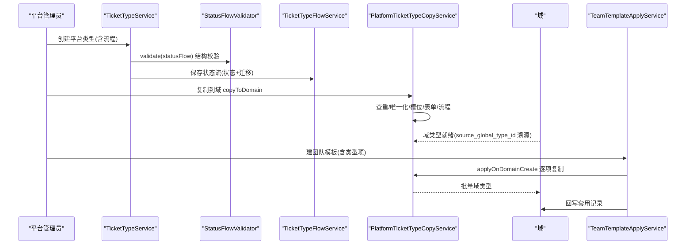
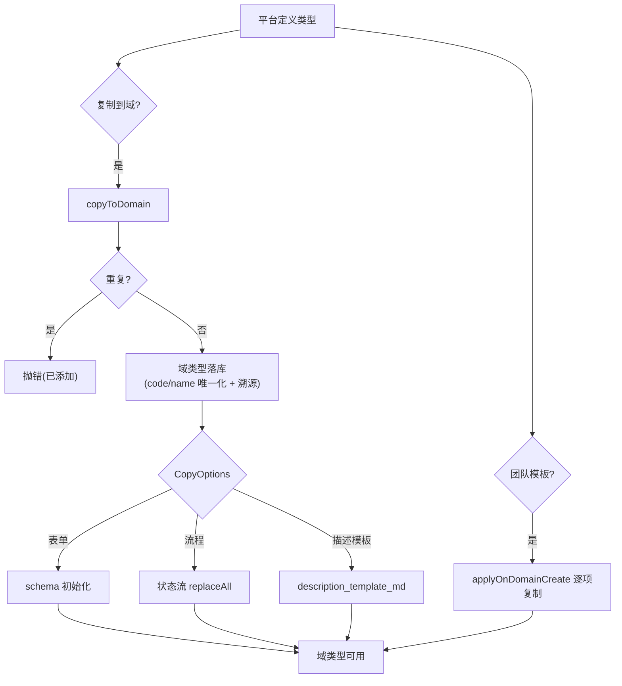
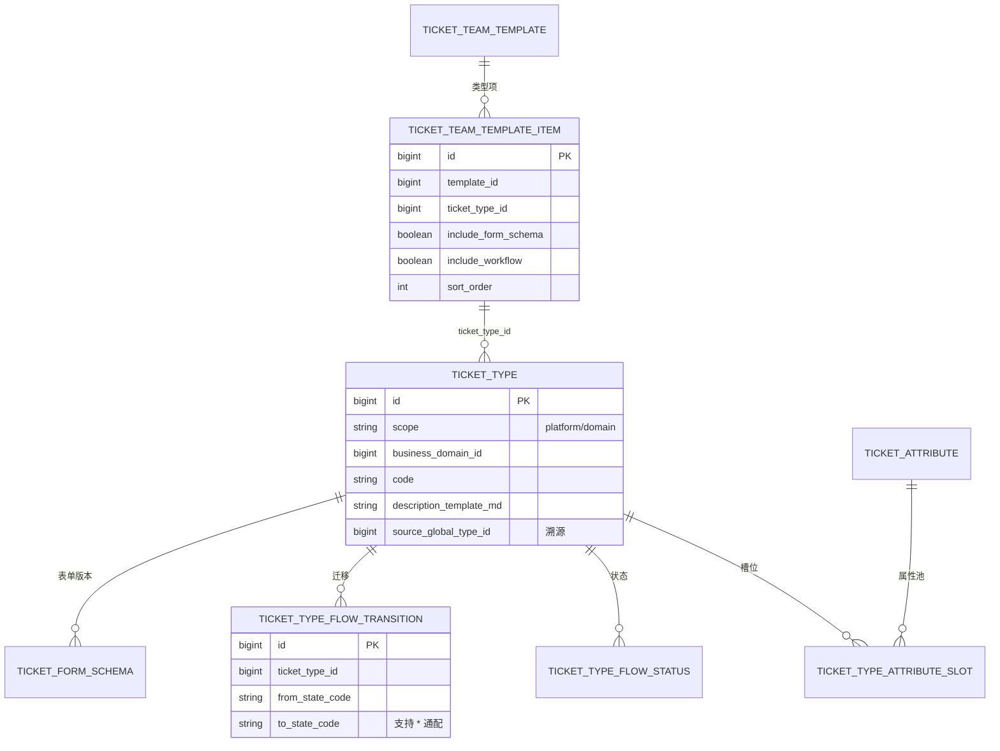
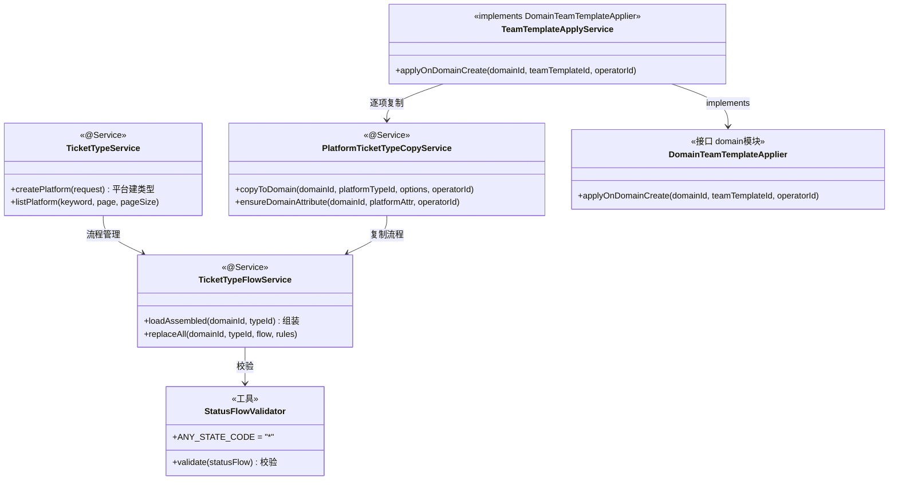

<cite>
- [UnionDesk/uniondesk-ticket/src/main/java/com/uniondesk/ticket/core/TicketTypeService.java](file://UnionDesk/uniondesk-ticket/src/main/java/com/uniondesk/ticket/core/TicketTypeService.java#L22-L32)
- [UnionDesk/uniondesk-ticket/src/main/java/com/uniondesk/ticket/core/TicketTypeService.java](file://UnionDesk/uniondesk-ticket/src/main/java/com/uniondesk/ticket/core/TicketTypeService.java#L47-L70)
- [UnionDesk/uniondesk-ticket/src/main/java/com/uniondesk/ticket/core/TicketTypeFlowService.java](file://UnionDesk/uniondesk-ticket/src/main/java/com/uniondesk/ticket/core/TicketTypeFlowService.java#L24-L86)
- [UnionDesk/uniondesk-ticket/src/main/java/com/uniondesk/ticket/core/PlatformTicketTypeCopyService.java](file://UnionDesk/uniondesk-ticket/src/main/java/com/uniondesk/ticket/core/PlatformTicketTypeCopyService.java#L27-L106)
- [UnionDesk/uniondesk-ticket/src/main/java/com/uniondesk/ticket/core/TeamTemplateApplyService.java](file://UnionDesk/uniondesk-ticket/src/main/java/com/uniondesk/ticket/core/TeamTemplateApplyService.java#L12-L58)
- [UnionDesk/uniondesk-ticket/src/main/java/com/uniondesk/ticket/core/StatusFlowValidator.java](file://UnionDesk/uniondesk-ticket/src/main/java/com/uniondesk/ticket/core/StatusFlowValidator.java#L10-L18)
- [UnionDesk/uniondesk-domain/src/main/java/com/uniondesk/domain/core/DomainTeamTemplateApplier.java](file://UnionDesk/uniondesk-domain/src/main/java/com/uniondesk/domain/core/DomainTeamTemplateApplier.java#L3-L9)
- [UnionDesk/uniondesk-ticket/src/main/java/com/uniondesk/ticket/entity/TicketTypePo.java](file://UnionDesk/uniondesk-ticket/src/main/java/com/uniondesk/ticket/entity/TicketTypePo.java#L5-L27)
</cite>

# UnionDesk 工单类型与流程配置

## 简介

本文档详解工单类型与流程配置功能：平台级工单类型（`TicketTypeService`）、域级类型继承（平台 → 域复制 `PlatformTicketTypeCopyService`）、状态流配置（`TicketTypeFlowService` 状态/迁移 + `StatusFlowValidator` 校验）、团队模板套用（`TeamTemplateApplyService` 实现 `DomainTeamTemplateApplier`）。该体系实现「平台定义标准 → 域按需实例化」的配置分发模式。

章节来源：
- [UnionDesk/uniondesk-ticket/src/main/java/com/uniondesk/ticket/core/TicketTypeService.java](file://UnionDesk/uniondesk-ticket/src/main/java/com/uniondesk/ticket/core/TicketTypeService.java#L22-L70)
- [UnionDesk/uniondesk-ticket/src/main/java/com/uniondesk/ticket/core/PlatformTicketTypeCopyService.java](file://UnionDesk/uniondesk-ticket/src/main/java/com/uniondesk/ticket/core/PlatformTicketTypeCopyService.java#L27-L106)

## 项目结构

类型与流程配置组件：

```mermaid
graph TB
    TTS["TicketTypeService 类型CRUD"]
    TFS["TicketTypeFlowService 状态流"]
    SV["StatusFlowValidator 校验"]
    COPY["PlatformTicketTypeCopyService 平台→域复制"]
    TEAM["TeamTemplateApplyService 团队模板"]
    APPLIER["DomainTeamTemplateApplier(接口)"]
    DEFAULT["DefaultStatusFlowProvider 默认流"]
    TTS --> COPY
    COPY --> TFS
    TFS --> SV
    TEAM --> COPY
    TEAM --> APPLIER : implements
    COPY --> DEFAULT
```

图表来源：
- [UnionDesk/uniondesk-ticket/src/main/java/com/uniondesk/ticket/core/TeamTemplateApplyService.java](file://UnionDesk/uniondesk-ticket/src/main/java/com/uniondesk/ticket/core/TeamTemplateApplyService.java#L12-L26)
- [UnionDesk/uniondesk-ticket/src/main/java/com/uniondesk/ticket/core/PlatformTicketTypeCopyService.java](file://UnionDesk/uniondesk-ticket/src/main/java/com/uniondesk/ticket/core/PlatformTicketTypeCopyService.java#L40-L63)

## 核心组件

**1. TicketTypeService**：平台类型 `getPlatformDetail/listPlatform/createPlatform/updatePlatform/deletePlatform/reorderPlatform`（L47-170）；域类型管理（域 scope 增删改查）。

**2. TicketTypeFlowService 状态流**：`loadAssembled(domainId, ticketTypeId)`（L42）组装完整流程配置（状态+迁移）；`loadStatusFlow`（L48）、`loadRules`（L52）；`replaceAll`（L57）全量替换；`deleteByDomainIdAndTypeId`（L80）、`deleteTransitionsByStateCode`（L86）；`resolveDomainId` 静态工具（L419）。

**3. StatusFlowValidator 校验**：`validate(Object statusFlow)`（L18）校验流程结构；常量 `ANY_STATE_CODE="*"`（L12）通配迁移、`INITIAL_STATE_CODE_KEY="initial_state_code"`（L13）初始状态键。

**4. PlatformTicketTypeCopyService 复制**：`CopyOptions`（L29-38，includeFormSchema/includeWorkflow/includeDescriptionTemplate/sortOrder）；`copyToDomain`（L65-106）：查重（L68-70）→ 平台类型快照 → 域类型落库（code/name 唯一化 L75-76，`source_global_type_id` 溯源 L86）→ 槽位复制（L94）→ 表单 schema 初始化（L95-96）→ 流程复制/默认流（L98-105）；`ensureDomainAttribute`（L131）域属性兜底。

**5. TeamTemplateApplyService 团队模板**：实现 `DomainTeamTemplateApplier`（L13）；`applyOnDomainCreate`（L29-57）——模板状态校验（L32-34）→ 模板项非空（L36-38）→ 逐项 `copyToDomain`（L40-50）→ 回写域套用记录（L52-56）。

章节来源：
- [UnionDesk/uniondesk-ticket/src/main/java/com/uniondesk/ticket/core/PlatformTicketTypeCopyService.java](file://UnionDesk/uniondesk-ticket/src/main/java/com/uniondesk/ticket/core/PlatformTicketTypeCopyService.java#L65-L106)
- [UnionDesk/uniondesk-ticket/src/main/java/com/uniondesk/ticket/core/TeamTemplateApplyService.java](file://UnionDesk/uniondesk-ticket/src/main/java/com/uniondesk/ticket/core/TeamTemplateApplyService.java#L28-L57)
- [UnionDesk/uniondesk-ticket/src/main/java/com/uniondesk/ticket/core/StatusFlowValidator.java](file://UnionDesk/uniondesk-ticket/src/main/java/com/uniondesk/ticket/core/StatusFlowValidator.java#L10-L18)

## 架构总览

「平台定义类型 → 域复制 → 团队模板批量套用」的时序：



图表来源：
- [UnionDesk/uniondesk-ticket/src/main/java/com/uniondesk/ticket/core/PlatformTicketTypeCopyService.java](file://UnionDesk/uniondesk-ticket/src/main/java/com/uniondesk/ticket/core/PlatformTicketTypeCopyService.java#L65-L106)
- [UnionDesk/uniondesk-ticket/src/main/java/com/uniondesk/ticket/core/TeamTemplateApplyService.java](file://UnionDesk/uniondesk-ticket/src/main/java/com/uniondesk/ticket/core/TeamTemplateApplyService.java#L28-L57)

## 详细分析

**配置分发机制设计要点**：

1. **平台 → 域复制模式**：`copyToDomain` 全量复制（类型字段 + 槽位 + 表单 schema + 流程），`source_global_type_id` 记录溯源（L86）；code/name 唯一化（`resolveUniqueCode/resolveUniqueName` L75-76）防域内冲突；重复复制抛「已添加到当前域」（L68-70）幂等保护。
2. **可选复制项**：`CopyOptions` 控制表单/流程/描述模板是否随类型复制（L29-38）——域可按需裁剪；不复制流程时给 `DefaultStatusFlowProvider.emptyFlow()`（L104）保证域类型始终有可用流程。
3. **流程三要素**：状态（`ticket_type_flow_status`）、迁移（`ticket_type_flow_transition`，from→to + 规则）、初始状态（`initial_state_code`）；`StatusFlowValidator` 校验结构完整性（`ANY_STATE_CODE` 通配迁移 L12）；`replaceAll` 事务内全量替换防中间态。
4. **团队模板批量套用**：模板项（`TicketTeamTemplateItemPo`）逐项按各自 `CopyOptions` 复制（L40-50）；套用后回写 `domain.applied_team_template`（版本+操作者，L52-56）——「建域即全套工单配置」。
5. **接口倒置解耦**：`DomainTeamTemplateApplier` 定义在 domain 模块（L3-9），ticket 模块实现（TeamTemplateApplyService L13）——domain 建域时经 `ObjectProvider` 调用，无循环依赖。
6. **域类型独立演化**：复制后域类型可独立修改（不改平台源）；平台类型更新不影响已复制域类型（如需同步走模板 `syncTemplateInstance` 机制）。



图表来源：
- [UnionDesk/uniondesk-ticket/src/main/java/com/uniondesk/ticket/core/PlatformTicketTypeCopyService.java](file://UnionDesk/uniondesk-ticket/src/main/java/com/uniondesk/ticket/core/PlatformTicketTypeCopyService.java#L66-L105)
- [UnionDesk/uniondesk-ticket/src/main/java/com/uniondesk/ticket/core/TeamTemplateApplyService.java](file://UnionDesk/uniondesk-ticket/src/main/java/com/uniondesk/ticket/core/TeamTemplateApplyService.java#L29-L57)

## 数据模型

类型与流程相关实体：



图表来源：
- [UnionDesk/uniondesk-ticket/src/main/java/com/uniondesk/ticket/core/PlatformTicketTypeCopyService.java](file://UnionDesk/uniondesk-ticket/src/main/java/com/uniondesk/ticket/core/PlatformTicketTypeCopyService.java#L72-L105)
- [UnionDesk/uniondesk-ticket/src/main/java/com/uniondesk/ticket/core/TeamTemplateApplyService.java](file://UnionDesk/uniondesk-ticket/src/main/java/com/uniondesk/ticket/core/TeamTemplateApplyService.java#L35-L56)
- [UnionDesk/uniondesk-ticket/src/main/java/com/uniondesk/ticket/entity/TicketTypePo.java](file://UnionDesk/uniondesk-ticket/src/main/java/com/uniondesk/ticket/entity/TicketTypePo.java#L5-L27)

## 依赖关系分析



图表来源：
- [UnionDesk/uniondesk-ticket/src/main/java/com/uniondesk/ticket/core/TeamTemplateApplyService.java](file://UnionDesk/uniondesk-ticket/src/main/java/com/uniondesk/ticket/core/TeamTemplateApplyService.java#L13-L26)
- [UnionDesk/uniondesk-ticket/src/main/java/com/uniondesk/ticket/core/PlatformTicketTypeCopyService.java](file://UnionDesk/uniondesk-ticket/src/main/java/com/uniondesk/ticket/core/PlatformTicketTypeCopyService.java#L40-L63)
- [UnionDesk/uniondesk-domain/src/main/java/com/uniondesk/domain/core/DomainTeamTemplateApplier.java](file://UnionDesk/uniondesk-domain/src/main/java/com/uniondesk/domain/core/DomainTeamTemplateApplier.java#L3-L9)

## 性能与安全考虑

- **性能**：复制在单事务内批量落库（L65）；`loadAssembled` 一次组装避免多次查询；小类型集免分页。
- **安全**：复制查重防重复添加（L68-70）；code/name 唯一化防冲突；模板状态校验（停用不可套用 L32-34）；域隔离（所有操作按 `business_domain_id`）。
- **一致性**：`replaceAll` 事务全量替换防流程中间态；复制失败整体回滚（@Transactional）；表单 schema 版本化（draft/published）支撑回退。
- **可追溯**：`source_global_type_id`/`source_attribute_id` 溯源链；模板套用记录（模板 ID+版本+操作者）。

章节来源：
- [UnionDesk/uniondesk-ticket/src/main/java/com/uniondesk/ticket/core/PlatformTicketTypeCopyService.java](file://UnionDesk/uniondesk-ticket/src/main/java/com/uniondesk/ticket/core/PlatformTicketTypeCopyService.java#L65-L92)
- [UnionDesk/uniondesk-ticket/src/main/java/com/uniondesk/ticket/core/TeamTemplateApplyService.java](file://UnionDesk/uniondesk-ticket/src/main/java/com/uniondesk/ticket/core/TeamTemplateApplyService.java#L31-L38)

## 故障排查指南

| 现象 | 原因 | 处理建议 |
| --- | --- | --- |
| 复制到域报「已添加」 | 该平台类型已复制过（source_global_type_id 命中） | 查询域类型溯源；如需重新复制先删除域实例 |
| 复制报编码/名称冲突 | 域内 code/name 与既有类型冲突 | 检查 `resolveUniqueCode/Name` 逻辑；改名重试 |
| 建域套模板后无类型 | 模板状态非 active 或模板项为空 | 检查模板状态与 `findItemsByTemplateId` |
| 流程保存被拒 | `StatusFlowValidator` 校验失败（缺初始状态/非法迁移） | 对照校验规则补全流程结构；检查 `*` 通配用法 |
| 域类型流程为空 | 复制时未 includeWorkflow 且无默认流 | 检查 `CopyOptions`；确认 `DefaultStatusFlowProvider.emptyFlow` 落库 |

章节来源：
- [UnionDesk/uniondesk-ticket/src/main/java/com/uniondesk/ticket/core/PlatformTicketTypeCopyService.java](file://UnionDesk/uniondesk-ticket/src/main/java/com/uniondesk/ticket/core/PlatformTicketTypeCopyService.java#L68-L92)
- [UnionDesk/uniondesk-ticket/src/main/java/com/uniondesk/ticket/core/TeamTemplateApplyService.java](file://UnionDesk/uniondesk-ticket/src/main/java/com/uniondesk/ticket/core/TeamTemplateApplyService.java#L31-L38)

## 结论

工单类型与流程配置以「**平台标准定义、域按需复制、模板批量套用、溯源可控**」为核心：平台类型经 `PlatformTicketTypeCopyService` 复制为域实例（可选表单/流程/模板，`source_global_type_id` 溯源），`TicketTypeFlowService` + `StatusFlowValidator` 管理并校验状态流，`TeamTemplateApplyService` 实现建域即套用的团队模板能力。该模式让工单配置从平台到域可分发、可追溯、可独立演化。

章节来源：
- [UnionDesk/uniondesk-ticket/src/main/java/com/uniondesk/ticket/core/PlatformTicketTypeCopyService.java](file://UnionDesk/uniondesk-ticket/src/main/java/com/uniondesk/ticket/core/PlatformTicketTypeCopyService.java#L65-L106)
- [UnionDesk/uniondesk-ticket/src/main/java/com/uniondesk/ticket/core/TeamTemplateApplyService.java](file://UnionDesk/uniondesk-ticket/src/main/java/com/uniondesk/ticket/core/TeamTemplateApplyService.java#L28-L57)

## 附录

配置验证命令：

```bash
# 1. 平台类型列表
curl http://127.0.0.1:8080/api/v1/platform/ticket-types -H "Authorization: Bearer <token>"

# 2. 平台类型复制到域
curl -X POST http://127.0.0.1:8080/api/v1/domains/2/ticket-types/import \
  -H "Authorization: Bearer <token>" -H "Content-Type: application/json" \
  -d '{"platform_type_ids":[3,4]}'

# 3. 查看域类型流程配置
curl http://127.0.0.1:8080/api/v1/domains/2/ticket-types/8/workflow -H "Authorization: Bearer <token>"

# 4. 团队模板套用（建域时）
curl -X POST http://127.0.0.1:8080/api/v1/domains \
  -H "Authorization: Bearer <token>" -H "Content-Type: application/json" \
  -d '{"code":"demo3","name":"演示域3","team_template_id":1}'
```

章节来源：
- [UnionDesk/uniondesk-ticket/src/main/java/com/uniondesk/ticket/core/TicketTypeFlowService.java](file://UnionDesk/uniondesk-ticket/src/main/java/com/uniondesk/ticket/core/TicketTypeFlowService.java#L42-L52)
- [UnionDesk/uniondesk-ticket/src/main/java/com/uniondesk/ticket/core/TeamTemplateApplyService.java](file://UnionDesk/uniondesk-ticket/src/main/java/com/uniondesk/ticket/core/TeamTemplateApplyService.java#L29-L57)
