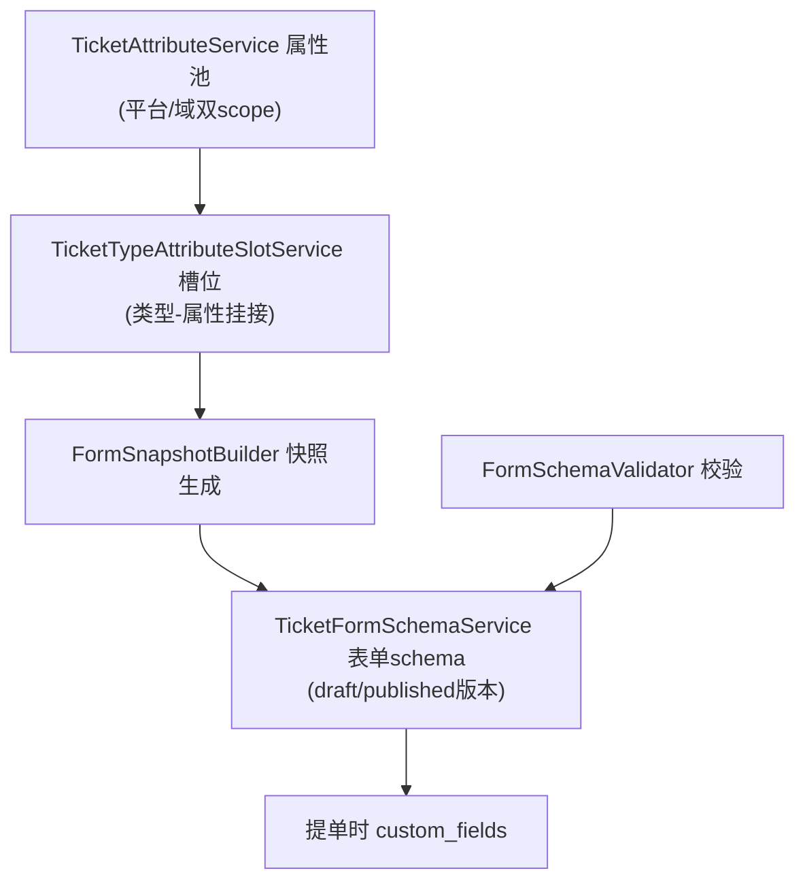
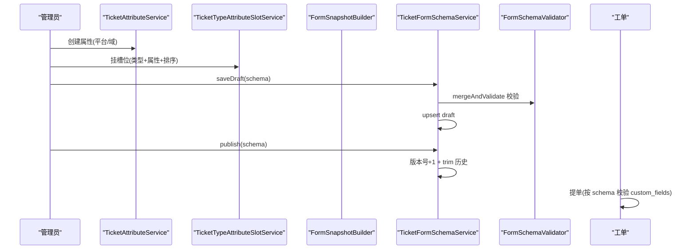
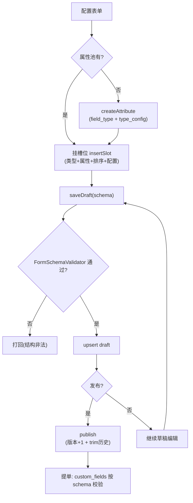
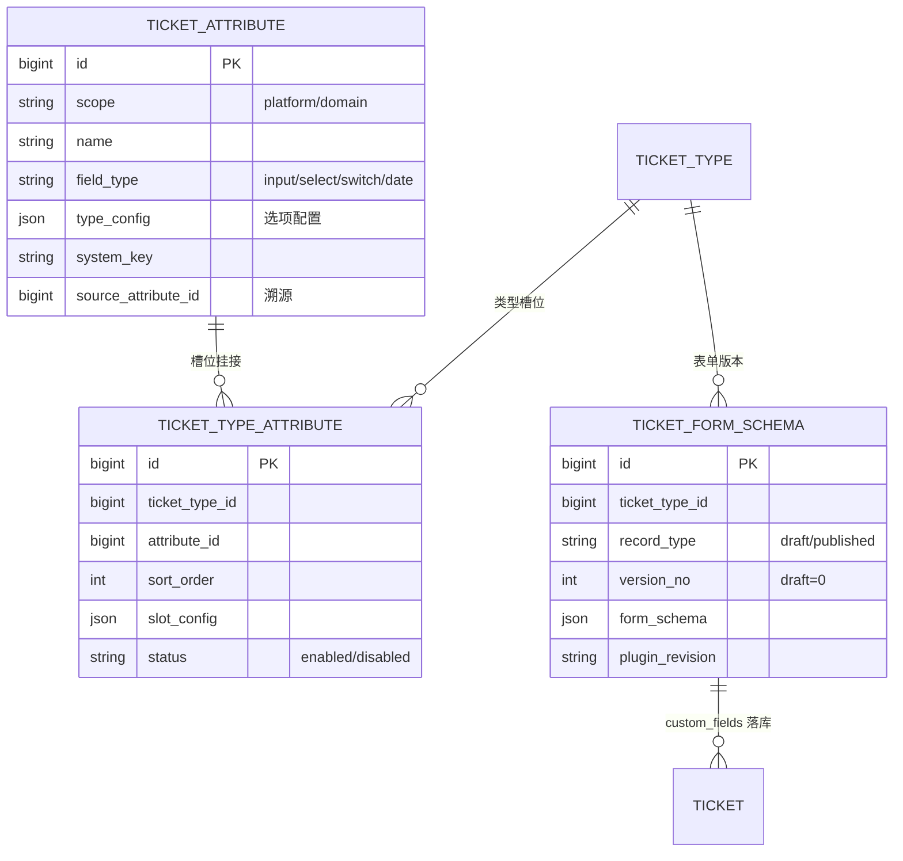
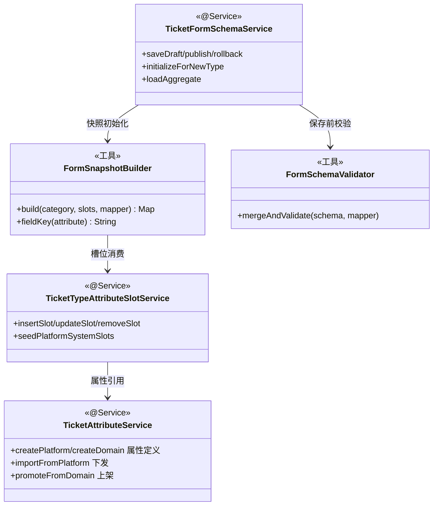

<cite>
- [UnionDesk/uniondesk-ticket/src/main/java/com/uniondesk/ticket/core/TicketAttributeService.java](file://UnionDesk/uniondesk-ticket/src/main/java/com/uniondesk/ticket/core/TicketAttributeService.java#L23-L41)
- [UnionDesk/uniondesk-ticket/src/main/java/com/uniondesk/ticket/core/TicketAttributeService.java](file://UnionDesk/uniondesk-ticket/src/main/java/com/uniondesk/ticket/core/TicketAttributeService.java#L101-L102)
- [UnionDesk/uniondesk-ticket/src/main/java/com/uniondesk/ticket/core/TicketFormSchemaService.java](file://UnionDesk/uniondesk-ticket/src/main/java/com/uniondesk/ticket/core/TicketFormSchemaService.java#L17-L96)
- [UnionDesk/uniondesk-ticket/src/main/java/com/uniondesk/ticket/core/FormSnapshotBuilder.java](file://UnionDesk/uniondesk-ticket/src/main/java/com/uniondesk/ticket/core/FormSnapshotBuilder.java#L16-L51)
- [UnionDesk/uniondesk-ticket/src/main/java/com/uniondesk/ticket/core/FormSchemaValidator.java](file://UnionDesk/uniondesk-ticket/src/main/java/com/uniondesk/ticket/core/FormSchemaValidator.java#L8-L13)
- [UnionDesk/uniondesk-ticket/src/main/java/com/uniondesk/ticket/core/TicketTypeAttributeSlotService.java](file://UnionDesk/uniondesk-ticket/src/main/java/com/uniondesk/ticket/core/TicketTypeAttributeSlotService.java#L36-L47)
- [UnionDesk/uniondesk-ticket/src/main/java/com/uniondesk/ticket/core/TicketTypeAttributeSlotService.java](file://UnionDesk/uniondesk-ticket/src/main/java/com/uniondesk/ticket/core/TicketTypeAttributeSlotService.java#L66-L72)
- [UnionDesk/uniondesk-ticket/src/main/java/com/uniondesk/ticket/entity/TicketFormSchemaPo.java](file://UnionDesk/uniondesk-ticket/src/main/java/com/uniondesk/ticket/entity/TicketFormSchemaPo.java#L5-L21)
- [UnionDesk/uniondesk-ticket/src/main/java/com/uniondesk/ticket/entity/TicketAttributePo.java](file://UnionDesk/uniondesk-ticket/src/main/java/com/uniondesk/ticket/entity/TicketAttributePo.java#L5-L28)
</cite>

# UnionDesk 工单表单架构

## 简介

本文档详解工单表单架构：属性池（`TicketAttributeService` 属性类型/选项）、槽位挂接（`TicketTypeAttributeSlotService` 类型-属性槽位）、表单 schema（`TicketFormSchemaService` JSON Schema 草稿/发布/回滚）、表单快照（`FormSnapshotBuilder` 从槽位生成 schema）、校验器（`FormSchemaValidator`）。该体系让每个工单类型拥有「属性池 → 槽位 → schema → 表单实例」的完整配置链。

章节来源：
- [UnionDesk/uniondesk-ticket/src/main/java/com/uniondesk/ticket/core/TicketAttributeService.java](file://UnionDesk/uniondesk-ticket/src/main/java/com/uniondesk/ticket/core/TicketAttributeService.java#L23-L41)
- [UnionDesk/uniondesk-ticket/src/main/java/com/uniondesk/ticket/core/TicketFormSchemaService.java](file://UnionDesk/uniondesk-ticket/src/main/java/com/uniondesk/ticket/core/TicketFormSchemaService.java#L17-L96)

## 项目结构

表单架构组件链路：



图表来源：
- [UnionDesk/uniondesk-ticket/src/main/java/com/uniondesk/ticket/core/TicketTypeAttributeSlotService.java](file://UnionDesk/uniondesk-ticket/src/main/java/com/uniondesk/ticket/core/TicketTypeAttributeSlotService.java#L36-L47)
- [UnionDesk/uniondesk-ticket/src/main/java/com/uniondesk/ticket/core/FormSnapshotBuilder.java](file://UnionDesk/uniondesk-ticket/src/main/java/com/uniondesk/ticket/core/FormSnapshotBuilder.java#L16-L51)

## 核心组件

**1. TicketAttributeService 属性池**：平台/域双 scope 的 `listPlatform/listDomain`（L41-45）、`createPlatform/createDomain`（L49-57）、`update/delete/reorder`（L64-97）、`importFromPlatform`（L102，平台属性导入域）、`promoteFromDomain`（L155，域属性上架平台）——属性定义（`field_type`：input/select/switch/date + `type_config` JSON 选项）。

**2. TicketTypeAttributeSlotService 槽位**：`listSlots`（L66）、`insertSlot`（L72）、`updateSlot`（L109）、`removeSlot`（L127）、`reorderSlots`（L141）、`listPlatformSlots`（L156）、`seedPlatformSystemSlots`（L162）——属性以槽位（sort_order + slot_config）挂到具体类型，支持不同类型复用属性。

**3. TicketFormSchemaService 表单 schema**：
- 初始化：`initializeForNewType`（L29-33，published v1 + draft 双写）、`initializeForNewPlatformType`（L35-38，平台用 `PLATFORM_SCHEMA_DOMAIN_KEY`）。
- 编辑发布：`saveDraft`（L40-45，校验+序列化+upsert draft）、`publish`（L47-55，版本号递增 + trim 历史保留上限）、`rollback`（L57-64，回滚到历史版本并重新发布）。
- 查询：`listPublishedVersions`（L66-76）、`getPublishedVersion`（L78-88）、`loadAggregate`（L95）。
- 清理：`deleteByTicketType`（L90-93）。

**4. FormSnapshotBuilder 快照**：`build(category, slots, objectMapper)`（L26-51）——从槽位上下文生成 JSON Schema（`type=object` + properties）；`appendSystemFields` 注入系统字段；`fieldKey(attribute)`（L423）属性键；只挂启用槽位与启用属性（L39-44）。

**5. FormSchemaValidator 校验**：`mergeAndValidate(formSchema, objectMapper)`（L13）——合并并校验 schema 结构，非法 schema 拒绝入库。

章节来源：
- [UnionDesk/uniondesk-ticket/src/main/java/com/uniondesk/ticket/core/TicketAttributeService.java](file://UnionDesk/uniondesk-ticket/src/main/java/com/uniondesk/ticket/core/TicketAttributeService.java#L41-L102)
- [UnionDesk/uniondesk-ticket/src/main/java/com/uniondesk/ticket/core/TicketFormSchemaService.java](file://UnionDesk/uniondesk-ticket/src/main/java/com/uniondesk/ticket/core/TicketFormSchemaService.java#L29-L96)
- [UnionDesk/uniondesk-ticket/src/main/java/com/uniondesk/ticket/core/FormSnapshotBuilder.java](file://UnionDesk/uniondesk-ticket/src/main/java/com/uniondesk/ticket/core/FormSnapshotBuilder.java#L26-L51)

## 架构总览

「配置属性 → 挂槽位 → 生成 schema → 发布 → 提单」时序：



图表来源：
- [UnionDesk/uniondesk-ticket/src/main/java/com/uniondesk/ticket/core/TicketFormSchemaService.java](file://UnionDesk/uniondesk-ticket/src/main/java/com/uniondesk/ticket/core/TicketFormSchemaService.java#L40-L64)
- [UnionDesk/uniondesk-ticket/src/main/java/com/uniondesk/ticket/core/FormSchemaValidator.java](file://UnionDesk/uniondesk-ticket/src/main/java/com/uniondesk/ticket/core/FormSchemaValidator.java#L8-L13)

## 详细分析

**表单架构设计要点**：

1. **属性池与槽位分离**：属性（`ticket_attribute`）是「定义」（类型/选项/系统键），槽位（`ticket_type_attribute`）是「挂接」（类型+属性+排序+slot_config）——同一属性可被多个类型复用且差异化配置；`seedPlatformSystemSlots`（L162）按模板键预置系统槽位。
2. **schema 双记录版本化**：`ticket_form_schema` 的 `record_type=draft|published` + `version_no`（draft=0，published=1..n）；`initializeForNewType` 双写初始版本（L30-33）；`publish` 递增版本并 `trimPublishedHistory`（L50-53，保留上限 `MAX_PUBLISHED_VERSIONS`）；`rollback` 基于历史版本重新发布（L58-64）——发布可回退。
3. **快照生成与校验闭环**：`FormSnapshotBuilder.build` 从启用槽位+启用属性生成 JSON Schema（含系统字段注入）；`FormSchemaValidator.mergeAndValidate` 在保存前校验——「配置所见即所得、非法结构不入库」。
4. **平台/域双轨属性**：`importFromPlatform` 平台属性下发域（域属性 `source_attribute_id` 溯源）；`promoteFromDomain` 域属性上架平台（L155）——属性可双向流动。
5. **提单时校验**：工单 `custom_fields` JSON 按已发布 schema 校验（`peelSystemFormValues` 剥离系统字段，动态数据入 custom_fields——见生命周期文档）。
6. **平台 schema 特例**：平台类型 schema 用 `PLATFORM_SCHEMA_DOMAIN_KEY` 占位域键（L37），复制到域时 `initializeForNewType` 重建域版本。



图表来源：
- [UnionDesk/uniondesk-ticket/src/main/java/com/uniondesk/ticket/core/TicketFormSchemaService.java](file://UnionDesk/uniondesk-ticket/src/main/java/com/uniondesk/ticket/core/TicketFormSchemaService.java#L40-L64)
- [UnionDesk/uniondesk-ticket/src/main/java/com/uniondesk/ticket/core/FormSnapshotBuilder.java](file://UnionDesk/uniondesk-ticket/src/main/java/com/uniondesk/ticket/core/FormSnapshotBuilder.java#L26-L51)
- [UnionDesk/uniondesk-ticket/src/main/java/com/uniondesk/ticket/core/TicketTypeAttributeSlotService.java](file://UnionDesk/uniondesk-ticket/src/main/java/com/uniondesk/ticket/core/TicketTypeAttributeSlotService.java#L66-L72)

## 数据模型

表单架构相关实体：



图表来源：
- [UnionDesk/uniondesk-ticket/src/main/java/com/uniondesk/ticket/entity/TicketAttributePo.java](file://UnionDesk/uniondesk-ticket/src/main/java/com/uniondesk/ticket/entity/TicketAttributePo.java#L5-L28)
- [UnionDesk/uniondesk-ticket/src/main/java/com/uniondesk/ticket/entity/TicketFormSchemaPo.java](file://UnionDesk/uniondesk-ticket/src/main/java/com/uniondesk/ticket/entity/TicketFormSchemaPo.java#L5-L21)
- [UnionDesk/uniondesk-ticket/src/main/java/com/uniondesk/ticket/core/TicketTypeAttributeSlotService.java](file://UnionDesk/uniondesk-ticket/src/main/java/com/uniondesk/ticket/core/TicketTypeAttributeSlotService.java#L36-L47)

## 依赖关系分析



图表来源：
- [UnionDesk/uniondesk-ticket/src/main/java/com/uniondesk/ticket/core/TicketFormSchemaService.java](file://UnionDesk/uniondesk-ticket/src/main/java/com/uniondesk/ticket/core/TicketFormSchemaService.java#L17-L27)
- [UnionDesk/uniondesk-ticket/src/main/java/com/uniondesk/ticket/core/FormSnapshotBuilder.java](file://UnionDesk/uniondesk-ticket/src/main/java/com/uniondesk/ticket/core/FormSnapshotBuilder.java#L21-L51)
- [UnionDesk/uniondesk-ticket/src/main/java/com/uniondesk/ticket/core/FormSchemaValidator.java](file://UnionDesk/uniondesk-ticket/src/main/java/com/uniondesk/ticket/core/FormSchemaValidator.java#L8-L13)

## 性能与安全考虑

- **性能**：`loadAggregate` 一次加载草稿+当前发布版本；版本列表限量（`MAX_PUBLISHED_VERSIONS`）；`trimPublishedHistory` 防历史无限膨胀。
- **安全**：schema 保存前 `mergeAndValidate` 校验防畸形 JSON/结构注入；属性类型白名单（field_type 枚举）；系统字段（system_key）与自定义字段隔离，防伪造系统值。
- **一致性**：draft/published 双记录防「发布中读到半成品」；发布版本号唯一（复合唯一键）；回滚基于快照重新发布保证一致性。
- **可追溯**：发布版本记录 `published_by/published_at`；`plugin_revision` 记录设计器插件版本保证渲染兼容。

章节来源：
- [UnionDesk/uniondesk-ticket/src/main/java/com/uniondesk/ticket/core/TicketFormSchemaService.java](file://UnionDesk/uniondesk-ticket/src/main/java/com/uniondesk/ticket/core/TicketFormSchemaService.java#L47-L64)
- [UnionDesk/uniondesk-ticket/src/main/java/com/uniondesk/ticket/entity/TicketFormSchemaPo.java](file://UnionDesk/uniondesk-ticket/src/main/java/com/uniondesk/ticket/entity/TicketFormSchemaPo.java#L13-L17)

## 故障排查指南

| 现象 | 原因 | 处理建议 |
| --- | --- | --- |
| 表单保存被拒 | `FormSchemaValidator` 校验失败（结构非法） | 查看校验错误明细；修正 schema 结构 |
| 发布后前端渲染异常 | `plugin_revision` 与当前设计器版本不兼容 | 检查插件版本；回滚到兼容版本 |
| 类型表单为空 | `initializeForNewType` 未调用或 schema 为空 | 复制/新建类型时确认初始化；检查 `loadAggregate` |
| 属性挂了但表单无该字段 | 槽位 status 非 enabled 或属性 status 非 active | 检查 `listSlots` 状态；激活属性/槽位 |
| 回滚失败「未找到版本」 | version_no 超出保留范围（被 trim） | 检查 `trimPublishedHistory` 上限；提高保留数 |

章节来源：
- [UnionDesk/uniondesk-ticket/src/main/java/com/uniondesk/ticket/core/TicketFormSchemaService.java](file://UnionDesk/uniondesk-ticket/src/main/java/com/uniondesk/ticket/core/TicketFormSchemaService.java#L57-L64)
- [UnionDesk/uniondesk-ticket/src/main/java/com/uniondesk/ticket/core/FormSnapshotBuilder.java](file://UnionDesk/uniondesk-ticket/src/main/java/com/uniondesk/ticket/core/FormSnapshotBuilder.java#L38-L47)

## 结论

工单表单架构以「**属性池定义、槽位挂接、schema 版本化、快照+校验闭环**」为核心：`TicketAttributeService` 管理平台/域属性池，`TicketTypeAttributeSlotService` 以槽位实现属性复用，`TicketFormSchemaService` 以 draft/published 双记录支撑编辑/发布/回滚，`FormSnapshotBuilder` 从槽位生成 schema、`FormSchemaValidator` 保存前校验。提单时 `custom_fields` 严格按已发布 schema 落库——配置到实例全链路可控。

章节来源：
- [UnionDesk/uniondesk-ticket/src/main/java/com/uniondesk/ticket/core/TicketFormSchemaService.java](file://UnionDesk/uniondesk-ticket/src/main/java/com/uniondesk/ticket/core/TicketFormSchemaService.java#L29-L96)
- [UnionDesk/uniondesk-ticket/src/main/java/com/uniondesk/ticket/core/FormSnapshotBuilder.java](file://UnionDesk/uniondesk-ticket/src/main/java/com/uniondesk/ticket/core/FormSnapshotBuilder.java#L26-L51)

## 附录

表单架构验证命令：

```bash
# 1. 平台属性列表
curl http://127.0.0.1:8080/api/v1/platform/ticket-attributes -H "Authorization: Bearer <token>"

# 2. 创建域属性
curl -X POST http://127.0.0.1:8080/api/v1/domains/2/ticket-attributes \
  -H "Authorization: Bearer <token>" -H "Content-Type: application/json" \
  -d '{"name":"紧急程度","fieldType":"select","typeConfig":{"options":[{"label":"高","value":"high"},{"label":"低","value":"low"}]}}'

# 3. 类型槽位列表
curl http://127.0.0.1:8080/api/v1/domains/2/ticket-types/8/attributes -H "Authorization: Bearer <token>"

# 4. 保存草稿 + 发布
curl -X POST http://127.0.0.1:8080/api/v1/domains/2/ticket-types/8/form-schema/draft \
  -H "Authorization: Bearer <token>" -H "Content-Type: application/json" \
  -d '{"formSchema":{"type":"object","properties":{}}}'
curl -X POST http://127.0.0.1:8080/api/v1/domains/2/ticket-types/8/form-schema/publish \
  -H "Authorization: Bearer <token>" -H "Content-Type: application/json" \
  -d '{"formSchema":{"type":"object","properties":{}}}'

# 5. 发布版本列表
curl http://127.0.0.1:8080/api/v1/domains/2/ticket-types/8/form-schema/versions -H "Authorization: Bearer <token>"
```

章节来源：
- [UnionDesk/uniondesk-ticket/src/main/java/com/uniondesk/ticket/core/TicketFormSchemaService.java](file://UnionDesk/uniondesk-ticket/src/main/java/com/uniondesk/ticket/core/TicketFormSchemaService.java#L40-L76)
- [UnionDesk/uniondesk-ticket/src/main/java/com/uniondesk/ticket/core/TicketAttributeService.java](file://UnionDesk/uniondesk-ticket/src/main/java/com/uniondesk/ticket/core/TicketAttributeService.java#L49-L57)
