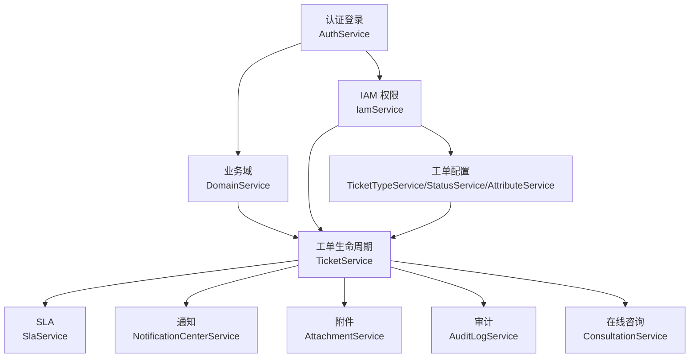
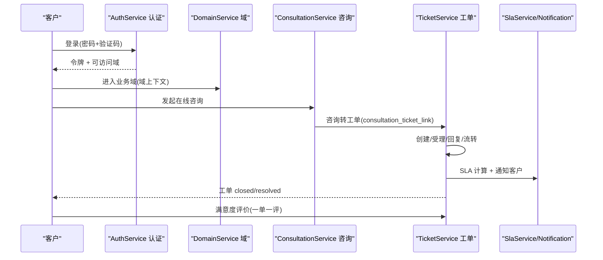
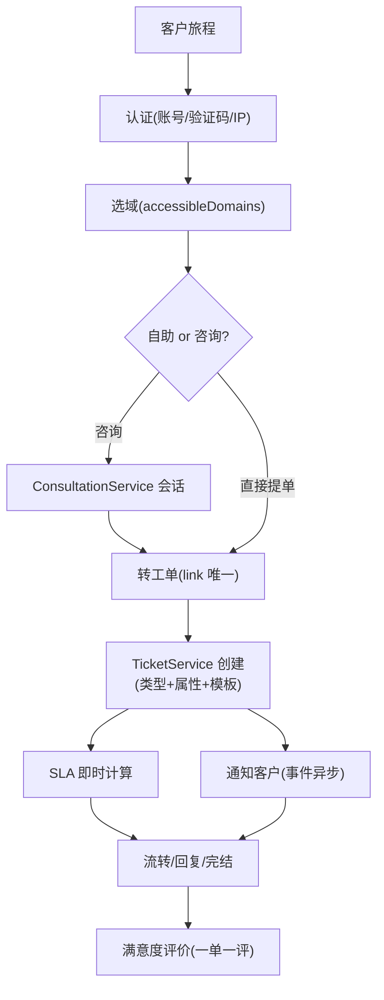
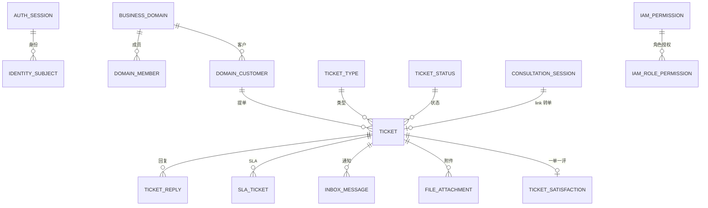
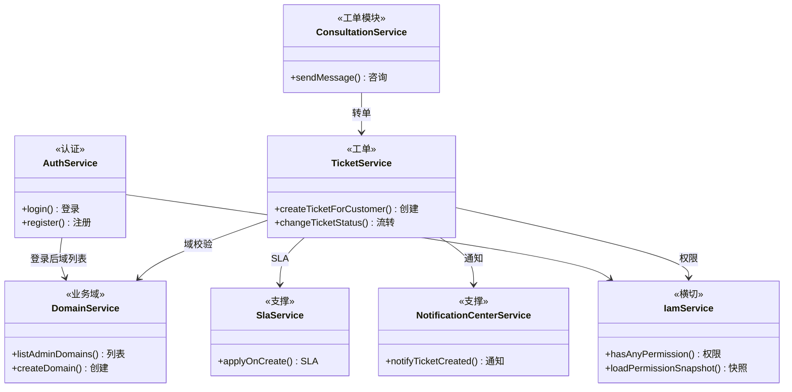

<cite>
- [UnionDesk/uniondesk-app/src/main/java/com/uniondesk/auth/core/AuthService.java](file://UnionDesk/uniondesk-app/src/main/java/com/uniondesk/auth/core/AuthService.java#L42-L106)
- [UnionDesk/uniondesk-app/src/main/java/com/uniondesk/auth/core/AuthService.java](file://UnionDesk/uniondesk-app/src/main/java/com/uniondesk/auth/core/AuthService.java#L108-L199)
- [UnionDesk/uniondesk-ticket/src/main/java/com/uniondesk/ticket/core/TicketService.java](file://UnionDesk/uniondesk-ticket/src/main/java/com/uniondesk/ticket/core/TicketService.java#L52-L77)
- [UnionDesk/uniondesk-ticket/src/main/java/com/uniondesk/ticket/core/TicketService.java](file://UnionDesk/uniondesk-ticket/src/main/java/com/uniondesk/ticket/core/TicketService.java#L124-L192)
- [UnionDesk/uniondesk-domain/src/main/java/com/uniondesk/domain/core/DomainService.java](file://UnionDesk/uniondesk-domain/src/main/java/com/uniondesk/domain/core/DomainService.java#L30-L55)
- [UnionDesk/uniondesk-iam/src/main/java/com/uniondesk/iam/core/IamService.java](file://UnionDesk/uniondesk-iam/src/main/java/com/uniondesk/iam/core/IamService.java#L34-L77)
- [UnionDesk/uniondesk-iam/src/main/java/com/uniondesk/iam/core/IamService.java](file://UnionDesk/uniondesk-iam/src/main/java/com/uniondesk/iam/core/IamService.java#L102-L146)
</cite>

# UnionDesk 核心功能总览

## 简介

本文档总览 UnionDesk 十大核心功能领域及其交互关系：认证登录、业务域、工单全生命周期、工单配置（类型/属性/状态/流转）、IAM 权限、SLA、通知、审计、附件、在线咨询。各领域由独立 Service 承载并通过「事件 + 注入」协作，本文提供功能地图与联动索引。

章节来源：
- [UnionDesk/uniondesk-app/src/main/java/com/uniondesk/auth/core/AuthService.java](file://UnionDesk/uniondesk-app/src/main/java/com/uniondesk/auth/core/AuthService.java#L42-L106)
- [UnionDesk/uniondesk-ticket/src/main/java/com/uniondesk/ticket/core/TicketService.java](file://UnionDesk/uniondesk-ticket/src/main/java/com/uniondesk/ticket/core/TicketService.java#L52-L77)

## 项目结构

十大功能领域与承载 Service 的映射：



图表来源：
- [UnionDesk/uniondesk-app/src/main/java/com/uniondesk/auth/core/AuthService.java](file://UnionDesk/uniondesk-app/src/main/java/com/uniondesk/auth/core/AuthService.java#L47-L65)
- [UnionDesk/uniondesk-ticket/src/main/java/com/uniondesk/ticket/core/TicketService.java](file://UnionDesk/uniondesk-ticket/src/main/java/com/uniondesk/ticket/core/TicketService.java#L57-L77)

## 核心组件

| 领域 | 核心 Service | 关键能力 |
| --- | --- | --- |
| 认证登录 | `AuthService`（19 依赖） | 密码/验证码登录、注册、密码找回、刷新、会话、可信 IP |
| 业务域 | `DomainService` + `DomainBootstrapService` | 域 CRUD、成员/角色/客户、引导（预置角色）、模板 |
| 工单生命周期 | `TicketService` | 创建/受理/回复/流转/完结/满意度 |
| 工单配置 | `TicketTypeService`/`TicketStatusService`/`TicketAttributeService`/`TicketTypeFlowService` | 类型、状态字典、属性、状态流转 |
| IAM 权限 | `IamService`（30s 缓存） | 权限快照、菜单、角色、授权合并 |
| SLA | `SlaService` | 规则匹配、时限计算、违约动作 |
| 通知 | `NotificationCenterService` | 模板、站内信、事件驱动 |
| 审计 | `AuditLogService` + `AuditLogWriter` | 操作审计、登录日志 |
| 附件 | `AttachmentService` | 上传/下载、策略、对象存储 |
| 在线咨询 | `ConsultationService` | 会话、消息、转工单 |

章节来源：
- [UnionDesk/uniondesk-app/src/main/java/com/uniondesk/auth/core/AuthService.java](file://UnionDesk/uniondesk-app/src/main/java/com/uniondesk/auth/core/AuthService.java#L47-L106)
- [UnionDesk/uniondesk-ticket/src/main/java/com/uniondesk/ticket/core/TicketService.java](file://UnionDesk/uniondesk-ticket/src/main/java/com/uniondesk/ticket/core/TicketService.java#L52-L77)
- [UnionDesk/uniondesk-domain/src/main/java/com/uniondesk/domain/core/DomainService.java](file://UnionDesk/uniondesk-domain/src/main/java/com/uniondesk/domain/core/DomainService.java#L30-L55)

## 架构总览

一次完整的客户服务旅程（登录 → 咨询 → 提单 → 处理 → 评价）跨领域协作：



图表来源：
- [UnionDesk/uniondesk-app/src/main/java/com/uniondesk/auth/core/AuthService.java](file://UnionDesk/uniondesk-app/src/main/java/com/uniondesk/auth/core/AuthService.java#L108-L199)
- [UnionDesk/uniondesk-ticket/src/main/java/com/uniondesk/ticket/core/TicketService.java](file://UnionDesk/uniondesk-ticket/src/main/java/com/uniondesk/ticket/core/TicketService.java#L124-L192)

## 详细分析

**领域交互的关键机制**：

1. **认证 → 域上下文**：登录后 `LoginResponse` 携带 `accessibleDomains`（可访问域列表，L96-97）；请求带域 ID 经 `@RequirePermission(domainIdParam)` 域级校验，`IamService.hasPermissionForDomains`（L59）按域过滤权限。
2. **业务域 → 工单隔离**：`DomainService` 管理租户生命周期；`TicketService` 所有操作强制 `business_domain_id` 过滤（域校验、仓储查询双条件），域即数据隔离边界。
3. **工单 → 支撑服务注入**：`TicketService` 直接注入 `SlaService`/`NotificationCenterService`/`AttachmentService`（L73-75）——SLA 即时计算、通知即时发送、附件即时关联，主链路同步协作。
4. **事件驱动旁路**：状态变更发布 `TicketStatusChangedEvent` → 通知/审计异步联动（AFTER_COMMIT + @Async），`IamService` 权限变更 `evictAuthorizationCache`（L491-495）主动失效缓存。
5. **工单配置 → 工单实例**：`TicketTypeService` 定义类型（scope platform/domain）→ 域类型溯源 `source_global_type_id`；`TicketAttributeService` 定义属性池 → `ticket_type_attribute` 槽位挂接 → 提单时 `custom_fields` JSON 落库。
6. **咨询 → 工单转化**：`ConsultationService` 会话消息；`consultation_ticket_link` 唯一键约束「一会单一单」，转化后客户继续走工单流程。
7. **权限 → 所有领域**：`IamService` 是横切能力——菜单/动作资源、权限快照（`PermissionSnapshotView`）、30 秒缓存；所有 Controller 经 `@RequirePermission` 声明权限码。



图表来源：
- [UnionDesk/uniondesk-iam/src/main/java/com/uniondesk/iam/core/IamService.java](file://UnionDesk/uniondesk-iam/src/main/java/com/uniondesk/iam/core/IamService.java#L34-L77)
- [UnionDesk/uniondesk-ticket/src/main/java/com/uniondesk/ticket/core/TicketService.java](file://UnionDesk/uniondesk-ticket/src/main/java/com/uniondesk/ticket/core/TicketService.java#L124-L192)

## 数据模型

十大领域核心实体关系：



图表来源：
- [UnionDesk/uniondesk-app/src/main/java/com/uniondesk/auth/core/AuthService.java](file://UnionDesk/uniondesk-app/src/main/java/com/uniondesk/auth/core/AuthService.java#L183-L199)
- [UnionDesk/uniondesk-ticket/src/main/java/com/uniondesk/ticket/core/TicketService.java](file://UnionDesk/uniondesk-ticket/src/main/java/com/uniondesk/ticket/core/TicketService.java#L157-L191)

## 依赖关系分析



图表来源：
- [UnionDesk/uniondesk-app/src/main/java/com/uniondesk/auth/core/AuthService.java](file://UnionDesk/uniondesk-app/src/main/java/com/uniondesk/auth/core/AuthService.java#L47-L65)
- [UnionDesk/uniondesk-ticket/src/main/java/com/uniondesk/ticket/core/TicketService.java](file://UnionDesk/uniondesk-ticket/src/main/java/com/uniondesk/ticket/core/TicketService.java#L57-L77)
- [UnionDesk/uniondesk-domain/src/main/java/com/uniondesk/domain/core/DomainService.java](file://UnionDesk/uniondesk-domain/src/main/java/com/uniondesk/domain/core/DomainService.java#L35-L55)

## 性能与安全考虑

- **性能**：`IamService` 30 秒缓存权限快照（L36/42）；工单列表复合索引（域+状态+优先级）；SLA 子查询「具体优先」；通知/审计异步不阻塞主链路。
- **安全**：认证四道防线（客户端/验证码/IP/方式）；域级权限校验（`@RequirePermission` domainIdParam）；工单域隔离强制；满意度一单一评唯一键；审计全记录。
- **一致性**：事务边界在 Service 用例级；事件 AFTER_COMMIT 保证主事务成功才联动；幂等（单号唯一、IfNotExists 引导）。
- **可观测性**：审计日志（操作者/动作/目标/request_id）+ 登录日志双轨。

章节来源：
- [UnionDesk/uniondesk-iam/src/main/java/com/uniondesk/iam/core/IamService.java](file://UnionDesk/uniondesk-iam/src/main/java/com/uniondesk/iam/core/IamService.java#L36-L42)
- [UnionDesk/uniondesk-app/src/main/java/com/uniondesk/auth/core/AuthService.java](file://UnionDesk/uniondesk-app/src/main/java/com/uniondesk/auth/core/AuthService.java#L108-L130)

## 故障排查指南

| 现象 | 原因 | 处理建议 |
| --- | --- | --- |
| 登录成功但无可用域 | `accessibleDomains` 为空（域成员/客户入域状态非 active） | 检查 `domain_member`/`domain_customer` 状态与绑定 |
| 工单无 SLA/通知 | `applyOnCreate`/`notifyTicketCreated` 未执行或配置缺失 | 检查规则/模板；核对事务内调用点 |
| 权限快照滞后 | `IamService` 30s 缓存未失效 | 授权变更后调 `evictAuthorizationCache` |
| 咨询转工单失败 | `consultation_ticket_link` 唯一键冲突（已转单） | 查询 link 记录；确认会话未重复转单 |
| 跨域越权风险 | 请求未带域上下文或权限码域校验缺失 | 检查 `@RequirePermission` domainIdParam 与拦截器路径 |

章节来源：
- [UnionDesk/uniondesk-iam/src/main/java/com/uniondesk/iam/core/IamService.java](file://UnionDesk/uniondesk-iam/src/main/java/com/uniondesk/iam/core/IamService.java#L491-L495)
- [UnionDesk/uniondesk-ticket/src/main/java/com/uniondesk/ticket/core/TicketService.java](file://UnionDesk/uniondesk-ticket/src/main/java/com/uniondesk/ticket/core/TicketService.java#L188-L191)

## 结论

UnionDesk 十大核心功能以「**认证入口、域为边界、工单为枢纽、权限横切、事件联动**」组织：认证登录建立身份与域上下文；业务域承载租户隔离；工单聚合类型/属性/状态/SLA/通知/附件/满意度；IAM 权限以快照+缓存横切所有领域；在线咨询可平滑转工单。理解功能地图与联动索引，即可按领域定位任何业务问题。

章节来源：
- [UnionDesk/uniondesk-app/src/main/java/com/uniondesk/auth/core/AuthService.java](file://UnionDesk/uniondesk-app/src/main/java/com/uniondesk/auth/core/AuthService.java#L42-L106)
- [UnionDesk/uniondesk-ticket/src/main/java/com/uniondesk/ticket/core/TicketService.java](file://UnionDesk/uniondesk-ticket/src/main/java/com/uniondesk/ticket/core/TicketService.java#L52-L192)

## 附录

十大领域验证命令：

```bash
# 1. 认证：登录
curl -X POST http://127.0.0.1:8080/api/v1/auth/login \
  -H "Content-Type: application/json" \
  -d '{"username":"admin","password":"***","clientCode":"uniondesk-admin"}'

# 2. 业务域：列表（携带令牌）
curl http://127.0.0.1:8080/api/v1/domains -H "Authorization: Bearer <token>"

# 3. 工单：创建 + 列表
curl -X POST http://127.0.0.1:8080/api/v1/domains/1/tickets \
  -H "Authorization: Bearer <token>" -H "Content-Type: application/json" \
  -d '{"ticket_type_id":5,"title":"测试","priority":"normal"}'

# 4. 权限：权限快照
curl http://127.0.0.1:8080/api/v1/me/permissions -H "Authorization: Bearer <token>"

# 5. 审计/通知：查询日志
curl "http://127.0.0.1:8080/api/v1/admin/audit-logs?page=1&page_size=20" -H "Authorization: Bearer <token>"
```

章节来源：
- [UnionDesk/uniondesk-app/src/main/java/com/uniondesk/auth/web/AuthController.java](file://UnionDesk/uniondesk-app/src/main/java/com/uniondesk/auth/web/AuthController.java#L54-L60)
- [UnionDesk/uniondesk-ticket/src/main/java/com/uniondesk/ticket/web/TicketController.java](file://UnionDesk/uniondesk-ticket/src/main/java/com/uniondesk/ticket/web/TicketController.java#L38-L45)
