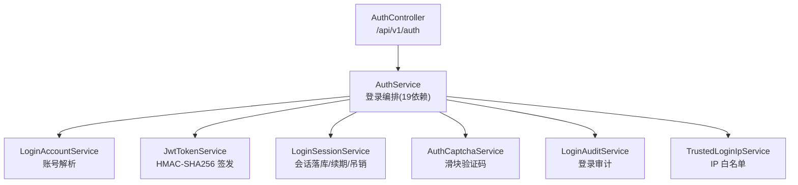
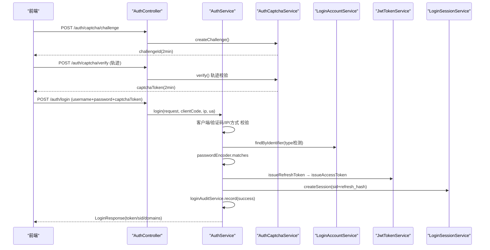
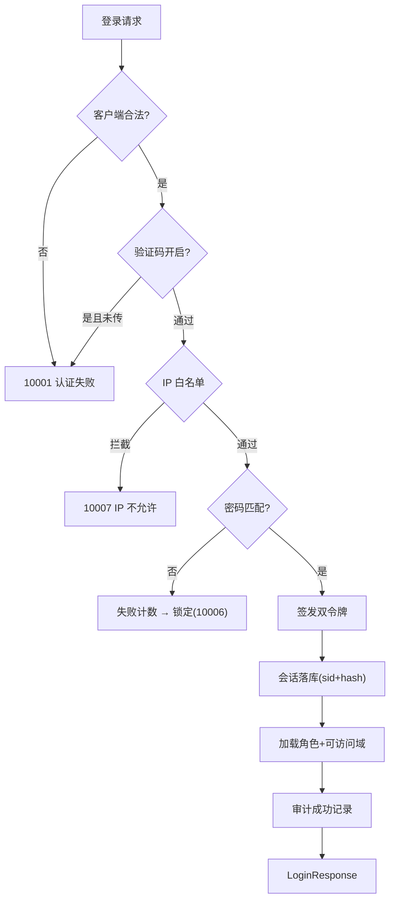
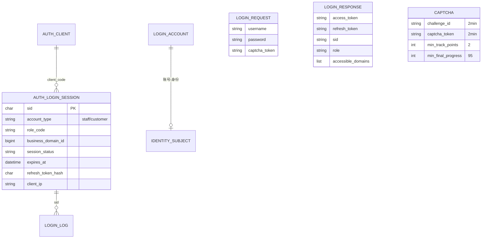
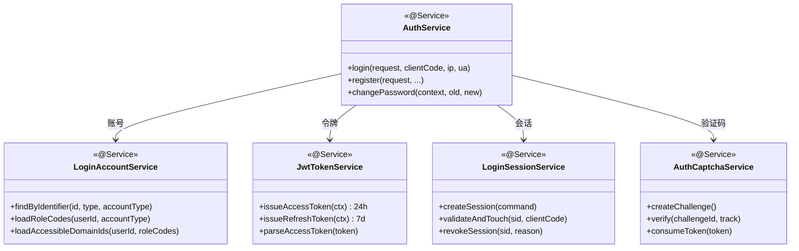

<cite>
- [UnionDesk/uniondesk-app/src/main/java/com/uniondesk/auth/web/AuthController.java](file://UnionDesk/uniondesk-app/src/main/java/com/uniondesk/auth/web/AuthController.java#L31-L96)
- [UnionDesk/uniondesk-app/src/main/java/com/uniondesk/auth/core/AuthService.java](file://UnionDesk/uniondesk-app/src/main/java/com/uniondesk/auth/core/AuthService.java#L42-L106)
- [UnionDesk/uniondesk-app/src/main/java/com/uniondesk/auth/core/AuthService.java](file://UnionDesk/uniondesk-app/src/main/java/com/uniondesk/auth/core/AuthService.java#L108-L199)
- [UnionDesk/uniondesk-iam/src/main/java/com/uniondesk/auth/core/LoginAccountService.java](file://UnionDesk/uniondesk-iam/src/main/java/com/uniondesk/auth/core/LoginAccountService.java#L13-L78)
- [UnionDesk/uniondesk-iam/src/main/java/com/uniondesk/auth/core/JwtTokenService.java](file://UnionDesk/uniondesk-iam/src/main/java/com/uniondesk/auth/core/JwtTokenService.java#L19-L80)
- [UnionDesk/uniondesk-iam/src/main/java/com/uniondesk/auth/core/LoginSessionService.java](file://UnionDesk/uniondesk-iam/src/main/java/com/uniondesk/auth/core/LoginSessionService.java#L13-L32)
- [UnionDesk/uniondesk-iam/src/main/java/com/uniondesk/auth/core/LoginSessionService.java](file://UnionDesk/uniondesk-iam/src/main/java/com/uniondesk/auth/core/LoginSessionService.java#L95-L111)
- [UnionDesk/uniondesk-iam/src/main/java/com/uniondesk/auth/core/AuthCaptchaService.java](file://UnionDesk/uniondesk-iam/src/main/java/com/uniondesk/auth/core/AuthCaptchaService.java#L14-L59)
</cite>

# UnionDesk 认证与登录机制

## 简介

本文档详解 UnionDesk 认证与登录机制：多账号类型登录（平台用户/域员工/客户）、密码登录 + 滑块验证码、JWT 双令牌签发（access/refresh）、登录会话落库（可吊销）、登录日志审计、可信 IP 白名单。认证是系统安全的入口，采用「JWT 无状态 + 会话可撤销」双轨设计。

章节来源：
- [UnionDesk/uniondesk-app/src/main/java/com/uniondesk/auth/web/AuthController.java](file://UnionDesk/uniondesk-app/src/main/java/com/uniondesk/auth/web/AuthController.java#L31-L96)
- [UnionDesk/uniondesk-app/src/main/java/com/uniondesk/auth/core/AuthService.java](file://UnionDesk/uniondesk-app/src/main/java/com/uniondesk/auth/core/AuthService.java#L108-L199)

## 项目结构

认证相关组件：



图表来源：
- [UnionDesk/uniondesk-app/src/main/java/com/uniondesk/auth/web/AuthController.java](file://UnionDesk/uniondesk-app/src/main/java/com/uniondesk/auth/web/AuthController.java#L31-L96)
- [UnionDesk/uniondesk-app/src/main/java/com/uniondesk/auth/core/AuthService.java](file://UnionDesk/uniondesk-app/src/main/java/com/uniondesk/auth/core/AuthService.java#L47-L65)

## 核心组件

**1. AuthController（/api/v1/auth）**：`captcha/challenge`、`captcha/verify`、`login`、`register`、`password/reset-request`、`password/reset`、`changePassword`、`refresh`、`me`（L42-96）。

**2. AuthService**：19 个依赖（L47-65），`login()` 完整编排（L108-199）：客户端校验 → 验证码 → IP 白名单 → 登录方式检查 → 账号解析 → 密码比对 → 令牌+会话 → 审计。

**3. LoginAccountService**：账号解析（L24-47）——按 `LoginIdentifierType`（手机/用户名/邮箱）动态列查询 staff/customer 表（`identifierColumn`）；`loadRoleCodes`（L49-61）合并域角色+平台角色并排序；`loadAccessibleDomainIds`（L63-78）——super_admin/platform_admin 返回全部域，客户只返回入域。

**4. JwtTokenService**：HMAC-SHA256 自实现 JWT（L22-44）；claims 含 `sub/uid/sid/role/cid/typ/bd(域)`（L66-80）；`accessTokenTtl` 默认 24h、`refreshTokenTtl` 默认 7d（配置注入 L35-38）；access/refresh 分型签发。

**5. LoginSessionService**：`createSession(CreateSessionCommand)`（L32）、`validateAndTouch(sid, clientCode)`（L95-99）滑动续期、`revokeSession(sid, reason)`（L103）、`revokeSessionsByUser`（L107）、密码重置令牌（L53/70）。

**6. AuthCaptchaService**：滑块验证码——`createChallenge`（2 分钟 challenge，L32-37）、`verify`（轨迹校验：点数≥2、时长≥100ms、平均速度≤5、进度≥95%，L39-48）、`consumeToken`（一次性消费，L50-59）。

**7. LoginAuditService + TrustedLoginIpService**：登录成功/失败审计；IP 白名单拦截（`AUTH_IP_NOT_ALLOWED`）。

章节来源：
- [UnionDesk/uniondesk-app/src/main/java/com/uniondesk/auth/core/AuthService.java](file://UnionDesk/uniondesk-app/src/main/java/com/uniondesk/auth/core/AuthService.java#L47-L106)
- [UnionDesk/uniondesk-iam/src/main/java/com/uniondesk/auth/core/LoginAccountService.java](file://UnionDesk/uniondesk-iam/src/main/java/com/uniondesk/auth/core/LoginAccountService.java#L24-L78)
- [UnionDesk/uniondesk-iam/src/main/java/com/uniondesk/auth/core/JwtTokenService.java](file://UnionDesk/uniondesk-iam/src/main/java/com/uniondesk/auth/core/JwtTokenService.java#L33-L80)
- [UnionDesk/uniondesk-iam/src/main/java/com/uniondesk/auth/core/AuthCaptchaService.java](file://UnionDesk/uniondesk-iam/src/main/java/com/uniondesk/auth/core/AuthCaptchaService.java#L32-L59)

## 架构总览

带验证码的完整登录时序：



图表来源：
- [UnionDesk/uniondesk-app/src/main/java/com/uniondesk/auth/web/AuthController.java](file://UnionDesk/uniondesk-app/src/main/java/com/uniondesk/auth/web/AuthController.java#L42-L60)
- [UnionDesk/uniondesk-app/src/main/java/com/uniondesk/auth/core/AuthService.java](file://UnionDesk/uniondesk-app/src/main/java/com/uniondesk/auth/core/AuthService.java#L108-L199)

## 详细分析

**认证机制设计要点**：

1. **多账号类型统一登录**：`LoginAccountService.findByIdentifier` 按 `LoginIdentifierType.detect`（L118）决定查询列与表（staff/customer）；`LoginAccountPo` 联合投影承载统一账号视图（username/mobile/passwordHash/accountType/employmentStatus）。
2. **前置防线顺序**：客户端合法（`auth_client.status=1`）→ 验证码（配置开启时，L120-125）→ IP 白名单（非 customer 门户，L127-129）→ 标识类型/密码登录开关（L130）——逐层拦截，失败各有专属错误码（10001/10003/10007）。
3. **密码安全**：BCrypt（`PasswordEncoder`）比对；失败审计计数（L131）触发锁定策略（`AUTH_ACCOUNT_LOCKED 10006`）。
4. **双令牌 + 会话双轨**：refresh 令牌（7d）用于 `refresh` 端点换新；会话表存 `refresh_token_hash`（哈希）与过期时间；`validateAndTouch` 每次请求续期（滑动窗口）；吊销（登出/强制下线）直接改 `session_status`——JWT 无状态扩展 + 会话可撤销管控。
5. **角色与域加载**：`loadRoleCodes` 合并域角色（`findStaffDomainRoleCodes`）+ 平台角色（`findStaffPlatformRoleCodes`）；`loadAccessibleDomainIds` 特权角色（super_admin/platform_admin）全量域，客户按入域；`LoginResponse` 携带 `accessibleDomains + defaultBusinessDomainId`（L96-98）供前端默认域。
6. **验证码防机器**：challenge/verify 两段式 + 轨迹规则（点数/时长/速度/进度四条件，L39-48）；token 一次性消费（L50-59）防重放。
7. **审计闭环**：登录成功/失败/会话事件全量记录（`LoginAuditService`），含 IP/UA/sid——异常登录可追溯。



图表来源：
- [UnionDesk/uniondesk-app/src/main/java/com/uniondesk/auth/core/AuthService.java](file://UnionDesk/uniondesk-app/src/main/java/com/uniondesk/auth/core/AuthService.java#L108-L199)
- [UnionDesk/uniondesk-iam/src/main/java/com/uniondesk/auth/core/LoginAccountService.java](file://UnionDesk/uniondesk-iam/src/main/java/com/uniondesk/auth/core/LoginAccountService.java#L49-L78)

## 数据模型

认证相关数据：



图表来源：
- [UnionDesk/uniondesk-iam/src/main/java/com/uniondesk/auth/core/JwtTokenService.java](file://UnionDesk/uniondesk-iam/src/main/java/com/uniondesk/auth/core/JwtTokenService.java#L66-L80)（claims）
- [UnionDesk/uniondesk-iam/src/main/java/com/uniondesk/auth/core/AuthCaptchaService.java](file://UnionDesk/uniondesk-iam/src/main/java/com/uniondesk/auth/core/AuthCaptchaService.java#L17-L22)（验证码规则）

## 依赖关系分析



图表来源：
- [UnionDesk/uniondesk-app/src/main/java/com/uniondesk/auth/core/AuthService.java](file://UnionDesk/uniondesk-app/src/main/java/com/uniondesk/auth/core/AuthService.java#L47-L106)
- [UnionDesk/uniondesk-iam/src/main/java/com/uniondesk/auth/core/LoginAccountService.java](file://UnionDesk/uniondesk-iam/src/main/java/com/uniondesk/auth/core/LoginAccountService.java#L13-L22)

## 性能与安全考虑

- **性能**：会话 `validateAndTouch` 轻量滑动续期；JWT 解析免查库（无状态）；`LoginResponse` 一次返回完整登录态减少往返。
- **安全**：BCrypt 密码哈希；refresh 令牌哈希存储（库泄露不可逆）；验证码一次性消费防重放；IP 白名单 + 失败锁定 + 登录审计三层防护；JWT secret 经配置注入（`uniondesk.security.jwt.secret`）不硬编码。
- **会话治理**：`revokeSessionsByUser` 支持权限变更/离职批量下线；`expires_at` 索引支撑过期清理。
- **兼容**：`@JsonAlias` 兼容登录字段旧名（identifier/login_name）；`AuthClientHeaders` 传递客户端标识。

章节来源：
- [UnionDesk/uniondesk-iam/src/main/java/com/uniondesk/auth/core/JwtTokenService.java](file://UnionDesk/uniondesk-iam/src/main/java/com/uniondesk/auth/core/JwtTokenService.java#L33-L44)
- [UnionDesk/uniondesk-iam/src/main/java/com/uniondesk/auth/core/LoginSessionService.java](file://UnionDesk/uniondesk-iam/src/main/java/com/uniondesk/auth/core/LoginSessionService.java#L95-L111)

## 故障排查指南

| 现象 | 原因 | 处理建议 |
| --- | --- | --- |
| 登录报 10003 验证码失败 | 滑块轨迹不满足规则或 token 已消费/过期 | 检查轨迹四条件；重新 challenge；确认 consumeToken 调用 |
| 登录 10001 但密码正确 | 客户端 status=0、标识类型未启用或白名单拦截 | 检查 `auth_client`、`auth_login_config`、IP 白名单 |
| 登录后立即 401 | 会话未落库或 `validateAndTouch` 失败 | 检查 `createSession` 与 refresh 链路；核对 clientCode |
| 强制下线不生效 | `revokeSessionsByUser` 未调用或会话已过期 | 检查吊销调用点；确认 session_status 变更 |
| 令牌解析失败 | secret 变更（环境不一致）或 token 过期 | 核对 JWT secret 配置；检查 exp claims |

章节来源：
- [UnionDesk/uniondesk-iam/src/main/java/com/uniondesk/auth/core/AuthCaptchaService.java](file://UnionDesk/uniondesk-iam/src/main/java/com/uniondesk/auth/core/AuthCaptchaService.java#L50-L59)
- [UnionDesk/uniondesk-iam/src/main/java/com/uniondesk/auth/core/JwtTokenService.java](file://UnionDesk/uniondesk-iam/src/main/java/com/uniondesk/auth/core/JwtTokenService.java#L54-L60)

## 结论

认证与登录机制以「**防线前置、双令牌双轨、会话可撤销、审计闭环**」为核心：滑块验证码 + IP 白名单 + 客户端校验在前，BCrypt 密码比对，JWT access/refresh 双令牌 + 会话表（refresh 哈希 + 滑动续期 + 吊销）在后，登录审计全程记录。多账号类型（平台/员工/客户）经 `LoginAccountService` 统一投影解析。该机制在无状态扩展性与服务端管控之间取得平衡，是系统安全的第一道闸门。

章节来源：
- [UnionDesk/uniondesk-app/src/main/java/com/uniondesk/auth/core/AuthService.java](file://UnionDesk/uniondesk-app/src/main/java/com/uniondesk/auth/core/AuthService.java#L108-L199)
- [UnionDesk/uniondesk-iam/src/main/java/com/uniondesk/auth/core/LoginAccountService.java](file://UnionDesk/uniondesk-iam/src/main/java/com/uniondesk/auth/core/LoginAccountService.java#L24-L78)

## 附录

登录接口示例：

```bash
# 1. 获取滑块验证码 challenge
curl -X POST http://127.0.0.1:8080/api/v1/auth/captcha/challenge

# 2. 验证滑块轨迹（得到 captchaToken）
curl -X POST http://127.0.0.1:8080/api/v1/auth/captcha/verify \
  -H "Content-Type: application/json" \
  -d '{"challengeId":"xxx","track":[{"x":10,"y":5,"t":120},{"x":80,"y":8,"t":900}]}'

# 3. 登录
curl -X POST http://127.0.0.1:8080/api/v1/auth/login \
  -H "Content-Type: application/json" \
  -d '{"username":"admin","password":"***","captchaToken":"xxx","clientCode":"uniondesk-admin"}'

# 4. 刷新令牌
curl -X POST http://127.0.0.1:8080/api/v1/auth/refresh \
  -H "Content-Type: application/json" \
  -d '{"refreshToken":"xxx"}'
```

登录响应结构（关键字段）：

```json
{
  "accessToken": "eyJ...",
  "refreshToken": "eyJ...",
  "sid": "6f1e...",
  "role": "platform_admin",
  "clientCode": "uniondesk-admin",
  "expiresInSeconds": 86400,
  "accessibleDomains": [{"id": 1, "code": "demo", "name": "演示域"}],
  "defaultBusinessDomainId": 1
}
```

章节来源：
- [UnionDesk/uniondesk-app/src/main/java/com/uniondesk/auth/web/AuthController.java](file://UnionDesk/uniondesk-app/src/main/java/com/uniondesk/auth/web/AuthController.java#L42-L60)
- [UnionDesk/uniondesk-app/src/main/java/com/uniondesk/auth/core/AuthService.java](file://UnionDesk/uniondesk-app/src/main/java/com/uniondesk/auth/core/AuthService.java#L196-L218)
