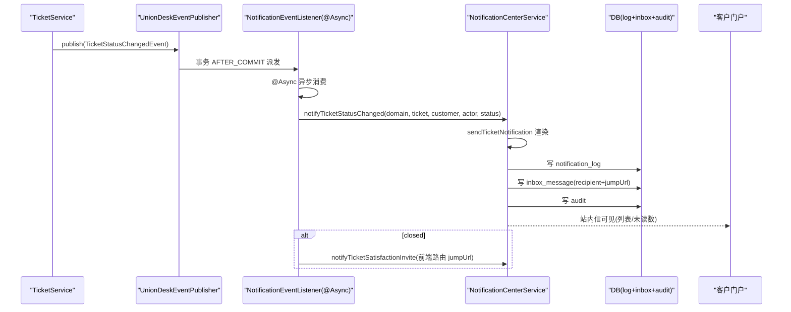
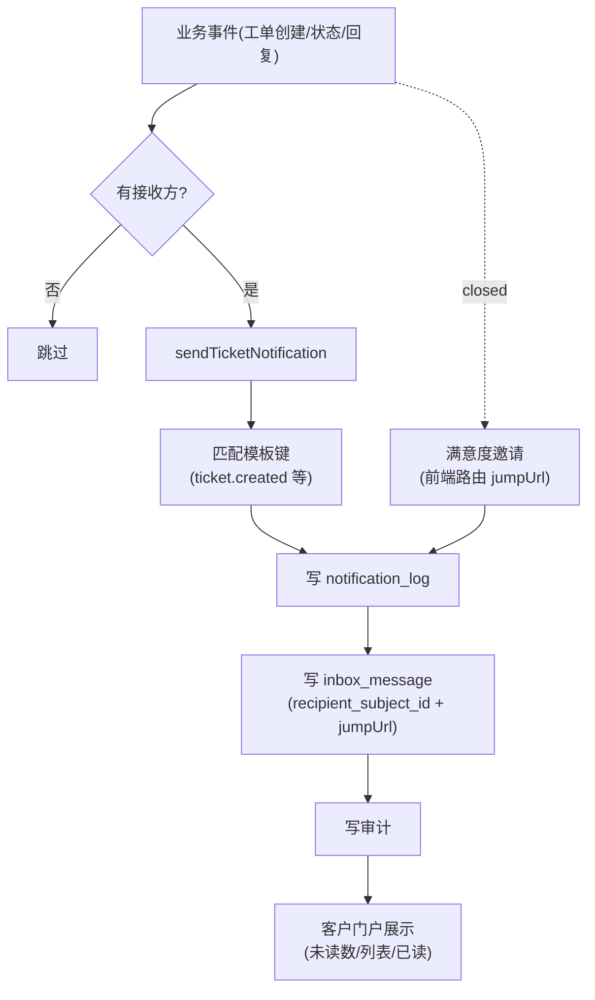
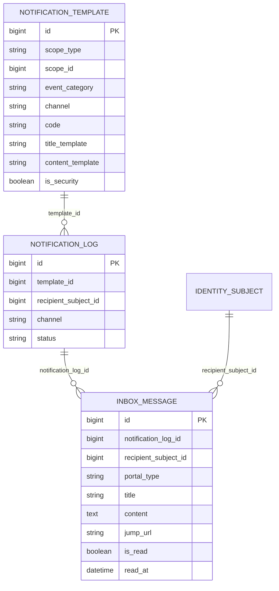
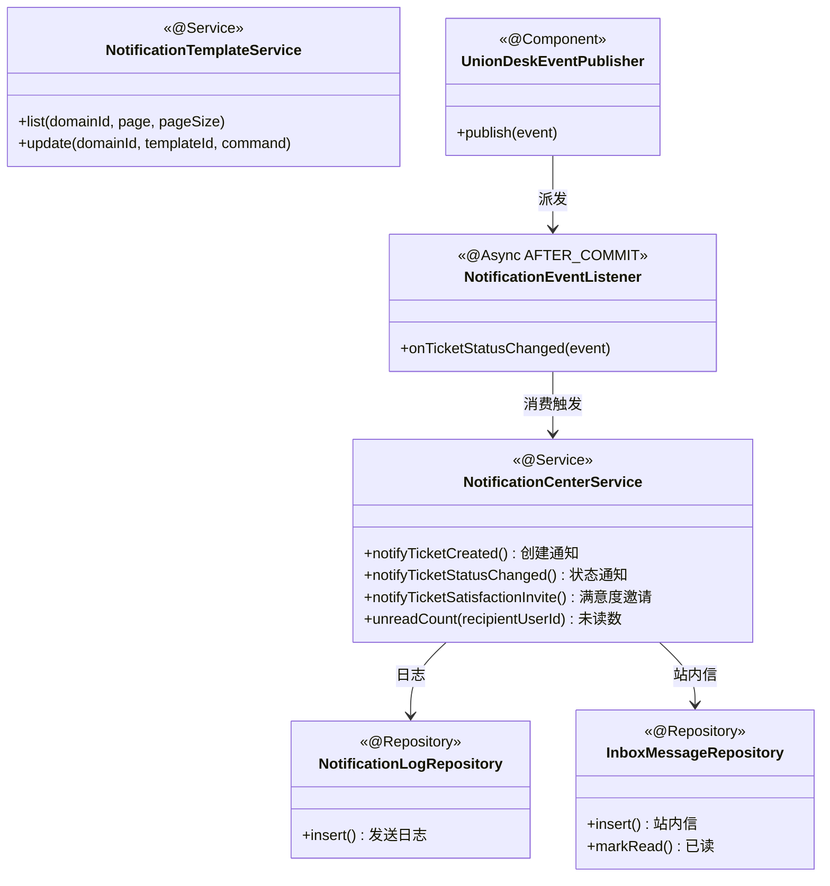

<cite>
- [UnionDesk/uniondesk-support/src/main/java/com/uniondesk/notification/core/NotificationCenterService.java](file://UnionDesk/uniondesk-support/src/main/java/com/uniondesk/notification/core/NotificationCenterService.java#L21-L46)
- [UnionDesk/uniondesk-support/src/main/java/com/uniondesk/notification/core/NotificationCenterService.java](file://UnionDesk/uniondesk-support/src/main/java/com/uniondesk/notification/core/NotificationCenterService.java#L48-L113)
- [UnionDesk/uniondesk-support/src/main/java/com/uniondesk/notification/core/NotificationCenterService.java](file://UnionDesk/uniondesk-support/src/main/java/com/uniondesk/notification/core/NotificationCenterService.java#L115-L130)
- [UnionDesk/uniondesk-support/src/main/java/com/uniondesk/notification/core/NotificationTemplateService.java](file://UnionDesk/uniondesk-support/src/main/java/com/uniondesk/notification/core/NotificationTemplateService.java#L13-L29)
- [UnionDesk/uniondesk-support/src/main/java/com/uniondesk/notification/event/NotificationEventListener.java](file://UnionDesk/uniondesk-support/src/main/java/com/uniondesk/notification/event/NotificationEventListener.java#L10-L38)
- [UnionDesk/uniondesk-support/src/main/java/com/uniondesk/notification/entity/InboxMessagePo.java](file://UnionDesk/uniondesk-support/src/main/java/com/uniondesk/notification/entity/InboxMessagePo.java#L5-L24)
- [UnionDesk/uniondesk-support/src/main/java/com/uniondesk/notification/entity/NotificationTemplatePo.java](file://UnionDesk/uniondesk-support/src/main/java/com/uniondesk/notification/entity/NotificationTemplatePo.java#L5-L19)
- [UnionDesk/uniondesk-common/src/main/java/com/uniondesk/common/event/UnionDeskEventPublisher.java](file://UnionDesk/uniondesk-common/src/main/java/com/uniondesk/common/event/UnionDeskEventPublisher.java#L15-L17)
</cite>

# UnionDesk 通知中心

## 简介

本文档详解通知中心：通知模板（`NotificationTemplateService` 模板管理）、消息发送与站内信（`NotificationCenterService` 场景化通知 + `inbox_message` 站内信 + `notification_log` 日志）、事件驱动（`NotificationEventListener` AFTER_COMMIT + @Async 消费）。通知是工单状态变更触达客户的旁路能力，全链路可追溯。

章节来源：
- [UnionDesk/uniondesk-support/src/main/java/com/uniondesk/notification/core/NotificationCenterService.java](file://UnionDesk/uniondesk-support/src/main/java/com/uniondesk/notification/core/NotificationCenterService.java#L21-L46)
- [UnionDesk/uniondesk-support/src/main/java/com/uniondesk/notification/event/NotificationEventListener.java](file://UnionDesk/uniondesk-support/src/main/java/com/uniondesk/notification/event/NotificationEventListener.java#L10-L38)

## 项目结构

通知中心组件：

```mermaid
graph TB
    NC["NotificationCenterService<br/>场景化通知"]
    NT["NotificationTemplateService 模板"]
    EV["NotificationEventListener 事件监听"]
    PUB["UnionDeskEventPublisher 发布"]
    LOG["notification_log 发送日志"]
    IN["inbox_message 站内信"]
    AUD["audit 审计"]
    NC --> LOG & IN & AUD
    NT --> NC : 模板渲染
    PUB --> EV : 事件派发
    EV --> NC : 消费触发
```

图表来源：
- [UnionDesk/uniondesk-support/src/main/java/com/uniondesk/notification/core/NotificationCenterService.java](file://UnionDesk/uniondesk-support/src/main/java/com/uniondesk/notification/core/NotificationCenterService.java#L31-L46)
- [UnionDesk/uniondesk-support/src/main/java/com/uniondesk/notification/event/NotificationEventListener.java](file://UnionDesk/uniondesk-support/src/main/java/com/uniondesk/notification/event/NotificationEventListener.java#L10-L21)

## 核心组件

**1. NotificationCenterService 场景化通知**：六个场景方法（L48-130）——`notifyTicketCreated`（L48-59，工单已创建）、`notifyTicketStatusChanged`（L61-77，状态更新）、`notifyTicketReply`（L79-95，新回复）、`notifyTicketMerged`（L97-113，工单合并）、`notifyTicketSatisfactionInvite`（L119-130，满意度邀请，jumpUrl 用前端路由）、`notifyCustomerRiskLogin`（L139，风险登录）；站内信收件箱 `unreadCount/listInboxMessages/markRead/markReadBatch`（L163-185）。

**2. NotificationTemplateService 模板**：`list`（L21-27，分页）、`update`（L28-43）、`load`（L44-70）——模板按 scope 隔离管理。

**3. NotificationEventListener 事件驱动**：`@Async @TransactionalEventListener(AFTER_COMMIT)`（L19-21）消费 `TicketStatusChangedEvent`——客户非空才通知（L22-24）；closed 额外发满意度邀请（L31-37）。

**4. 发送日志 + 站内信 + 审计三写**：每次通知写 `notification_log`（溯源）→ `inbox_message`（接收方 subject + jump_url）→ 审计（`AuditLogWriteRepository`）。

**5. 配置**：`uniondesk.notification.smtp-enabled`（L38）SMTP 开关（当前默认 false，站内信为主）。

章节来源：
- [UnionDesk/uniondesk-support/src/main/java/com/uniondesk/notification/core/NotificationCenterService.java](file://UnionDesk/uniondesk-support/src/main/java/com/uniondesk/notification/core/NotificationCenterService.java#L48-L130)
- [UnionDesk/uniondesk-support/src/main/java/com/uniondesk/notification/core/NotificationCenterService.java](file://UnionDesk/uniondesk-support/src/main/java/com/uniondesk/notification/core/NotificationCenterService.java#L163-L185)
- [UnionDesk/uniondesk-support/src/main/java/com/uniondesk/notification/core/NotificationTemplateService.java](file://UnionDesk/uniondesk-support/src/main/java/com/uniondesk/notification/core/NotificationTemplateService.java#L21-L45)

## 架构总览

工单状态变更 → 通知客户的完整链路：



图表来源：
- [UnionDesk/uniondesk-support/src/main/java/com/uniondesk/notification/event/NotificationEventListener.java](file://UnionDesk/uniondesk-support/src/main/java/com/uniondesk/notification/event/NotificationEventListener.java#L19-L38)
- [UnionDesk/uniondesk-support/src/main/java/com/uniondesk/notification/core/NotificationCenterService.java](file://UnionDesk/uniondesk-support/src/main/java/com/uniondesk/notification/core/NotificationCenterService.java#L61-L77)

## 详细分析

**通知机制设计要点**：

1. **场景方法收敛**：六类通知场景各一个方法（L48-130），统一走 `sendTicketNotification` 私有管道——参数（域/工单/接收方/操作者）+ 模板键（`ticket.created`/`ticket.status.changed`/`ticket.reply`/`ticket.merged`/`ticket.satisfaction_invite`）+ 文案 + jumpUrl。
2. **jumpUrl 双轨**：历史工单通知用 API 路径（L58），满意度邀请用前端路由（L117 注释明确区别）——通知跳转目标按场景区分。
3. **事件驱动异步**：`NotificationEventListener` AFTER_COMMIT + @Async（L19-21）——主事务提交成功才通知、异步不阻塞；客户为空跳过（L22-24）防御匿名场景；closed 触发满意度邀请（L31-37）。
4. **三写溯源**：通知日志（模板/接收方/状态）→ 站内信（接收方 subject + 已读状态）→ 审计（操作者/动作）——一条通知全链路可追溯。
5. **收件箱管理**：`unreadCount`（L163）未读数、`listInboxMessages`（L168-176）列表、`markRead/markReadBatch`（L177-185）已读——按 `recipient_subject_id` 隔离。
6. **模板可配置**：`NotificationTemplateService` 支持模板更新（L28-43）——文案/标题可运营调整（当前场景方法内嵌默认文案，模板表为扩展位）。



图表来源：
- [UnionDesk/uniondesk-support/src/main/java/com/uniondesk/notification/core/NotificationCenterService.java](file://UnionDesk/uniondesk-support/src/main/java/com/uniondesk/notification/core/NotificationCenterService.java#L48-L130)
- [UnionDesk/uniondesk-support/src/main/java/com/uniondesk/notification/event/NotificationEventListener.java](file://UnionDesk/uniondesk-support/src/main/java/com/uniondesk/notification/event/NotificationEventListener.java#L19-L38)

## 数据模型

通知相关实体：



图表来源：
- [UnionDesk/uniondesk-support/src/main/java/com/uniondesk/notification/entity/NotificationTemplatePo.java](file://UnionDesk/uniondesk-support/src/main/java/com/uniondesk/notification/entity/NotificationTemplatePo.java#L5-L19)
- [UnionDesk/uniondesk-support/src/main/java/com/uniondesk/notification/entity/InboxMessagePo.java](file://UnionDesk/uniondesk-support/src/main/java/com/uniondesk/notification/entity/InboxMessagePo.java#L5-L24)

## 依赖关系分析



图表来源：
- [UnionDesk/uniondesk-support/src/main/java/com/uniondesk/notification/core/NotificationCenterService.java](file://UnionDesk/uniondesk-support/src/main/java/com/uniondesk/notification/core/NotificationCenterService.java#L31-L46)
- [UnionDesk/uniondesk-support/src/main/java/com/uniondesk/notification/event/NotificationEventListener.java](file://UnionDesk/uniondesk-support/src/main/java/com/uniondesk/notification/event/NotificationEventListener.java#L13-L21)
- [UnionDesk/uniondesk-common/src/main/java/com/uniondesk/common/event/UnionDeskEventPublisher.java](file://UnionDesk/uniondesk-common/src/main/java/com/uniondesk/common/event/UnionDeskEventPublisher.java#L15-L17)

## 性能与安全考虑

- **性能**：事件异步消费（@Async）不阻塞工单主链路；未读数/列表按 `recipient_subject_id` 索引（`idx_inbox_recipient_read`）；批量已读单次更新。
- **安全**：站内信按接收方 subject 隔离（列表/已读均校验归属）；通知日志全量留痕；`is_security` 模板标记安全类通知不可退订。
- **一致性**：AFTER_COMMIT 保证「主事务成功才通知」；三写（日志+站内信+审计）同事务（@Transactional L48）；jumpUrl 按场景区分防错误跳转。
- **可观测**：`notification_log` 状态（成功/失败）供排查；审计记录操作者与动作。

章节来源：
- [UnionDesk/uniondesk-support/src/main/java/com/uniondesk/notification/core/NotificationCenterService.java](file://UnionDesk/uniondesk-support/src/main/java/com/uniondesk/notification/core/NotificationCenterService.java#L163-L185)
- [UnionDesk/uniondesk-support/src/main/java/com/uniondesk/notification/event/NotificationEventListener.java](file://UnionDesk/uniondesk-support/src/main/java/com/uniondesk/notification/event/NotificationEventListener.java#L19-L38)

## 故障排查指南

| 现象 | 原因 | 处理建议 |
| --- | --- | --- |
| 客户收不到通知 | 事件未发布/监听失败/接收方为空 | 检查 `notification_log`；核对事件发布点与 `@Async` |
| 站内信未读数不对 | `markRead` 未调用或接收方 ID 不匹配 | 检查已读接口调用；核对 `recipient_subject_id` |
| 满意度邀请未发 | 状态非 closed 或监听器跳过 | 检查 `EVALUABLE_STATUSES` 与监听器分支 |
| 通知跳转 404 | jumpUrl 用错（API 路径 vs 前端路由） | 对照场景方法 jumpUrl；满意度邀请用前端路由 |
| 异步不触发 | `@EnableAsync` 缺失或事件在事务外发布 | 确认 `AsyncConfiguration`；检查事务边界 |

章节来源：
- [UnionDesk/uniondesk-support/src/main/java/com/uniondesk/notification/core/NotificationCenterService.java](file://UnionDesk/uniondesk-support/src/main/java/com/uniondesk/notification/core/NotificationCenterService.java#L115-L130)
- [UnionDesk/uniondesk-support/src/main/java/com/uniondesk/notification/event/NotificationEventListener.java](file://UnionDesk/uniondesk-support/src/main/java/com/uniondesk/notification/event/NotificationEventListener.java#L19-L38)

## 结论

通知中心以「**场景收敛、事件异步、三写溯源、收件箱隔离**」为核心：`NotificationCenterService` 用六个场景方法收敛通知管道（模板键+文案+jumpUrl），`NotificationEventListener` AFTER_COMMIT + @Async 消费工单事件，每次通知同步写日志+站内信+审计，收件箱按接收方隔离并支持已读管理。通知与工单主链路解耦，客户触达全程可追溯。

章节来源：
- [UnionDesk/uniondesk-support/src/main/java/com/uniondesk/notification/core/NotificationCenterService.java](file://UnionDesk/uniondesk-support/src/main/java/com/uniondesk/notification/core/NotificationCenterService.java#L48-L185)
- [UnionDesk/uniondesk-support/src/main/java/com/uniondesk/notification/event/NotificationEventListener.java](file://UnionDesk/uniondesk-support/src/main/java/com/uniondesk/notification/event/NotificationEventListener.java#L10-L38)

## 附录

通知验证命令：

```bash
# 1. 站内信未读数
curl http://127.0.0.1:8080/api/v1/inbox/unread-count -H "Authorization: Bearer <token>"

# 2. 站内信列表
curl "http://127.0.0.1:8080/api/v1/inbox?limit=20" -H "Authorization: Bearer <token>"

# 3. 标记已读
curl -X POST http://127.0.0.1:8080/api/v1/inbox/1001/read -H "Authorization: Bearer <token>"

# 4. 通知日志排查
mysql -u uniondesk_app -p -h 127.0.0.1 -P 30306 uniondesk \
  -e "SELECT id, template_id, recipient_subject_id, channel, status, created_at FROM notification_log ORDER BY id DESC LIMIT 10;"
```

章节来源：
- [UnionDesk/uniondesk-support/src/main/java/com/uniondesk/notification/core/NotificationCenterService.java](file://UnionDesk/uniondesk-support/src/main/java/com/uniondesk/notification/core/NotificationCenterService.java#L163-L185)
- [UnionDesk/uniondesk-support/src/main/java/com/uniondesk/notification/entity/InboxMessagePo.java](file://UnionDesk/uniondesk-support/src/main/java/com/uniondesk/notification/entity/InboxMessagePo.java#L5-L24)
