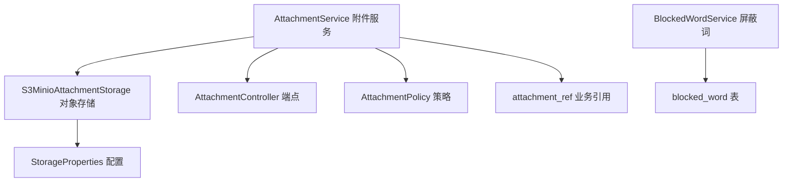
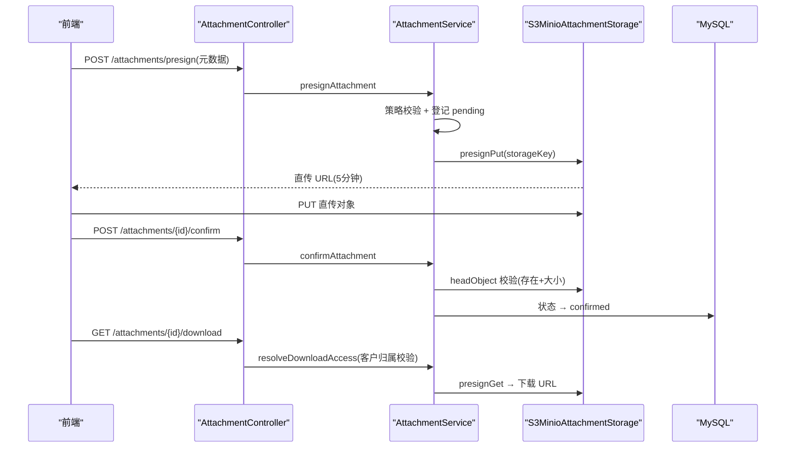
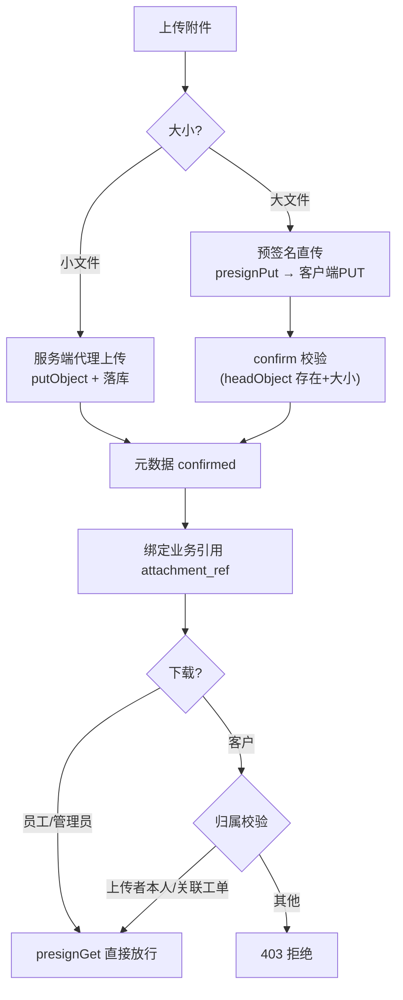
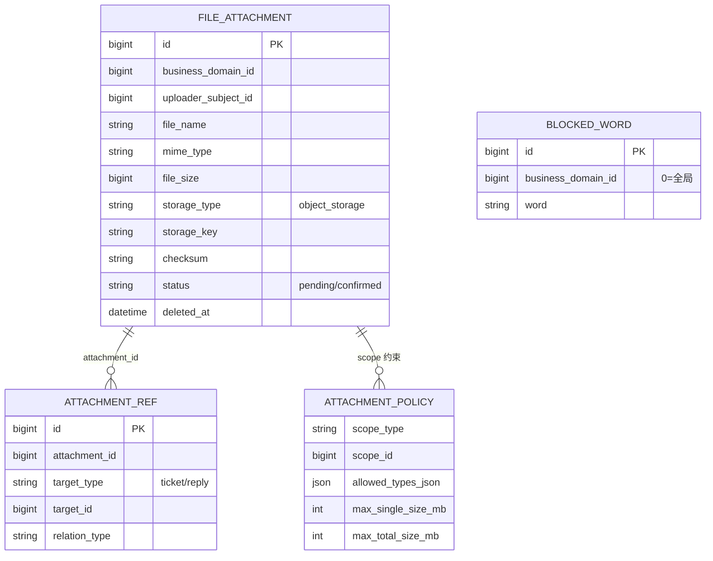
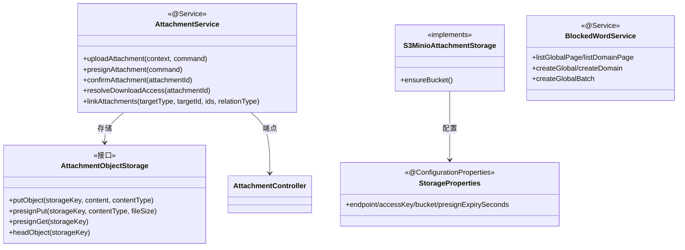

<cite>
- [UnionDesk/uniondesk-support/src/main/java/com/uniondesk/attachment/core/AttachmentService.java](file://UnionDesk/uniondesk-support/src/main/java/com/uniondesk/attachment/core/AttachmentService.java#L30-L108)
- [UnionDesk/uniondesk-support/src/main/java/com/uniondesk/attachment/core/AttachmentService.java](file://UnionDesk/uniondesk-support/src/main/java/com/uniondesk/attachment/core/AttachmentService.java#L111-L178)
- [UnionDesk/uniondesk-support/src/main/java/com/uniondesk/attachment/storage/S3MinioAttachmentStorage.java](file://UnionDesk/uniondesk-support/src/main/java/com/uniondesk/attachment/storage/S3MinioAttachmentStorage.java#L24-L106)
- [UnionDesk/uniondesk-support/src/main/java/com/uniondesk/attachment/storage/StorageProperties.java](file://UnionDesk/uniondesk-support/src/main/java/com/uniondesk/attachment/storage/StorageProperties.java#L7-L14)
- [UnionDesk/uniondesk-support/src/main/java/com/uniondesk/attachment/web/AttachmentController.java](file://UnionDesk/uniondesk-support/src/main/java/com/uniondesk/attachment/web/AttachmentController.java#L22-L84)
- [UnionDesk/uniondesk-support/src/main/java/com/uniondesk/blockedword/core/BlockedWordService.java](file://UnionDesk/uniondesk-support/src/main/java/com/uniondesk/blockedword/core/BlockedWordService.java#L16-L66)
- [UnionDesk/uniondesk-support/src/main/java/com/uniondesk/attachment/entity/FileAttachmentPo.java](file://UnionDesk/uniondesk-support/src/main/java/com/uniondesk/attachment/entity/FileAttachmentPo.java#L5-L19)
- [UnionDesk/uniondesk-app/src/main/resources/db/migration/current/V202605200002__rebaseline_current_schema.sql](file://UnionDesk/uniondesk-app/src/main/resources/db/migration/current/V202605200002__rebaseline_current_schema.sql#L19-L30)
</cite>

# UnionDesk 附件与屏蔽词

## 简介

本文档详解附件存储与屏蔽词两大支撑能力：附件（`AttachmentService` 上传/预签名/确认/下载权限/业务引用 + `S3MinioAttachmentStorage` 对象存储集成 + `AttachmentPolicy` 策略）与屏蔽词（`BlockedWordService` 全局/域双维度的命中检测词库管理）。两者分别保障文件资产安全与内容合规。

章节来源：
- [UnionDesk/uniondesk-support/src/main/java/com/uniondesk/attachment/core/AttachmentService.java](file://UnionDesk/uniondesk-support/src/main/java/com/uniondesk/attachment/core/AttachmentService.java#L30-L108)
- [UnionDesk/uniondesk-support/src/main/java/com/uniondesk/blockedword/core/BlockedWordService.java](file://UnionDesk/uniondesk-support/src/main/java/com/uniondesk/blockedword/core/BlockedWordService.java#L16-L66)

## 项目结构

附件与屏蔽词组件：



图表来源：
- [UnionDesk/uniondesk-support/src/main/java/com/uniondesk/attachment/core/AttachmentService.java](file://UnionDesk/uniondesk-support/src/main/java/com/uniondesk/attachment/core/AttachmentService.java#L32-L58)
- [UnionDesk/uniondesk-support/src/main/java/com/uniondesk/attachment/storage/S3MinioAttachmentStorage.java](file://UnionDesk/uniondesk-support/src/main/java/com/uniondesk/attachment/storage/S3MinioAttachmentStorage.java#L24-L30)

## 核心组件

**1. AttachmentService 附件服务**：
- `uploadAttachment`（L59-109）：内容非空校验 → 策略加载校验（`loadPolicy` + `validateAttachment`）→ 上传者身份解析 → `putObject` 对象存储 → checksum 计算 → 元数据落库（confirmed/pending 更新）→ 业务引用绑定。
- `presignAttachment`（L111-134）：预签名直传——校验元数据/大小 → 登记 pending 记录 → `presignPut` 返回直传 URL（`StorageProperties.presignExpirySeconds`）。
- `confirmAttachment`（L136-151）：上传后确认——`headObject` 校验存在与大小 → 状态置 confirmed。
- `resolveDownloadAccess`（L153-162）：下载权限——客户角色校验归属（`requireCustomerOwnership` L164-173：上传者本人或已关联其工单）→ `presignGet`。
- `linkAttachments`（L175-181）：工单/业务引用绑定。

**2. S3MinioAttachmentStorage 对象存储**：`ensureBucket`（L55）、`putObject`（L65）、`presignPut`（L76）、`presignGet`（L92）、`headObject`（L106）——S3 兼容 API（MinIO）；`StorageProperties`（L7-14）配置 endpoint/accessKey/secretKey/bucket/region/presignExpirySeconds。

**3. AttachmentController 端点**：`POST /attachments/upload`（L31-33）、`POST /attachments/presign`（L63-65）、`POST /attachments/{attachment_id}/confirm`（L78）、`GET /attachments/{attachment_id}/download`（L82-84）。

**4. BlockedWordService 屏蔽词**：`listGlobalPage`（L28 全局分页）、`listDomainPage`（L32 域分页）、`createGlobal`（L38）、`createDomain`（L47）、`createGlobalBatch/createDomainBatch`（L56/61 批量）、`deleteGlobal`（L66）——全局/域双维度词库。

章节来源：
- [UnionDesk/uniondesk-support/src/main/java/com/uniondesk/attachment/core/AttachmentService.java](file://UnionDesk/uniondesk-support/src/main/java/com/uniondesk/attachment/core/AttachmentService.java#L59-L181)
- [UnionDesk/uniondesk-support/src/main/java/com/uniondesk/attachment/storage/S3MinioAttachmentStorage.java](file://UnionDesk/uniondesk-support/src/main/java/com/uniondesk/attachment/storage/S3MinioAttachmentStorage.java#L55-L106)
- [UnionDesk/uniondesk-support/src/main/java/com/uniondesk/blockedword/core/BlockedWordService.java](file://UnionDesk/uniondesk-support/src/main/java/com/uniondesk/blockedword/core/BlockedWordService.java#L28-L66)

## 架构总览

客户端直传（预签名）与下载的完整链路：



图表来源：
- [UnionDesk/uniondesk-support/src/main/java/com/uniondesk/attachment/core/AttachmentService.java](file://UnionDesk/uniondesk-support/src/main/java/com/uniondesk/attachment/core/AttachmentService.java#L111-L162)
- [UnionDesk/uniondesk-support/src/main/java/com/uniondesk/attachment/web/AttachmentController.java](file://UnionDesk/uniondesk-support/src/main/java/com/uniondesk/attachment/web/AttachmentController.java#L63-L84)

## 详细分析

**设计要点**：

1. **双通道上传**：小文件走 `uploadAttachment`（服务端代理上传，L59-109）；大文件走预签名直传（`presignAttachment` L111-134 + `confirmAttachment` L136-151）——客户端直传对象存储，服务端只登记元数据，减轻带宽压力。
2. **对象存储抽象**：`AttachmentObjectStorage` 接口 + `S3MinioAttachmentStorage` 实现（L24）——S3 兼容（MinIO 本地/云 S3 可切换）；`StorageProperties` 配置化（endpoint/凭据/bucket/presign 有效期 L7-14）。
3. **元数据与对象分离**：`file_attachment` 存元数据（fileName/mimeType/fileSize/storageKey/checksum/status），对象存 S3——软删除（deletedAt）+ 对象生命周期管理；checksum 校验完整性（L73）。
4. **下载权限归属校验**：`resolveDownloadAccess`（L153-162）——员工/管理员直接放行；客户角色必须「上传者本人或附件已关联其工单」（L164-173），防跨客户越权下载。
5. **策略约束**：`attachment_policy` 按 scope 限制允许类型（`allowed_types_json`）与大小（max_single/max_total，基线 DDL L19-30）——上传前校验（L64-65/114-115）。
6. **业务引用**：`attachment_ref` 记录「附件 ↔ 业务对象」（工单/回复，`linkAttachments` L175-181）——一文件多引用、引用可追溯。
7. **屏蔽词双维度**：`BlockedWordService` 全局 + 域双维度词库（L28-66）——内容检测时按域合并词库（详见内容合规调用方）；批量创建（L56/61）支持运营批量导入。



图表来源：
- [UnionDesk/uniondesk-support/src/main/java/com/uniondesk/attachment/core/AttachmentService.java](file://UnionDesk/uniondesk-support/src/main/java/com/uniondesk/attachment/core/AttachmentService.java#L59-L173)
- [UnionDesk/uniondesk-support/src/main/java/com/uniondesk/attachment/storage/S3MinioAttachmentStorage.java](file://UnionDesk/uniondesk-support/src/main/java/com/uniondesk/attachment/storage/S3MinioAttachmentStorage.java#L76-L106)

## 数据模型

附件与屏蔽词实体：



图表来源：
- [UnionDesk/uniondesk-support/src/main/java/com/uniondesk/attachment/entity/FileAttachmentPo.java](file://UnionDesk/uniondesk-support/src/main/java/com/uniondesk/attachment/entity/FileAttachmentPo.java#L5-L19)
- [UnionDesk/uniondesk-app/src/main/resources/db/migration/current/V202605200002__rebaseline_current_schema.sql](file://UnionDesk/uniondesk-app/src/main/resources/db/migration/current/V202605200002__rebaseline_current_schema.sql#L19-L30)（attachment_policy）

## 依赖关系分析



图表来源：
- [UnionDesk/uniondesk-support/src/main/java/com/uniondesk/attachment/core/AttachmentService.java](file://UnionDesk/uniondesk-support/src/main/java/com/uniondesk/attachment/core/AttachmentService.java#L44-L58)
- [UnionDesk/uniondesk-support/src/main/java/com/uniondesk/attachment/storage/S3MinioAttachmentStorage.java](file://UnionDesk/uniondesk-support/src/main/java/com/uniondesk/attachment/storage/S3MinioAttachmentStorage.java#L24-L30)
- [UnionDesk/uniondesk-support/src/main/java/com/uniondesk/attachment/storage/StorageProperties.java](file://UnionDesk/uniondesk-support/src/main/java/com/uniondesk/attachment/storage/StorageProperties.java#L7-L14)

## 性能与安全考虑

- **性能**：预签名直传卸载服务端带宽；对象存储海量扩展；`presignGet` 复用下载 URL（5 分钟有效期）减少服务端中转；分页列表按域索引。
- **安全**：策略限制类型/大小防恶意文件；客户下载归属校验防越权；checksum 完整性校验；S3 凭据配置化不硬编码；预签名 URL 短期有效防滥用。
- **一致性**：pending → confirmed 状态机（confirm 校验对象存在与大小）；`findLatestIdByStorageKey` 幂等回填；引用绑定事务内完成。
- **合规**：屏蔽词全局+域双维度词库支撑内容检测；批量导入效率与去重。

章节来源：
- [UnionDesk/uniondesk-support/src/main/java/com/uniondesk/attachment/core/AttachmentService.java](file://UnionDesk/uniondesk-support/src/main/java/com/uniondesk/attachment/core/AttachmentService.java#L136-L173)
- [UnionDesk/uniondesk-support/src/main/java/com/uniondesk/attachment/storage/StorageProperties.java](file://UnionDesk/uniondesk-support/src/main/java/com/uniondesk/attachment/storage/StorageProperties.java#L9-L14)

## 故障排查指南

| 现象 | 原因 | 处理建议 |
| --- | --- | --- |
| 上传被拒「策略不符」 | 类型/大小超出 `attachment_policy` | 检查 allowed_types_json 与大小上限；调整策略 |
| 确认失败「对象不存在」 | 预签名后未完成直传或 storageKey 不匹配 | 检查客户端 PUT 是否成功；核对 storageKey |
| 下载 403 | 客户非上传者且未关联其工单 | 检查 `attachment_ref` 绑定；核对上传者 subject |
| MinIO 连接失败 | endpoint/凭据配置错误或桶未建 | 检查 `StorageProperties`；调 `ensureBucket` |
| 屏蔽词批量导入部分失败 | 重复词或超长词 | 检查批量结果明细；去重后重试 |

章节来源：
- [UnionDesk/uniondesk-support/src/main/java/com/uniondesk/attachment/core/AttachmentService.java](file://UnionDesk/uniondesk-support/src/main/java/com/uniondesk/attachment/core/AttachmentService.java#L136-L151)
- [UnionDesk/uniondesk-support/src/main/java/com/uniondesk/attachment/core/AttachmentService.java](file://UnionDesk/uniondesk-support/src/main/java/com/uniondesk/attachment/core/AttachmentService.java#L164-L173)

## 结论

附件与屏蔽词以「**对象存储抽象、预签名直传、归属校验、词库双维度**」为核心：附件经 `AttachmentObjectStorage` 接口解耦 MinIO/S3，大文件预签名直传 + 确认校验，下载按角色归属校验防越权，策略约束类型与大小；屏蔽词全局/域双维度管理支撑内容合规。两者均为工单主链路的可靠支撑，文件资产与内容安全双保障。

章节来源：
- [UnionDesk/uniondesk-support/src/main/java/com/uniondesk/attachment/core/AttachmentService.java](file://UnionDesk/uniondesk-support/src/main/java/com/uniondesk/attachment/core/AttachmentService.java#L59-L181)
- [UnionDesk/uniondesk-support/src/main/java/com/uniondesk/blockedword/core/BlockedWordService.java](file://UnionDesk/uniondesk-support/src/main/java/com/uniondesk/blockedword/core/BlockedWordService.java#L16-L66)

## 附录

附件验证命令：

```bash
# 1. 预签名（获取直传 URL）
curl -X POST http://127.0.0.1:8080/api/v1/attachments/presign \
  -H "Authorization: Bearer <token>" -H "Content-Type: application/json" \
  -d '{"businessDomainId":1,"fileName":"report.pdf","mimeType":"application/pdf","fileSize":204800}'

# 2. 上传确认
curl -X POST http://127.0.0.1:8080/api/v1/attachments/1001/confirm \
  -H "Authorization: Bearer <token>"

# 3. 下载（返回 presignGet URL）
curl http://127.0.0.1:8080/api/v1/attachments/1001/download -H "Authorization: Bearer <token>"

# 4. 屏蔽词管理
curl -X POST http://127.0.0.1:8080/api/v1/domains/1/blocked-words \
  -H "Authorization: Bearer <token>" -H "Content-Type: application/json" \
  -d '{"words":["违禁词1","违禁词2"]}'
```

章节来源：
- [UnionDesk/uniondesk-support/src/main/java/com/uniondesk/attachment/web/AttachmentController.java](file://UnionDesk/uniondesk-support/src/main/java/com/uniondesk/attachment/web/AttachmentController.java#L31-L84)
- [UnionDesk/uniondesk-support/src/main/java/com/uniondesk/blockedword/core/BlockedWordService.java](file://UnionDesk/uniondesk-support/src/main/java/com/uniondesk/blockedword/core/BlockedWordService.java#L37-L66)
