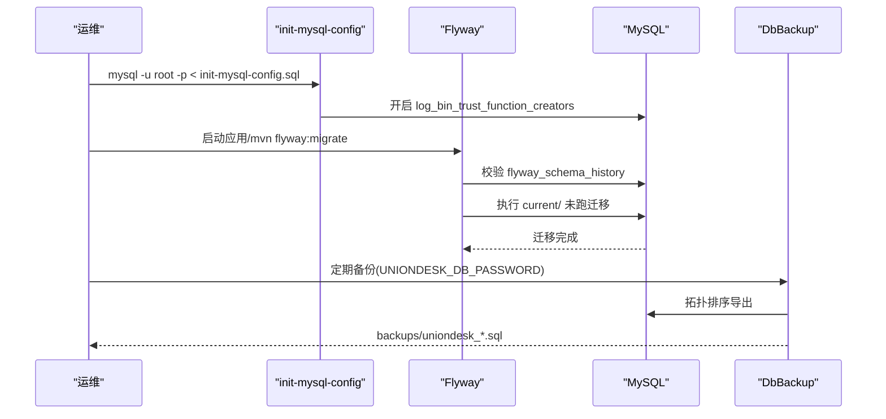
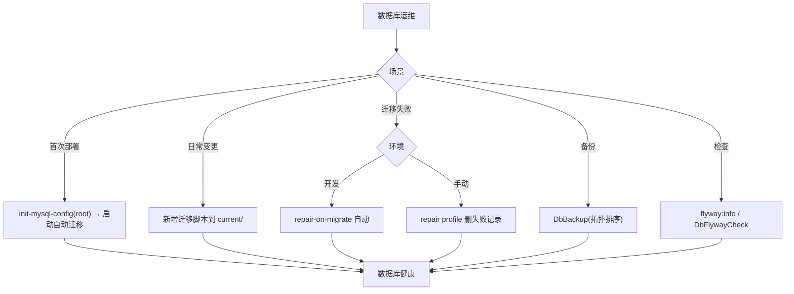
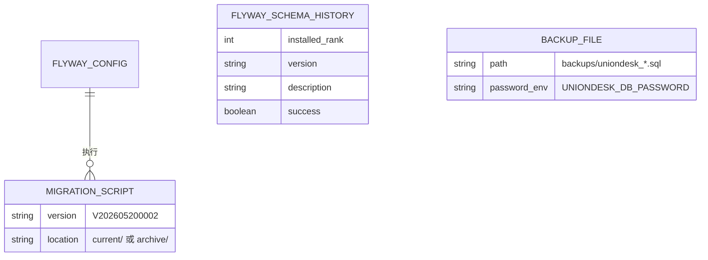
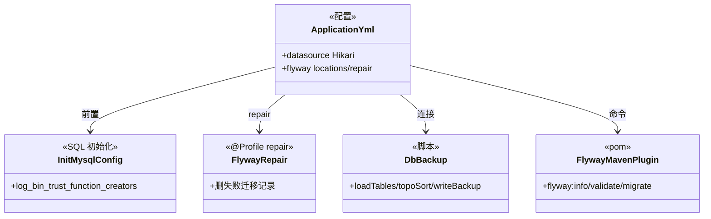

<cite>
- [UnionDesk/uniondesk-app/src/main/resources/application.yml](file://UnionDesk/uniondesk-app/src/main/resources/application.yml#L11-L35)
- [UnionDesk/uniondesk-app/src/main/resources/db/init-mysql-config.sql](file://UnionDesk/uniondesk-app/src/main/resources/db/init-mysql-config.sql#L1-L14)
- [UnionDesk/uniondesk-app/src/main/resources/db/migration/current/V202605200002__rebaseline_current_schema.sql](file://UnionDesk/uniondesk-app/src/main/resources/db/migration/current/V202605200002__rebaseline_current_schema.sql#L1-L4)
- [UnionDesk/uniondesk-app/src/main/java/com/uniondesk/config/FlywayRepair.java](file://UnionDesk/uniondesk-app/src/main/java/com/uniondesk/config/FlywayRepair.java#L19-L53)
- [UnionDesk/scripts/DbBackup.java](file://UnionDesk/scripts/DbBackup.java#L36-L59)
- [UnionDesk/uniondesk-app/pom.xml](file://UnionDesk/uniondesk-app/pom.xml#L76-L96)
- [UnionDesk/uniondesk-app/src/main/resources/db/init-mysql-config.sql](file://UnionDesk/uniondesk-app/src/main/resources/db/init-mysql-config.sql#L4-L14)
</cite>

# UnionDesk 数据库配置

## 简介

本文档详解数据库配置：MySQL 连接配置（`application.yml` 数据源 + Hikari 池）、Flyway 迁移配置（`archive/current` 双目录策略 + repair 修复）、`init-mysql-config.sql` 初始化脚本、备份工具（`DbBackup` 拓扑排序备份）、迁移检查（`DbFlywayCheck`）。数据库是部署链路的根基，配置与运维纪律在此收敛。

章节来源：
- [UnionDesk/uniondesk-app/src/main/resources/application.yml](file://UnionDesk/uniondesk-app/src/main/resources/application.yml#L11-L35)
- [UnionDesk/uniondesk-app/src/main/resources/db/init-mysql-config.sql](file://UnionDesk/uniondesk-app/src/main/resources/db/init-mysql-config.sql#L1-L14)

## 项目结构

数据库配置组件：

```mermaid
graph TB
    CFG["application.yml 数据源+Flyway"]
    INIT["init-mysql-config.sql 初始化"]
    MIG["db/migration 迁移"]
    CUR["current/ 当前生效"]
    ARC["archive/ 归档"]
    REPAIR["FlywayRepair 修复工具"]
    BK["DbBackup 备份工具"]
    CHK["DbFlywayCheck 检查"]
    CFG --> MIG
    MIG --> CUR & ARC
    INIT --> MIG : 前置
    REPAIR --> CUR
    BK --> CFG : 连接
    CHK --> CFG : 连接
```

图表来源：
- [UnionDesk/uniondesk-app/src/main/resources/application.yml](file://UnionDesk/uniondesk-app/src/main/resources/application.yml#L29-L35)
- [UnionDesk/uniondesk-app/src/main/resources/db/migration/current/V202605200002__rebaseline_current_schema.sql](file://UnionDesk/uniondesk-app/src/main/resources/db/migration/current/V202605200002__rebaseline_current_schema.sql#L1-L4)

## 核心组件

**1. 连接配置（application.yml）**：数据源 `jdbc:mysql://127.0.0.1:30306/uniondesk`（L12）+ Hikari 池（最大 20/最小 5、max-lifetime 30min < wait_timeout、SELECT 1 探活，L15-28）；Flyway `locations=classpath:db/migration/current`、`repair-on-migrate` 开发开启（L29-35）。

**2. 初始化脚本（init-mysql-config.sql）**：root 执行——开启 `log_bin_trust_function_creators`（L10-14）——Flyway 迁移中函数/触发器所需全局参数。

**3. 迁移双目录**：`current/` 当前生效（基线 + 增量，L1-4）；`archive/` 归档旧脚本——新环境只跑 current；基线 `V202605200002` 固化 65 张表。

**4. 修复工具（FlywayRepair）**：`repair` profile 启动——查 `flyway_schema_history` 失败记录（success=0）并删除（L37-50）——让 Flyway 重跑。

**5. 备份工具（DbBackup）**：`UNIONDESK_DB_PASSWORD` 环境变量取密码（L43-46）；JDBC 直连（L37-39/53）；`loadTables` + `topoSort`（外键拓扑排序，L54-55）保证备份顺序；输出 `backups/uniondesk_时间戳.sql`（L47-50）——结构+数据全量备份。

**6. Maven 插件（pom）**：flyway-maven-plugin（L76-96）——`flyway:info/validate/migrate` 命令支持；`cleanDisabled=false` 受控环境可用。

章节来源：
- [UnionDesk/uniondesk-app/src/main/resources/application.yml](file://UnionDesk/uniondesk-app/src/main/resources/application.yml#L11-L35)
- [UnionDesk/scripts/DbBackup.java](file://UnionDesk/scripts/DbBackup.java#L36-L59)
- [UnionDesk/uniondesk-app/pom.xml](file://UnionDesk/uniondesk-app/pom.xml#L76-L96)

## 架构总览

数据库初始化到运维的完整链路：



图表来源：
- [UnionDesk/uniondesk-app/src/main/resources/db/init-mysql-config.sql](file://UnionDesk/uniondesk-app/src/main/resources/db/init-mysql-config.sql#L4-L14)
- [UnionDesk/scripts/DbBackup.java](file://UnionDesk/scripts/DbBackup.java#L42-L59)
- [UnionDesk/uniondesk-app/src/main/resources/application.yml](file://UnionDesk/uniondesk-app/src/main/resources/application.yml#L29-L35)

## 详细分析

**数据库配置设计要点**：

1. **迁移双目录策略**：`current/` 是唯一执行源（application.yml L32 + pom L85-87）；`archive/` 只读参考——新环境从基线 + 增量重建，旧脚本不执行。
2. **初始化前置**：`init-mysql-config.sql` 必须 root 执行（L4-8）——Flyway 需要函数/触发器权限；不初始化则迁移报权限错。
3. **连接池语义调优**：`max-lifetime=1800000ms`（30min）< MySQL `wait_timeout`（8h）（L20 注释）——防陈旧连接；`connection-test-query=SELECT 1` 兜底（L26）。
4. **修复分层**：开发 `repair-on-migrate` 自动修复（L33-35 注释警告生产勿用）；`repair` profile 手动删失败记录（FlywayRepair L37-50）；生产严格校验。
5. **备份拓扑排序**：`DbBackup` 按外键依赖拓扑排序表（L54-55）——备份/恢复顺序正确；密码环境变量注入（L43-46）不落盘。
6. **版本化可回滚**：迁移脚本只追加不改（checksum 保护）；`flyway:info` 查看历史；备份可恢复。



图表来源：
- [UnionDesk/uniondesk-app/src/main/resources/db/init-mysql-config.sql](file://UnionDesk/uniondesk-app/src/main/resources/db/init-mysql-config.sql#L4-L14)
- [UnionDesk/uniondesk-app/src/main/java/com/uniondesk/config/FlywayRepair.java](file://UnionDesk/uniondesk-app/src/main/java/com/uniondesk/config/FlywayRepair.java#L35-L53)
- [UnionDesk/scripts/DbBackup.java](file://UnionDesk/scripts/DbBackup.java#L47-L58)

## 数据模型

数据库配置对象：



图表来源：
- [UnionDesk/uniondesk-app/src/main/java/com/uniondesk/config/FlywayRepair.java](file://UnionDesk/uniondesk-app/src/main/java/com/uniondesk/config/FlywayRepair.java#L37-L50)
- [UnionDesk/scripts/DbBackup.java](file://UnionDesk/scripts/DbBackup.java#L47-L50)

## 依赖关系分析



图表来源：
- [UnionDesk/uniondesk-app/src/main/resources/application.yml](file://UnionDesk/uniondesk-app/src/main/resources/application.yml#L11-L35)
- [UnionDesk/uniondesk-app/pom.xml](file://UnionDesk/uniondesk-app/pom.xml#L76-L96)
- [UnionDesk/scripts/DbBackup.java](file://UnionDesk/scripts/DbBackup.java#L36-L53)

## 性能与安全考虑

- **性能**：Hikari 池参数按 MySQL 语义调优；迁移分批执行；备份拓扑排序避免外键阻塞。
- **安全**：备份密码环境变量（`UNIONDESK_DB_PASSWORD`，L43-46）不落盘；迁移脚本 checksum 防篡改；`cleanDisabled=false` 生产勿 clean；生产禁用 `repair-on-migrate`。
- **一致性**：迁移只追加（基线 + 增量）；双目录策略可审计；备份可恢复。
- **可运维**：`flyway:info/validate` 命令；`DbFlywayCheck` 检查；滚动备份文件。

章节来源：
- [UnionDesk/uniondesk-app/src/main/resources/application.yml](file://UnionDesk/uniondesk-app/src/main/resources/application.yml#L15-L35)
- [UnionDesk/scripts/DbBackup.java](file://UnionDesk/scripts/DbBackup.java#L43-L46)

## 故障排查指南

| 现象 | 原因 | 处理建议 |
| --- | --- | --- |
| 迁移报函数权限错 | 未执行 init-mysql-config | root 执行初始化脚本后重试 |
| Validate failed | 已执行脚本被修改 | 恢复脚本；或 repair profile 修复 |
| 连接池陈旧连接 | max-lifetime ≥ wait_timeout | 调小 max-lifetime；检查探活查询 |
| 备份失败 | 密码环境变量缺失 | 设置 `UNIONDESK_DB_PASSWORD` |
| clean 误执行丢数据 | 受控环境误操作 | 生产禁止 clean；从备份恢复 |

章节来源：
- [UnionDesk/uniondesk-app/src/main/resources/db/init-mysql-config.sql](file://UnionDesk/uniondesk-app/src/main/resources/db/init-mysql-config.sql#L4-L14)
- [UnionDesk/scripts/DbBackup.java](file://UnionDesk/scripts/DbBackup.java#L43-L46)

## 结论

数据库配置以「**初始化前置、迁移双目录、连接池语义调优、备份可恢复**」为核心：`init-mysql-config.sql` 前置初始化全局参数，Flyway `current/` 唯一执行源（archive 只读、基线固化、增量只追加），Hikari 参数按 MySQL 语义配置，`DbBackup` 拓扑排序备份 + 环境变量密码，`FlywayRepair`/Maven 插件支撑修复与检查。数据库作为部署根基，配置与运维纪律完整闭环。

章节来源：
- [UnionDesk/uniondesk-app/src/main/resources/application.yml](file://UnionDesk/uniondesk-app/src/main/resources/application.yml#L11-L35)
- [UnionDesk/uniondesk-app/src/main/resources/db/migration/current/V202605200002__rebaseline_current_schema.sql](file://UnionDesk/uniondesk-app/src/main/resources/db/migration/current/V202605200002__rebaseline_current_schema.sql#L1-L4)

## 附录

数据库运维命令：

```bash
# 1. 首次初始化（root）
mysql -u root -p < UnionDesk/uniondesk-app/src/main/resources/db/init-mysql-config.sql

# 2. 迁移状态
mvn -pl uniondesk-app flyway:info

# 3. 迁移校验（提交前）
mvn -pl uniondesk-app flyway:validate

# 4. 备份（拓扑排序导出）
export UNIONDESK_DB_PASSWORD='***'
java -cp "mysql-connector-j.jar;." DbBackup.java backups/uniondesk_backup.sql
# 或默认输出 backups/uniondesk_yyyyMMdd_HHmmss.sql

# 5. 查看迁移历史
mysql -u uniondesk_app -p -h 127.0.0.1 -P 30306 uniondesk \
  -e "SELECT installed_rank, version, description, success FROM flyway_schema_history ORDER BY installed_rank;"
```

章节来源：
- [UnionDesk/uniondesk-app/pom.xml](file://UnionDesk/uniondesk-app/pom.xml#L76-L96)（flyway 插件命令）
- [UnionDesk/scripts/DbBackup.java](file://UnionDesk/scripts/DbBackup.java#L42-L58)
- [UnionDesk/uniondesk-app/src/main/resources/db/init-mysql-config.sql](file://UnionDesk/uniondesk-app/src/main/resources/db/init-mysql-config.sql#L4-L14)
