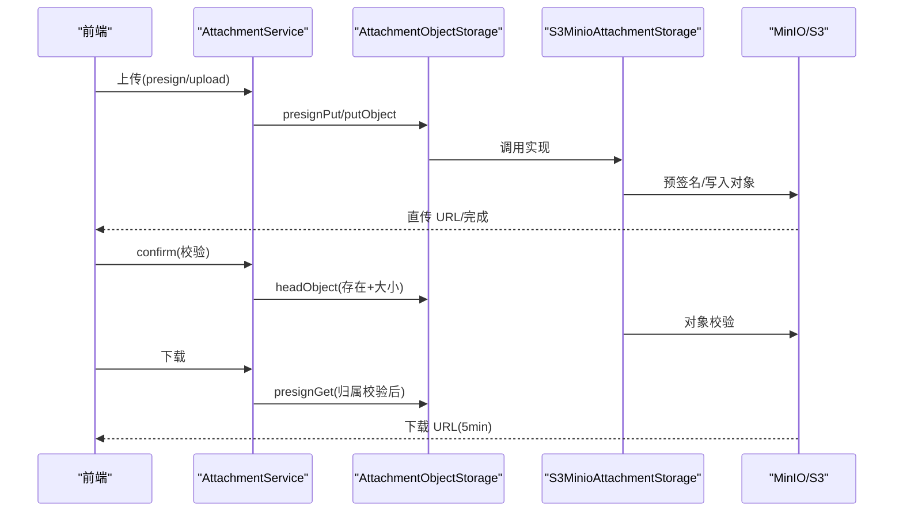
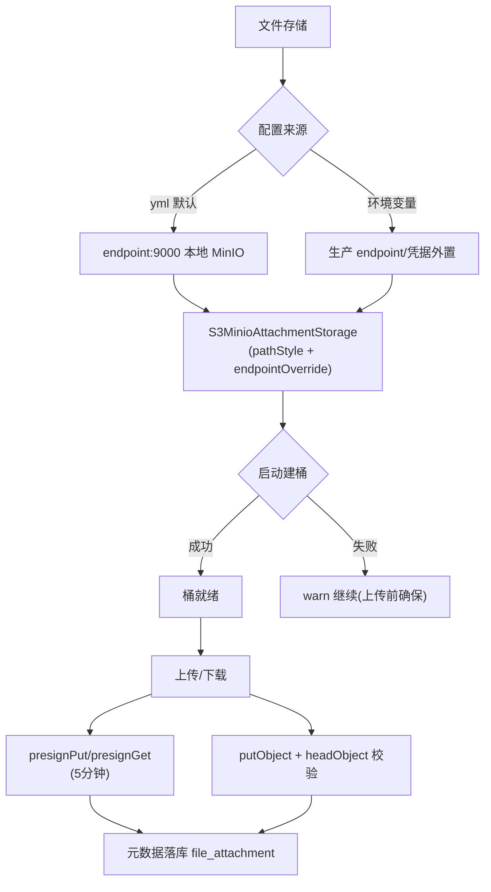
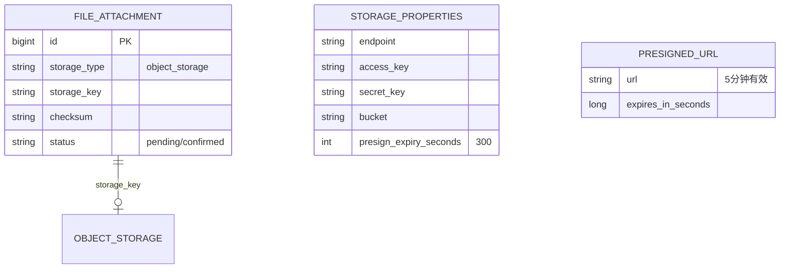
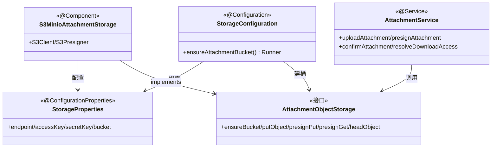

<cite>
- [UnionDesk/uniondesk-support/src/main/java/com/uniondesk/attachment/storage/StorageProperties.java](file://UnionDesk/uniondesk-support/src/main/java/com/uniondesk/attachment/storage/StorageProperties.java#L7-L14)
- [UnionDesk/uniondesk-support/src/main/java/com/uniondesk/attachment/storage/StorageConfiguration.java](file://UnionDesk/uniondesk-support/src/main/java/com/uniondesk/attachment/storage/StorageConfiguration.java#L10-L28)
- [UnionDesk/uniondesk-support/src/main/java/com/uniondesk/attachment/storage/S3MinioAttachmentStorage.java](file://UnionDesk/uniondesk-support/src/main/java/com/uniondesk/attachment/storage/S3MinioAttachmentStorage.java#L23-L80)
- [UnionDesk/uniondesk-support/src/main/java/com/uniondesk/attachment/core/AttachmentService.java](file://UnionDesk/uniondesk-support/src/main/java/com/uniondesk/attachment/core/AttachmentService.java#L59-L108)
- [UnionDesk/uniondesk-app/src/main/resources/application.yml](file://UnionDesk/uniondesk-app/src/main/resources/application.yml#L66-L72)
- [UnionDesk/uniondesk-support/src/main/java/com/uniondesk/attachment/entity/FileAttachmentPo.java](file://UnionDesk/uniondesk-support/src/main/java/com/uniondesk/attachment/entity/FileAttachmentPo.java#L5-L19)
</cite>

# UnionDesk 文件存储配置

## 简介

本文档详解文件存储配置：MinIO/S3 对象存储（`StorageProperties` 配置 + `StorageConfiguration` 装配 + `S3MinioAttachmentStorage` 实现）、附件策略（类型/大小限制）、本地备份（`DbBackup` 与对象存储并存）。文件存储承载工单/回复附件，配置与访问控制在此收敛。

章节来源：
- [UnionDesk/uniondesk-support/src/main/java/com/uniondesk/attachment/storage/StorageProperties.java](file://UnionDesk/uniondesk-support/src/main/java/com/uniondesk/attachment/storage/StorageProperties.java#L7-L14)
- [UnionDesk/uniondesk-support/src/main/java/com/uniondesk/attachment/storage/StorageConfiguration.java](file://UnionDesk/uniondesk-support/src/main/java/com/uniondesk/attachment/storage/StorageConfiguration.java#L10-L28)

## 项目结构

文件存储组件：

```mermaid
graph TB
    PROPS["StorageProperties 配置"]
    CFG["StorageConfiguration 装配"]
    IMPL["S3MinioAttachmentStorage 实现"]
    IF["AttachmentObjectStorage 接口"]
    SVC["AttachmentService 业务"]
    YML["application.yml 配置"]
    IMPL --> IF
    CFG --> IMPL : 建桶 Runner
    SVC --> IF : 上传/预签名/下载
    PROPS --> YML : 绑定
    IMPL --> PROPS
```

图表来源：
- [UnionDesk/uniondesk-support/src/main/java/com/uniondesk/attachment/storage/StorageConfiguration.java](file://UnionDesk/uniondesk-support/src/main/java/com/uniondesk/attachment/storage/StorageConfiguration.java#L10-L27)
- [UnionDesk/uniondesk-support/src/main/java/com/uniondesk/attachment/storage/S3MinioAttachmentStorage.java](file://UnionDesk/uniondesk-support/src/main/java/com/uniondesk/attachment/storage/S3MinioAttachmentStorage.java#L23-L52)

## 核心组件

**1. StorageProperties 配置**：`@ConfigurationProperties`（L7-14）——`endpoint`（默认 `http://127.0.0.1:9000`）、`accessKey`、`secretKey`、`bucket`（uniondesk-attachments）、`region`（us-east-1）、`presignExpirySeconds`（300）——yml 中 `uniondesk.storage` 绑定 + 环境变量覆盖（application.yml L66-72）。

**2. StorageConfiguration 装配**：`@EnableConfigurationProperties`（L11）+ `ensureAttachmentBucket` ApplicationRunner（L16-27）——启动时 `ensureBucket` 建桶；失败仅 warn 不阻断启动（L22-25，远程反代/无权限场景）。

**3. S3MinioAttachmentStorage 实现**：AWS SDK v2（L24-52）——`pathStyleAccessEnabled`（MinIO 兼容，L35-37）、endpointOverride（L41）、StaticCredentials（L33-34）；`ensureBucket`（L54-62，head + create）、`putObject`（L64-73）、`presignPut`（L75+，5 分钟直传）、`presignGet`（下载）、`headObject`（确认校验）。

**4. AttachmentObjectStorage 接口**：存储抽象（put/presign/head）——S3/MinIO 可切换实现。

**5. AttachmentService 业务**：`uploadAttachment`（L59-108）——策略校验 → putObject → checksum → 元数据落库；预签名直传 + confirm（见附件文档）。

**6. 附件策略**：`attachment_policy` 表（scope 类型/大小限制）——上传前校验。

**7. 本地备份并存**：数据库备份走 `DbBackup`（SQL 文件）；对象存储附件独立生命周期（软删除 + 对象管理）。

章节来源：
- [UnionDesk/uniondesk-support/src/main/java/com/uniondesk/attachment/storage/S3MinioAttachmentStorage.java](file://UnionDesk/uniondesk-support/src/main/java/com/uniondesk/attachment/storage/S3MinioAttachmentStorage.java#L30-L80)
- [UnionDesk/uniondesk-support/src/main/java/com/uniondesk/attachment/storage/StorageConfiguration.java](file://UnionDesk/uniondesk-support/src/main/java/com/uniondesk/attachment/storage/StorageConfiguration.java#L16-L27)
- [UnionDesk/uniondesk-app/src/main/resources/application.yml](file://UnionDesk/uniondesk-app/src/main/resources/application.yml#L66-L72)

## 架构总览

附件上传与下载的存储链路：



图表来源：
- [UnionDesk/uniondesk-support/src/main/java/com/uniondesk/attachment/core/AttachmentService.java](file://UnionDesk/uniondesk-support/src/main/java/com/uniondesk/attachment/core/AttachmentService.java#L59-L108)
- [UnionDesk/uniondesk-support/src/main/java/com/uniondesk/attachment/storage/S3MinioAttachmentStorage.java](file://UnionDesk/uniondesk-support/src/main/java/com/uniondesk/attachment/storage/S3MinioAttachmentStorage.java#L54-L80)

## 详细分析

**文件存储配置要点**：

1. **接口抽象可切换**：`AttachmentObjectStorage` 接口 + `S3MinioAttachmentStorage` 实现（L23-24）——本地 MinIO / 云 S3 无缝切换（endpoint 配置）。
2. **MinIO 兼容关键**：`pathStyleAccessEnabled(true)`（L35-37）——MinIO 用路径式寻址（非虚拟主机式）；endpointOverride 指向 MinIO 地址（L41）。
3. **启动建桶容错**：`ensureAttachmentBucket` 失败仅 warn（L22-25）——远程反代/无建桶权限不阻断启动；上传前确保桶存在。
4. **预签名直传**：`presignPut`（L75+，300s 默认，StorageProperties L14）——大文件客户端直传对象存储，服务端只登记元数据；`presignGet` 下载同理。
5. **确认校验**：`confirmAttachment` headObject 校验存在与大小（见附件文档）——防「登记了没上传」。
6. **配置分层**：yml 默认（L66-72）+ 环境变量覆盖（`MINIO_ENDPOINT/ACCESS_KEY/SECRET_KEY/BUCKET`）——生产凭据外置。
7. **元数据与对象分离**：`file_attachment` 存元数据（storageKey/checksum/status，L5-19），对象在 MinIO——软删除 + 对象生命周期管理。



图表来源：
- [UnionDesk/uniondesk-support/src/main/java/com/uniondesk/attachment/storage/StorageConfiguration.java](file://UnionDesk/uniondesk-support/src/main/java/com/uniondesk/attachment/storage/StorageConfiguration.java#L16-L27)
- [UnionDesk/uniondesk-support/src/main/java/com/uniondesk/attachment/storage/S3MinioAttachmentStorage.java](file://UnionDesk/uniondesk-support/src/main/java/com/uniondesk/attachment/storage/S3MinioAttachmentStorage.java#L54-L73)
- [UnionDesk/uniondesk-app/src/main/resources/application.yml](file://UnionDesk/uniondesk-app/src/main/resources/application.yml#L66-L72)

## 数据模型

存储相关数据对象：



图表来源：
- [UnionDesk/uniondesk-support/src/main/java/com/uniondesk/attachment/entity/FileAttachmentPo.java](file://UnionDesk/uniondesk-support/src/main/java/com/uniondesk/attachment/entity/FileAttachmentPo.java#L5-L19)
- [UnionDesk/uniondesk-support/src/main/java/com/uniondesk/attachment/storage/StorageProperties.java](file://UnionDesk/uniondesk-support/src/main/java/com/uniondesk/attachment/storage/StorageProperties.java#L7-L14)

## 依赖关系分析



图表来源：
- [UnionDesk/uniondesk-support/src/main/java/com/uniondesk/attachment/storage/StorageConfiguration.java](file://UnionDesk/uniondesk-support/src/main/java/com/uniondesk/attachment/storage/StorageConfiguration.java#L10-L27)
- [UnionDesk/uniondesk-support/src/main/java/com/uniondesk/attachment/storage/S3MinioAttachmentStorage.java](file://UnionDesk/uniondesk-support/src/main/java/com/uniondesk/attachment/storage/S3MinioAttachmentStorage.java#L23-L52)
- [UnionDesk/uniondesk-support/src/main/java/com/uniondesk/attachment/core/AttachmentService.java](file://UnionDesk/uniondesk-support/src/main/java/com/uniondesk/attachment/core/AttachmentService.java#L59-L108)

## 性能与安全考虑

- **性能**：预签名直传卸载服务端带宽；对象存储海量扩展；presign 5 分钟短期有效。
- **安全**：凭据配置化（env 外置）不硬编码；`pathStyleAccessEnabled` MinIO 兼容；附件策略限制类型/大小；下载归属校验；checksum 完整性。
- **一致性**：`ensureBucket` 启动幂等；pending → confirmed 状态机（headObject 校验）；元数据与对象分离。
- **可运维**：建桶失败 warn 不阻断；对象生命周期管理；桶独立于数据库备份。

章节来源：
- [UnionDesk/uniondesk-support/src/main/java/com/uniondesk/attachment/storage/StorageConfiguration.java](file://UnionDesk/uniondesk-support/src/main/java/com/uniondesk/attachment/storage/StorageConfiguration.java#L22-L25)
- [UnionDesk/uniondesk-support/src/main/java/com/uniondesk/attachment/storage/StorageProperties.java](file://UnionDesk/uniondesk-support/src/main/java/com/uniondesk/attachment/storage/StorageProperties.java#L9-L14)

## 故障排查指南

| 现象 | 原因 | 处理建议 |
| --- | --- | --- |
| 上传失败「桶不存在」 | 启动建桶失败且上传前未确保 | 检查 MinIO 地址/凭据；手动建桶或调 `ensureBucket` |
| 连接 MinIO 失败 | endpoint/凭据配置错误 | 检查 `MINIO_*` 环境变量与 yml 默认 |
| 预签名 URL 无效 | presignExpirySeconds 过短或时钟偏移 | 检查 300s 配置；核对服务端/客户端时钟 |
| confirm 失败「对象不存在」 | 直传未完成或 storageKey 不匹配 | 检查客户端 PUT 与 key 一致性 |
| 跨云切换失败 | 虚拟主机式 vs 路径式寻址 | 确认 `pathStyleAccessEnabled` 与云厂商要求 |

章节来源：
- [UnionDesk/uniondesk-support/src/main/java/com/uniondesk/attachment/storage/StorageConfiguration.java](file://UnionDesk/uniondesk-support/src/main/java/com/uniondesk/attachment/storage/StorageConfiguration.java#L17-L26)
- [UnionDesk/uniondesk-support/src/main/java/com/uniondesk/attachment/storage/S3MinioAttachmentStorage.java](file://UnionDesk/uniondesk-support/src/main/java/com/uniondesk/attachment/storage/S3MinioAttachmentStorage.java#L54-L62)

## 结论

文件存储配置以「**接口抽象、MinIO 兼容、预签名直传、启动容错**」为核心：`StorageProperties` 配置（yml 默认 + 环境变量覆盖）、`StorageConfiguration` 启动建桶（失败 warn 容错）、`S3MinioAttachmentStorage` 实现 AWS SDK v2（pathStyle + endpointOverride，MinIO/S3 可切换）、`AttachmentService` 业务接入（策略/上传/确认/下载），附件元数据与对象分离。文件存储与数据库备份双轨，附件资产安全可控。

章节来源：
- [UnionDesk/uniondesk-support/src/main/java/com/uniondesk/attachment/storage/S3MinioAttachmentStorage.java](file://UnionDesk/uniondesk-support/src/main/java/com/uniondesk/attachment/storage/S3MinioAttachmentStorage.java#L23-L80)
- [UnionDesk/uniondesk-support/src/main/java/com/uniondesk/attachment/storage/StorageConfiguration.java](file://UnionDesk/uniondesk-support/src/main/java/com/uniondesk/attachment/storage/StorageConfiguration.java#L10-L28)

## 附录

存储配置与验证命令：

```bash
# 1. 环境变量配置（生产）
export MINIO_ENDPOINT=https://minio.example.com
export MINIO_ACCESS_KEY=xxx
export MINIO_SECRET_KEY=xxx
export MINIO_BUCKET=uniondesk-attachments

# 2. 本地 MinIO（docker-compose 或手动）
# endpoint: http://127.0.0.1:30090（yml 默认）

# 3. 验证桶与对象（mc 客户端）
mc alias set local http://127.0.0.1:30090 comm_minio <secret>
mc ls local/uniondesk-attachments/

# 4. 附件上传验证
curl -X POST http://127.0.0.1:8080/api/v1/attachments/presign \
  -H "Authorization: Bearer <token>" -H "Content-Type: application/json" \
  -d '{"businessDomainId":1,"fileName":"demo.pdf","mimeType":"application/pdf","fileSize":102400}'
```

章节来源：
- [UnionDesk/uniondesk-app/src/main/resources/application.yml](file://UnionDesk/uniondesk-app/src/main/resources/application.yml#L66-L72)
- [UnionDesk/uniondesk-support/src/main/java/com/uniondesk/attachment/storage/StorageProperties.java](file://UnionDesk/uniondesk-support/src/main/java/com/uniondesk/attachment/storage/StorageProperties.java#L7-L14)
- [UnionDesk/uniondesk-support/src/main/java/com/uniondesk/attachment/core/AttachmentService.java](file://UnionDesk/uniondesk-support/src/main/java/com/uniondesk/attachment/core/AttachmentService.java#L111-L134)
