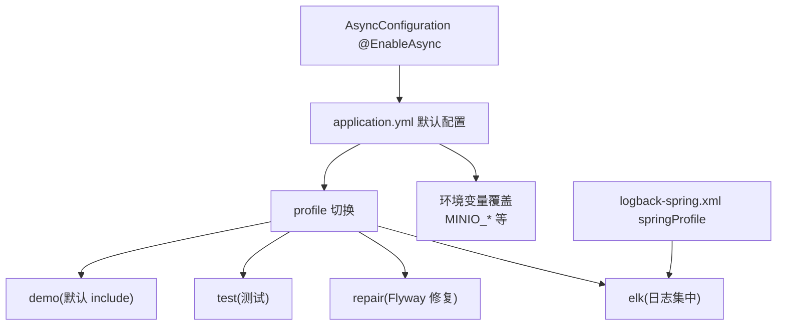
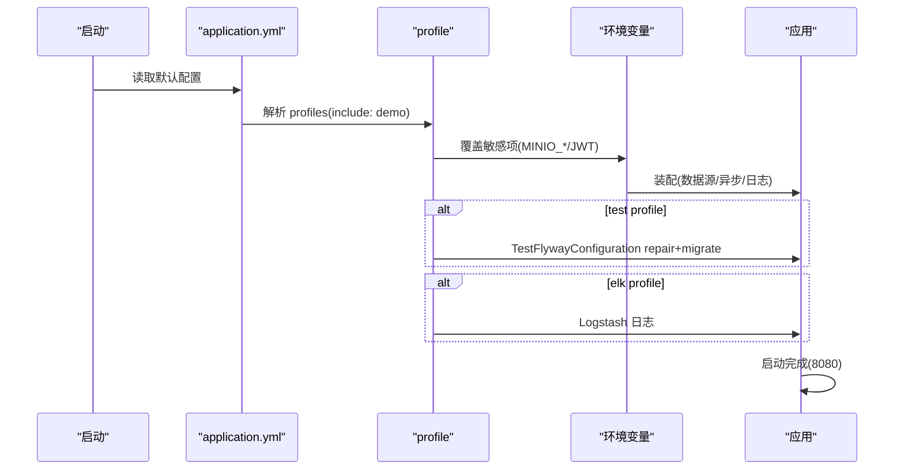
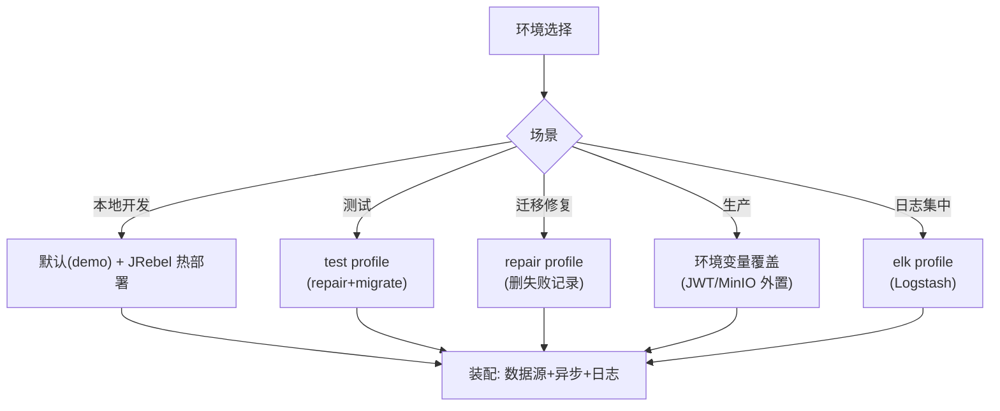
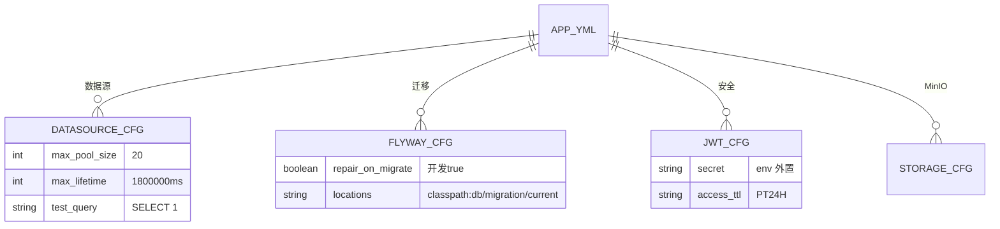
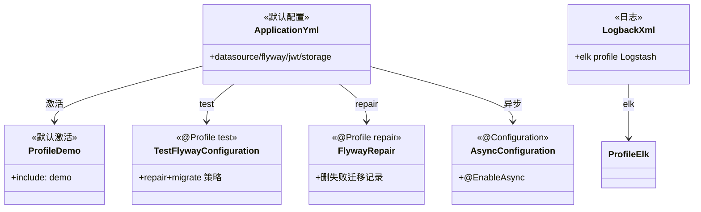

<cite>
- [UnionDesk/uniondesk-app/src/main/resources/application.yml](file://UnionDesk/uniondesk-app/src/main/resources/application.yml#L1-L37)
- [UnionDesk/uniondesk-app/src/main/resources/application.yml](file://UnionDesk/uniondesk-app/src/main/resources/application.yml#L39-L72)
- [UnionDesk/uniondesk-app/src/main/resources/logback-spring.xml](file://UnionDesk/uniondesk-app/src/main/resources/logback-spring.xml#L26-L47)
- [UnionDesk/uniondesk-app/src/main/java/com/uniondesk/config/AsyncConfiguration.java](file://UnionDesk/uniondesk-app/src/main/java/com/uniondesk/config/AsyncConfiguration.java#L6-L9)
- [UnionDesk/uniondesk-app/src/main/java/com/uniondesk/config/TestFlywayConfiguration.java](file://UnionDesk/uniondesk-app/src/main/java/com/uniondesk/config/TestFlywayConfiguration.java#L8-L19)
- [UnionDesk/config/jrebel.local.properties](file://UnionDesk/config/jrebel.local.properties#L1-L4)
- [UnionDesk/uniondesk-app/src/main/java/com/uniondesk/config/FlywayRepair.java](file://UnionDesk/uniondesk-app/src/main/java/com/uniondesk/config/FlywayRepair.java#L19-L21)
</cite>

# UnionDesk 环境配置

## 简介

本文档详解环境配置：`application.yml` 多环境（profile：demo/test/repair/elk）、数据源与连接池、缓存（内存态/无 Redis）、异步线程池（`@EnableAsync`）、日志级别（`logback-spring.xml` springProfile）、JRebel 本地热部署配置。环境差异通过「默认值 + profile + 环境变量」三层收敛。

章节来源：
- [UnionDesk/uniondesk-app/src/main/resources/application.yml](file://UnionDesk/uniondesk-app/src/main/resources/application.yml#L1-L37)
- [UnionDesk/uniondesk-app/src/main/resources/logback-spring.xml](file://UnionDesk/uniondesk-app/src/main/resources/logback-spring.xml#L26-L47)

## 项目结构

环境配置组件：



图表来源：
- [UnionDesk/uniondesk-app/src/main/resources/application.yml](file://UnionDesk/uniondesk-app/src/main/resources/application.yml#L36-L37)
- [UnionDesk/uniondesk-app/src/main/resources/logback-spring.xml](file://UnionDesk/uniondesk-app/src/main/resources/logback-spring.xml#L26-L47)

## 核心组件

**1. 默认配置（application.yml）**：应用名 `uniondesk`（L2-3）；multipart 20MB/22MB（L7-10）；数据源 MySQL + Hikari 池（L11-28）；Flyway（L29-35）；MyBatis 驼峰（L39-43）；端口 8080 UTF-8（L45-51）；actuator 仅 health,info（L53-57）；JWT/MinIO（L59-72）。

**2. profile 体系**：
- `demo`：`include: demo` 默认激活（L37）——演示数据/配置。
- `test`：`TestFlywayConfiguration` repair+migrate 策略（L8-19）。
- `repair`：`FlywayRepair` 删失败迁移记录（L19-21）。
- `elk`：日志走 Logstash（logback L26-40）。

**3. 数据源与连接池**：Hikari 最大 20/最小 5（L17-18）、`max-lifetime=1800000ms`（30min < MySQL wait_timeout，L20）、`connection-test-query=SELECT 1`（L26）——防连接失效。

**4. 缓存策略**：无 Redis——权限快照用 `ConcurrentHashMap` 内存缓存（30s TTL，见 IAM 文档）；验证码用内存 Map——轻量场景内存态。

**5. 异步线程池**：`AsyncConfiguration @EnableAsync`（L6-9）——事件监听 `@Async` 执行；线程池用 Spring 默认（SimpleAsyncTaskExecutor 可替换）。

**6. 日志级别**：root INFO（logback L35/43）；`elk` profile 追加 Logstash；级别调整走 logback 配置。

**7. JRebel 本地热部署**：`jrebel.local.properties`（L1-4）——激活 URL/邮箱（勿提交 Git）；pom 集成 jrebel-maven-plugin 生成 rebel.xml。

章节来源：
- [UnionDesk/uniondesk-app/src/main/resources/application.yml](file://UnionDesk/uniondesk-app/src/main/resources/application.yml#L11-L37)
- [UnionDesk/uniondesk-app/src/main/resources/application.yml](file://UnionDesk/uniondesk-app/src/main/resources/application.yml#L59-L72)
- [UnionDesk/uniondesk-app/src/main/java/com/uniondesk/config/AsyncConfiguration.java](file://UnionDesk/uniondesk-app/src/main/java/com/uniondesk/config/AsyncConfiguration.java#L6-L9)

## 架构总览

多环境启动的配置解析顺序：



图表来源：
- [UnionDesk/uniondesk-app/src/main/resources/application.yml](file://UnionDesk/uniondesk-app/src/main/resources/application.yml#L36-L37)
- [UnionDesk/uniondesk-app/src/main/resources/logback-spring.xml](file://UnionDesk/uniondesk-app/src/main/resources/logback-spring.xml#L26-L47)

## 详细分析

**环境配置设计要点**：

1. **三层覆盖**：`application.yml` 默认值 → profile（demo/test/repair/elk）→ 环境变量（`MINIO_ENDPOINT` 等 L67-70）——开发零配置、生产外置敏感项。
2. **连接池防失效**：`max-lifetime < wait_timeout`（L20 注释明确）——避免 MySQL 主动断连后的陈旧连接；`connection-test-query` 兜底探活（L26）。
3. **无 Redis 设计**：权限/验证码缓存内存态（ConcurrentHashMap）——单实例部署零依赖；多实例扩展时需迁移分布式缓存（演进点）。
4. **profile 即行为开关**：`repair` 启 Flyway 修复工具（L19-21）、`test` 启 repair+migrate 策略（L8-19）、`elk` 切日志通道——行为随 profile 切换。
5. **异步默认线程池**：`@EnableAsync` 用 Spring 默认——事件通知/审计异步执行；高并发场景可自定义 `ThreadPoolTaskExecutor`（演进点）。
6. **日志级别收敛**：root INFO（L35/43）——线上 INFO、调试局部 DEBUG（logback 配置调整）。
7. **热部署**：JRebel 本地激活（jrebel.local.properties）+ maven 插件生成 rebel.xml——改码免重启。



图表来源：
- [UnionDesk/uniondesk-app/src/main/resources/application.yml](file://UnionDesk/uniondesk-app/src/main/resources/application.yml#L36-L37)
- [UnionDesk/uniondesk-app/src/main/java/com/uniondesk/config/TestFlywayConfiguration.java](file://UnionDesk/uniondesk-app/src/main/java/com/uniondesk/config/TestFlywayConfiguration.java#L8-L19)
- [UnionDesk/config/jrebel.local.properties](file://UnionDesk/config/jrebel.local.properties#L1-L4)

## 数据模型

配置数据对象：



图表来源：
- [UnionDesk/uniondesk-app/src/main/resources/application.yml](file://UnionDesk/uniondesk-app/src/main/resources/application.yml#L11-L36)
- [UnionDesk/uniondesk-app/src/main/resources/application.yml](file://UnionDesk/uniondesk-app/src/main/resources/application.yml#L59-L72)

## 依赖关系分析



图表来源：
- [UnionDesk/uniondesk-app/src/main/resources/application.yml](file://UnionDesk/uniondesk-app/src/main/resources/application.yml#L36-L37)
- [UnionDesk/uniondesk-app/src/main/java/com/uniondesk/config/TestFlywayConfiguration.java](file://UnionDesk/uniondesk-app/src/main/java/com/uniondesk/config/TestFlywayConfiguration.java#L8-L19)
- [UnionDesk/uniondesk-app/src/main/resources/logback-spring.xml](file://UnionDesk/uniondesk-app/src/main/resources/logback-spring.xml#L26-L47)

## 性能与安全考虑

- **性能**：连接池参数调优（20/5/30min）防断连；内存缓存零网络开销；异步事件不阻塞主链路。
- **安全**：敏感配置（JWT secret/MinIO 凭据）环境变量外置；`repair-on-migrate` 生产禁用；JRebel 激活文件不入 Git。
- **一致性**：profile 行为开关明确；配置三层覆盖同源；日志归档策略防磁盘打满。
- **可运维**：health 端点探活；elk 集中日志；滚动归档 50MB/30d/2GB。

章节来源：
- [UnionDesk/uniondesk-app/src/main/resources/application.yml](file://UnionDesk/uniondesk-app/src/main/resources/application.yml#L15-L28)
- [UnionDesk/config/jrebel.local.properties](file://UnionDesk/config/jrebel.local.properties#L1-L4)

## 故障排查指南

| 现象 | 原因 | 处理建议 |
| --- | --- | --- |
| 连接池报「连接失效」 | max-lifetime ≥ wait_timeout | 调小 `max-lifetime`（<8h）；检查测试查询 |
| 测试迁移卡住 | 失败记录残留 | 用 test profile（repair+migrate）或 repair 工具 |
| 生产误启 repair | profile 配置错误 | 生产禁止 `repair-on-migrate`；核对 profile |
| 异步未生效 | `@EnableAsync` 缺失或自调用 | 检查 `AsyncConfiguration`；代理调用 |
| 日志不滚动 | 策略或权限问题 | 检查 rollingPolicy 与 `logs/` 权限 |

章节来源：
- [UnionDesk/uniondesk-app/src/main/resources/application.yml](file://UnionDesk/uniondesk-app/src/main/resources/application.yml#L15-L28)
- [UnionDesk/uniondesk-app/src/main/java/com/uniondesk/config/FlywayRepair.java](file://UnionDesk/uniondesk-app/src/main/java/com/uniondesk/config/FlywayRepair.java#L19-L21)

## 结论

环境配置以「**默认值 + profile + 环境变量三层覆盖、profile 即行为开关、连接池防失效**」为核心：`application.yml` 承载默认（数据源/JWT/MinIO/上传限制），demo/test/repair/elk profile 切换行为（迁移策略/日志通道），环境变量外置生产敏感项，Hikari 参数按 MySQL 语义调优，异步 `@EnableAsync` 支撑事件链路。多环境同源配置、差异收敛，部署与排障路径清晰。

章节来源：
- [UnionDesk/uniondesk-app/src/main/resources/application.yml](file://UnionDesk/uniondesk-app/src/main/resources/application.yml#L1-L72)
- [UnionDesk/uniondesk-app/src/main/resources/logback-spring.xml](file://UnionDesk/uniondesk-app/src/main/resources/logback-spring.xml#L26-L47)

## 附录

环境配置命令：

```bash
# 1. 本地开发（默认 demo profile + JRebel）
mvn -pl uniondesk-app -am spring-boot:run

# 2. 测试 profile（repair+migrate）
mvn -pl uniondesk-app test -Dspring.profiles.active=test

# 3. repair profile（修复失败迁移后重启）
mvn -pl uniondesk-app -am spring-boot:run -Dspring-boot.run.profiles=repair

# 4. elk profile（日志集中）
mvn -pl uniondesk-app -am spring-boot:run -Dspring-boot.run.profiles=elk

# 5. 生产环境变量覆盖
export MINIO_ENDPOINT=https://minio.example.com
export MINIO_ACCESS_KEY=xxx
export MINIO_SECRET_KEY=xxx
java -jar uniondesk-app.jar --spring.profiles.active=prod
```

章节来源：
- [UnionDesk/uniondesk-app/src/main/resources/application.yml](file://UnionDesk/uniondesk-app/src/main/resources/application.yml#L36-L37)
- [UnionDesk/uniondesk-app/src/main/resources/application.yml](file://UnionDesk/uniondesk-app/src/main/resources/application.yml#L66-L72)
- [UnionDesk/uniondesk-app/src/main/java/com/uniondesk/config/AsyncConfiguration.java](file://UnionDesk/uniondesk-app/src/main/java/com/uniondesk/config/AsyncConfiguration.java#L6-L9)
