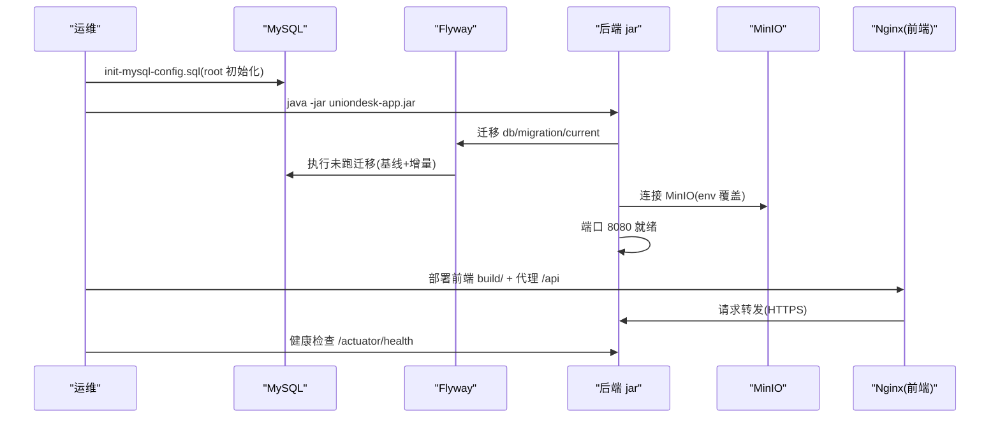
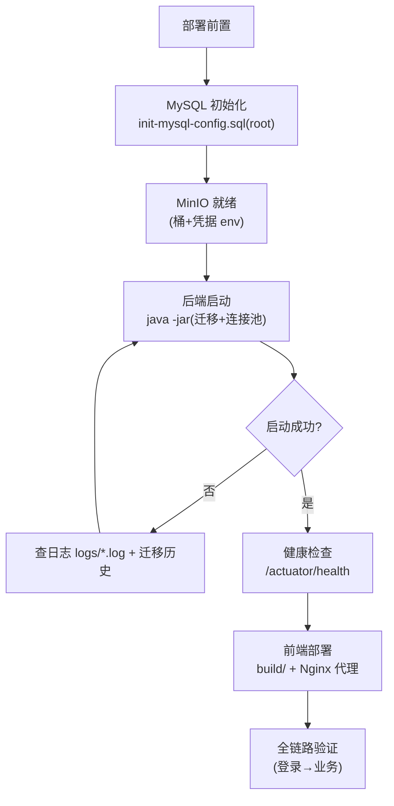
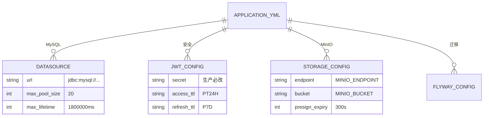
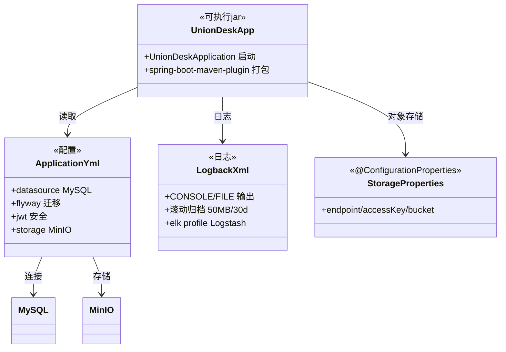

<cite>
- [UnionDesk/uniondesk-app/src/main/resources/application.yml](file://UnionDesk/uniondesk-app/src/main/resources/application.yml#L1-L37)
- [UnionDesk/uniondesk-app/src/main/resources/application.yml](file://UnionDesk/uniondesk-app/src/main/resources/application.yml#L39-L72)
- [UnionDesk/uniondesk-app/src/main/resources/logback-spring.xml](file://UnionDesk/uniondesk-app/src/main/resources/logback-spring.xml#L1-L48)
- [UnionDesk/uniondesk-app/src/main/resources/db/init-mysql-config.sql](file://UnionDesk/uniondesk-app/src/main/resources/db/init-mysql-config.sql#L1-L14)
- [UnionDesk/uniondesk-app/src/main/java/com/uniondesk/UnionDeskApplication.java](file://UnionDesk/uniondesk-app/src/main/java/com/uniondesk/UnionDeskApplication.java#L9-L17)
- [UnionDesk/uniondesk-app/pom.xml](file://UnionDesk/uniondesk-app/pom.xml#L62-L96)
- [UnionDesk/uniondesk-support/src/main/java/com/uniondesk/attachment/storage/StorageProperties.java](file://UnionDesk/uniondesk-support/src/main/java/com/uniondesk/attachment/storage/StorageProperties.java#L7-L14)
</cite>

# UnionDesk 部署与配置总览

## 简介

本文档总览 UnionDesk 部署与配置：后端 Spring Boot 可执行 jar（`uniondesk-app` 聚合打包）、前端构建产物（`build/` 静态资源）、数据库 Flyway 迁移（`db/migration/current`）、环境配置（`application.yml` 数据源/JWT/MinIO + 环境变量覆盖）、日志配置（`logback-spring.xml` 滚动归档 + ELK）、启动流程与健康检查。

章节来源：
- [UnionDesk/uniondesk-app/src/main/resources/application.yml](file://UnionDesk/uniondesk-app/src/main/resources/application.yml#L1-L37)
- [UnionDesk/uniondesk-app/src/main/resources/logback-spring.xml](file://UnionDesk/uniondesk-app/src/main/resources/logback-spring.xml#L1-L48)

## 项目结构

部署产物与配置：

```mermaid
graph TB
    DEP["部署"]
    BACK["后端 jar<br/>uniondesk-app target"]
    FRONT["前端 build/<br/>AdminWeb/CustomerWeb"]
    DB["MySQL + Flyway 迁移"]
    MINIO["MinIO/S3 对象存储"]
    CFG["application.yml 配置"]
    LOG["logback-spring.xml 日志"]
    BACK --> CFG & DB & MINIO & LOG
    FRONT --> BACK : 反向代理
    CFG --> DB
    CFG --> MINIO
```

图表来源：
- [UnionDesk/uniondesk-app/pom.xml](file://UnionDesk/uniondesk-app/pom.xml#L62-L76)（spring-boot 打包插件）
- [UnionDesk/uniondesk-app/src/main/resources/application.yml](file://UnionDesk/uniondesk-app/src/main/resources/application.yml#L11-L36)

## 核心组件

**1. 后端可执行 jar**：`uniondesk-app` 聚合全部模块 + `spring-boot-maven-plugin` 打包（pom L62-67）；启动类 `UnionDeskApplication`（L9-17）；`java -jar` 直接运行。

**2. application.yml 配置**：
- 数据源：MySQL `127.0.0.1:30306/uniondesk` + Hikari 连接池（最大 20/最小 5、max-lifetime 30min < wait_timeout、连接测试 SELECT 1，L11-28）。
- Flyway：`locations=classpath:db/migration/current`、`repair-on-migrate: true`（开发）、`validate-on-migrate: false`（L29-35）——生产应关闭 repair。
- MyBatis：`mapper-locations` 通配 + 驼峰映射（L39-43）。
- JWT：`uniondesk.security.jwt`（issuer/secret/access 24h/refresh 7d，L60-65）——secret 生产必改。
- MinIO：`uniondesk.storage` 环境变量覆盖（`MINIO_ENDPOINT/ACCESS_KEY/SECRET_KEY/BUCKET`，L66-72）。
- 上传限制：multipart 20MB/22MB（L7-10）；端口 8080（L46）。

**3. 日志（logback-spring.xml）**：CONSOLE + FILE（`logs/uniondesk-backend.log`，L4-5）；滚动归档（50MB/30 天/2GB 上限，L15-19）；`elk` profile 追加 Logstash TCP（L26-40）——日志分级归档 + ELK 集成。

**4. 数据库初始化**：`init-mysql-config.sql` 需 root 执行（开启 `log_bin_trust_function_creators`，L10-14）——Flyway 迁移前置。

**5. 前端构建**：`pnpm build` 产物 `build/`（静态资源）——由 Nginx 等托管并反向代理 `/api`。

**6. 健康检查**：`/api/health`、`/actuator/health`（management 暴露 health,info，L53-57）。

章节来源：
- [UnionDesk/uniondesk-app/src/main/resources/application.yml](file://UnionDesk/uniondesk-app/src/main/resources/application.yml#L11-L72)
- [UnionDesk/uniondesk-app/src/main/resources/logback-spring.xml](file://UnionDesk/uniondesk-app/src/main/resources/logback-spring.xml#L13-L47)
- [UnionDesk/uniondesk-app/pom.xml](file://UnionDesk/uniondesk-app/pom.xml#L62-L96)

## 架构总览

部署启动到可用的完整流程：



图表来源：
- [UnionDesk/uniondesk-app/src/main/resources/db/init-mysql-config.sql](file://UnionDesk/uniondesk-app/src/main/resources/db/init-mysql-config.sql#L4-L14)
- [UnionDesk/uniondesk-app/src/main/resources/application.yml](file://UnionDesk/uniondesk-app/src/main/resources/application.yml#L29-L37)
- [UnionDesk/uniondesk-app/src/main/java/com/uniondesk/UnionDeskApplication.java](file://UnionDesk/uniondesk-app/src/main/java/com/uniondesk/UnionDeskApplication.java#L9-L17)

## 详细分析

**部署设计要点**：

1. **单 jar 聚合**：app 模块聚合全部业务模块打包（pom L17-37 依赖 + L62-67 插件）——部署只需一个 jar；业务模块不单独部署。
2. **配置分层覆盖**：`application.yml` 默认值 + 环境变量覆盖（`MINIO_*` 等，L67-70）+ profile（demo/elk/repair/test）——开发/测试/生产同源配置差异化。
3. **连接池调优**：Hikari `max-lifetime=30min` 小于 MySQL `wait_timeout`（L20 注释）防连接失效；`connection-test-query=SELECT 1` 探活（L26）。
4. **迁移策略双轨**：开发 `repair-on-migrate` 容忍失败迁移（L33-35 注释警告生产勿用）；生产应 `validate-on-migrate=true` 严格校验。
5. **日志治理**：滚动归档（50MB/30 天/2GB）防磁盘打满（L15-19）；`elk` profile 走 Logstash（L26-40）——集中日志可切换。
6. **安全基线**：JWT secret 演示值生产必改（L63）；数据源密码为本地开发值（L14）；MinIO 凭据环境变量注入（L68-69）。
7. **健康可观测**：`/actuator/health` + `/api/health` 双健康端点（L53-57）——部署探活。



图表来源：
- [UnionDesk/uniondesk-app/src/main/resources/application.yml](file://UnionDesk/uniondesk-app/src/main/resources/application.yml#L11-L37)
- [UnionDesk/uniondesk-app/src/main/resources/logback-spring.xml](file://UnionDesk/uniondesk-app/src/main/resources/logback-spring.xml#L13-L24)

## 数据模型

配置数据对象：



图表来源：
- [UnionDesk/uniondesk-app/src/main/resources/application.yml](file://UnionDesk/uniondesk-app/src/main/resources/application.yml#L11-L36)
- [UnionDesk/uniondesk-app/src/main/resources/application.yml](file://UnionDesk/uniondesk-app/src/main/resources/application.yml#L59-L72)

## 依赖关系分析



图表来源：
- [UnionDesk/uniondesk-app/src/main/java/com/uniondesk/UnionDeskApplication.java](file://UnionDesk/uniondesk-app/src/main/java/com/uniondesk/UnionDeskApplication.java#L9-L17)
- [UnionDesk/uniondesk-support/src/main/java/com/uniondesk/attachment/storage/StorageProperties.java](file://UnionDesk/uniondesk-support/src/main/java/com/uniondesk/attachment/storage/StorageProperties.java#L7-L14)
- [UnionDesk/uniondesk-app/pom.xml](file://UnionDesk/uniondesk-app/pom.xml#L62-L76)

## 性能与安全考虑

- **性能**：Hikari 连接池调优（20/5/30min）；日志滚动归档防磁盘打满；`/actuator` 仅暴露 health,info 减面。
- **安全**：JWT secret/MinIO 凭据生产外置（env 覆盖）；数据源密码不硬编码到生产；`repair-on-migrate` 仅开发；CORS 生产收紧（见安全文档）。
- **一致性**：配置分层（yml 默认 + env + profile）同源；迁移版本化可回滚；健康端点双轨。
- **可运维**：ELK 集中日志可选；滚动归档策略；启动/迁移日志定位。

章节来源：
- [UnionDesk/uniondesk-app/src/main/resources/application.yml](file://UnionDesk/uniondesk-app/src/main/resources/application.yml#L15-L28)
- [UnionDesk/uniondesk-app/src/main/resources/application.yml](file://UnionDesk/uniondesk-app/src/main/resources/application.yml#L53-L72)

## 故障排查指南

| 现象 | 原因 | 处理建议 |
| --- | --- | --- |
| 启动连不上数据库 | 连接池配置/网络/凭据错误 | 检查数据源 URL 与 Hikari；核对 `wait_timeout` |
| Flyway 迁移失败 | 脚本错误或 checksum 变化 | 开发用 repair profile；生产恢复脚本 |
| 附件上传失败 | MinIO 未就绪或凭据错误 | 检查 `MINIO_*` 环境变量与桶 |
| 日志不滚动 | logback 策略配置异常 | 检查 `logs/` 权限与 rollingPolicy |
| 健康检查失败 | 应用未就绪或依赖服务挂 | 查 `/actuator/health` 明细；逐依赖排查 |

章节来源：
- [UnionDesk/uniondesk-app/src/main/resources/application.yml](file://UnionDesk/uniondesk-app/src/main/resources/application.yml#L15-L28)
- [UnionDesk/uniondesk-app/src/main/resources/application.yml](file://UnionDesk/uniondesk-app/src/main/resources/application.yml#L29-L35)

## 结论

部署与配置以「**单 jar 聚合、配置分层覆盖、迁移版本化、日志可治理**」为核心：后端 `uniondesk-app` 聚合打包单 jar 部署，`application.yml` 默认值 + 环境变量 + profile 三层配置，Flyway 迁移版本化（开发 repair/生产严格），logback 滚动归档 + ELK 可选，健康端点双轨探活。部署流程「初始化 → 启动 → 迁移 → 验证」清晰可控。

章节来源：
- [UnionDesk/uniondesk-app/pom.xml](file://UnionDesk/uniondesk-app/pom.xml#L62-L96)
- [UnionDesk/uniondesk-app/src/main/resources/application.yml](file://UnionDesk/uniondesk-app/src/main/resources/application.yml#L1-L72)

## 附录

部署命令：

```bash
# 1. 后端打包 + 启动
cd UnionDesk
mvn clean package -DskipTests
java -jar uniondesk-app/target/uniondesk-app-0.0.1-SNAPSHOT.jar

# 2. 环境变量覆盖（生产）
export MINIO_ENDPOINT=https://minio.example.com
export MINIO_ACCESS_KEY=xxx
export MINIO_SECRET_KEY=xxx
export MINIO_BUCKET=uniondesk-attachments

# 3. 前端构建 + 托管
cd UnionDeskWeb/apps/UnionDeskAdminWeb && pnpm build
# 产物 build/ 由 Nginx 托管，/api 反向代理到 8080

# 4. 健康检查
curl http://127.0.0.1:8080/actuator/health
curl http://127.0.0.1:8080/api/health

# 5. 日志查看
tail -f logs/uniondesk-backend.log
ls logs/archive/   # 滚动归档
```

章节来源：
- [UnionDesk/uniondesk-app/pom.xml](file://UnionDesk/uniondesk-app/pom.xml#L62-L76)
- [UnionDesk/uniondesk-app/src/main/resources/logback-spring.xml](file://UnionDesk/uniondesk-app/src/main/resources/logback-spring.xml#L3-L19)
- [UnionDesk/uniondesk-app/src/main/resources/application.yml](file://UnionDesk/uniondesk-app/src/main/resources/application.yml#L53-L72)
