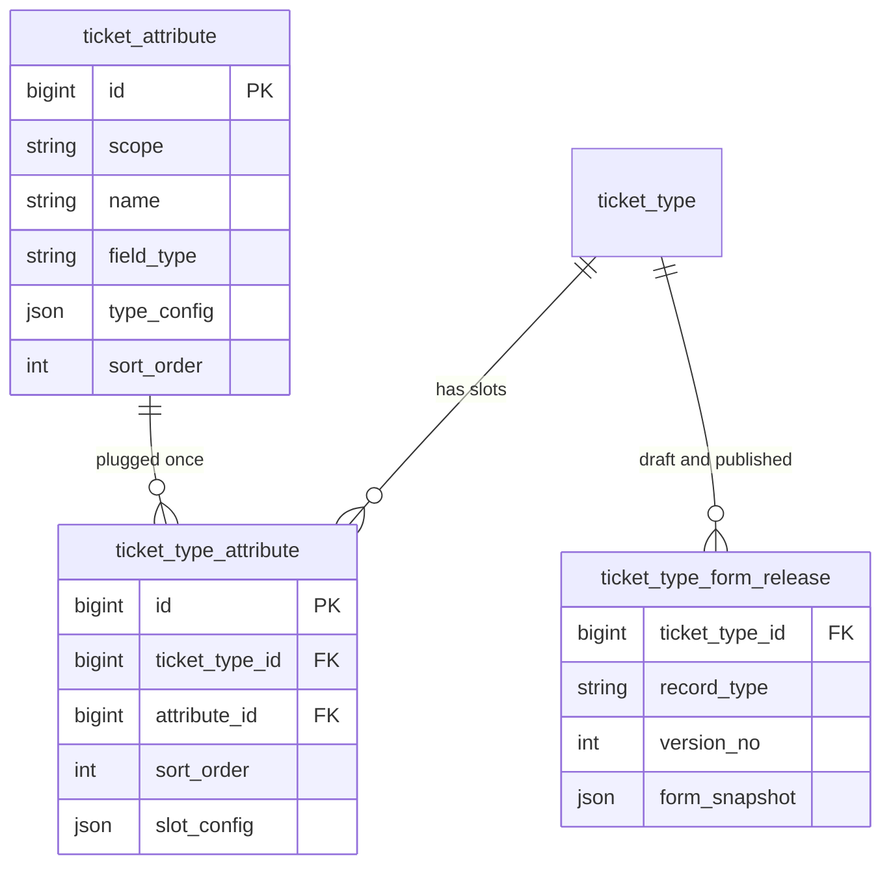
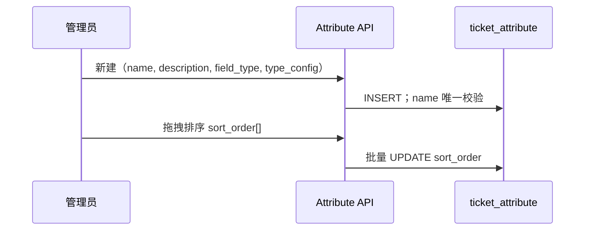
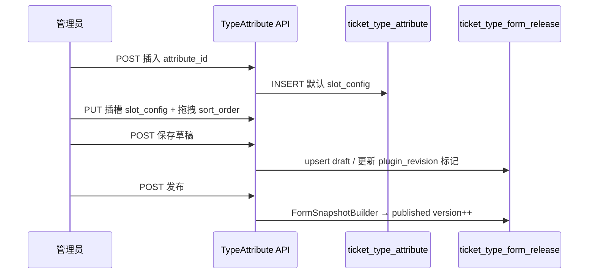

# 事项属性 — 专项设计（v2）

> **Sprint 范围**：平台域 — 全局/域内属性字典 + 类型可拔插装配 + 编排草稿/发布。  
> **同 Sprint 其他项**：[`proposal.md`](proposal.md)  
> **原则**：字典管「是什么类型」；**插入类型后**才配必填、placeholder 等；**弃用 Formily 自由画布**，改为**拖拽排序列表**编排。

---

## 方案概述

事项属性是可复用的**字段零件**：在全局或业务域内定义**名称、描述、字段类型**及类型相关的**最小配置**（选项、输入格式等）。管理员将属性**唯一插入**某一事项类型后，在该类型的「属性编排」页配置展示顺序、是否必填、placeholder 等；**保存草稿 / 发布**后生成提单可用的表单快照。

**拆解**：三层存储 — **字典**（`ticket_attribute`）→ **插槽**（`ticket_type_attribute`，一类型一属性唯一）→ **发布快照**（`ticket_type_form_release`，替代原 Formily 主编辑路径，表可沿用 `ticket_form_schema` 物理名）。字典列表支持**拖拽排序**；≤100 条不分页，超过再分页。

**复用**：`TicketFormSchemaService` 发布/版本 trim 逻辑；权限 `platform.ticket_config.*`、`platform.domain.control.ticket_attribute.*`；列表页 `TableSearchForm` + Ant Design `Table`（拖拽行）。

---

## 功能范围

### 功能结构

```text
┌─ 全局设置 → 事项配置 → 事项属性 ─────────────────────────────┐
│  字典 CRUD · 拖拽排序 · 按类型展示最小配置                      │
└──────────────────────────────────────────────────────────────┘

┌─ 域管控 → 事项管理 → 事项属性 ───────────────────────────────┐
│  域内字典（同上）                                               │
└──────────────────────────────────────────────────────────────┘

┌─ 事项类型列表 → 操作「属性」→ 属性编排页 ──────────────────────┐
│  ① 从字典「插入」属性（已插入的不可重复）                        │
│  ② 拖拽调整页面显示顺序                                         │
│  ③ 每条插槽：必填 / placeholder / 用户端可见 等               │
│  ④ 系统字段（title/description）固定顺序，独占一行，不可删       │
│  ⑤ 保存草稿 · 发布 · 版本历史                                   │
└──────────────────────────────────────────────────────────────┘
```

### 与旧方案差异

| 旧 | v2 |
|----|-----|
| 字典有 `code` | **无 code**；`name` + `description` 必填 |
| Formily 画布排布局 | **列表拖拽**；默认**一行一属性**，不可改列宽/分组 |
| `group_key` 分组 | **取消**；仅 `sort_order` 控制顺序 |
| `config_json` 混放 placeholder | 字典只放**类型配置**；placeholder 等在**插槽** |

---

## 设计详情

### 1. 概念与数据关系



**关系说明**

| 关系 |  cardinality | 规则 |
|------|-------------|------|
| 属性字典 → 类型插槽 | N : M 经插槽表 | **同一 `ticket_type_id` + `attribute_id` 唯一**（可拔插：删插槽再加回） |
| 类型 → 发布快照 | 1 : N | 每类型 1 条 draft + 最多 10 条 published |
| 字典 sort_order | — | 仅影响**字典列表**展示顺序，与类型内顺序无关 |
| 插槽 sort_order | — | 仅影响**该类型提单页**字段自上而下顺序 |

**运行时**：`ticket.layout_version_no` → 指向某条 `published` 的 `form_snapshot`（物化 JSON，供渲染与校验）。

---

### 2. 字段类型与字典层配置（`type_config`）

字典创建/编辑时，**必填**：`name`、`description`、`field_type`。  
**不在字典层配置**：是否必填、placeholder、用户端可见 — 这些在**插入类型后的插槽**配置。

#### 2.1 MVP 类型四分法

| field_type | 中文 | 字典层 type_config | 插槽层 slot_config（插入后） |
|------------|------|-------------------|------------------------------|
| `input` | 输入类 | `format`: `text` \| `email` \| `phone`（默认 text） | `required`, `placeholder`, `visible_to_customer` |
| `select` | 选项类 | `options`: `[{ label, value }]` 至少 1 项 | 同上；可选 `default_value` |
| `switch` | 开关类 | **无**（`{}`） | `required`, `visible_to_customer`；无 placeholder |
| `date` | 日期类 | **无**（`{}`） | `required`, `placeholder`, `visible_to_customer` |

**后续再考虑**：`textarea`、`number`、`multi_select` 等。

#### 2.2 type_config JSON 示例

```json
// input + 邮箱
{ "format": "email" }

// select
{
  "options": [
    { "label": "高", "value": "high" },
    { "label": "低", "value": "low" }
  ]
}

// switch / date
{}
```

#### 2.3 校验规则（字典保存时）

| 类型 | 校验 |
|------|------|
| 全部 | `name`、`description` 非空；同 scope 下 **name 唯一** |
| input | `format` 枚举合法 |
| select | `options` 非空；`value` 同属性内不重复 |
| switch / date | 不接受多余键 |

---

### 3. 数据模型（DDL 要点）

#### 3.1 `ticket_attribute` — 属性字典

| 字段 | 类型 | 说明 |
|------|------|------|
| id | BIGINT PK | |
| scope | VARCHAR(16) | `platform` \| `domain` |
| business_domain_id | BIGINT NULL | domain 必填 |
| name | VARCHAR(128) NOT NULL | **必填**；scope 内唯一 |
| description | VARCHAR(500) NOT NULL | **必填** |
| field_type | VARCHAR(32) NOT NULL | input / select / switch / date |
| type_config | JSON NOT NULL | 见 §2 |
| status | VARCHAR(16) | active / disabled |
| sort_order | INT NOT NULL DEFAULT 0 | **字典列表**拖拽排序 |
| is_system | TINYINT | 系统预置 title/description（若入库） |
| source_attribute_id | BIGINT NULL | 上浮/复制溯源 |
| created_by | BIGINT NULL | 创建人 subject_id |
| updated_by | BIGINT NULL | 最后更新人 |
| created_at | DATETIME(3) | |
| updated_at | DATETIME(3) | |

索引：

- `UNIQUE (scope, business_domain_id, name)` — platform 时 domain_id NULL 参与唯一
- `KEY (scope, business_domain_id, sort_order)`

**无 `code` 字段。**

#### 3.2 `ticket_type_attribute` — 类型插槽（可拔插）

| 字段 | 类型 | 说明 |
|------|------|------|
| id | BIGINT PK | |
| ticket_type_id | BIGINT NOT NULL | |
| attribute_id | BIGINT NOT NULL | → ticket_attribute |
| sort_order | INT NOT NULL | **类型内页面显示顺序**（拖拽） |
| slot_config | JSON NOT NULL | 见 §3.4 |
| status | VARCHAR(16) | enabled / disabled |
| created_by / updated_by | BIGINT NULL | |
| created_at / updated_at | DATETIME(3) | |

约束：

- `UNIQUE (ticket_type_id, attribute_id)` — **同一属性在同一类型中只能插入一次**
- 删除插槽 = 拔出；可再次插入

**取消 `group_key`**：不做分组；**每条属性独占一行**（物化时 `x-display: block` / FormItem 100% 宽），**不可配置**多列或合并行。

#### 3.3 `slot_config`（插槽层，插入类型后才 editable）

```json
{
  "required": true,
  "placeholder": "请输入联系邮箱",
  "visible_to_customer": true
}
```

| 字段 | 说明 |
|------|------|
| required | 是否必填（系统字段由 category 锁定） |
| placeholder | input / date / select 可用；switch 忽略 |
| visible_to_customer | 用户端是否展示 |

#### 3.4 `ticket_type_form_release` — 编排草稿/发布（逻辑名）

> **物理表**：本 Sprint **沿用** `ticket_form_schema`，避免大迁移；语义改为「类型表单发布」，**不再**作为 Formily 自由编辑数据源。

| 字段 | 类型 | 说明 |
|------|------|------|
| id | BIGINT PK | |
| business_domain_id | BIGINT NOT NULL | |
| ticket_type_id | BIGINT NOT NULL | |
| record_type | VARCHAR(16) | `draft` \| `published` |
| version_no | INT | draft=0；published=1..n |
| form_snapshot | JSON NOT NULL | 物化表单（列名仍可用 `form_schema`） |
| plugin_revision | VARCHAR(64) NULL | 插槽列表 hash，用于 has_unpublished |
| published_by / published_at | | 发布时写入 |
| created_at / updated_at | | |

**为何保留此表**

- 提单需绑定**某一版 published 快照**，历史工单不受后续改插件影响。
- draft 行存**最近一次「保存草稿」**物化结果（或仅存 plugin_revision，发布时再物化 — **推荐发布时物化**，draft 保存只更新插槽 + 标记 unpublished）。

**弃用什么**

- 弃用：Formily Designable **画布**编辑 `form_schema` 作为主路径。
- 保留：物化器 `FormSnapshotBuilder.build(type, slots, systemFields)` → JSON，结构与现 Formily 兼容（供现有渲染链渐进迁移）。

**`has_unpublished` 判定**

```text
当前插槽集合（含 sort_order、slot_config）的 hash
  ≠ 最新 published 行的 plugin_revision
→ 类型列表显示「未发布」
```

#### 3.5 系统字段（不占字典或占 is_system 行）

按 `ticket_type.category` 注入插槽逻辑（**不在字典页创建**）：

| category | 系统字段 | 顺序 | 行布局 |
|----------|---------|------|--------|
| transaction | title, description | 固定最前 | 各独占一行，不可删、不可改 field_type |
| feedback | description | 固定最前 | 同上 |

系统字段在编排页**展示但不可移除**；required 由 category 锁定。

---

### 4. 核心流程

#### 4.1 字典维护



- 列表：**拖拽排序**；默认一次拉全量；**count > 100** 时改分页 API（`page`/`page_size`）。
- 禁用 `status=disabled` 的属性：不可被**新插入**类型，已插入的插槽仍保留（发布物化时可警告）。

#### 4.2 插入类型 + 编排 + 发布



**物化规则（form_snapshot）**

1. 系统字段（按 category）  
2. 按 `sort_order` 遍历 enabled 插槽  
3. 每条：`name` 作 label；`field_type` + `type_config` + `slot_config` → Formily property  
4. 每条 property **整行**：不设 grid 多列  

#### 4.3 上浮为全局

- 复制域内 `ticket_attribute` → `scope=platform` 新行；**name 冲突则拒绝**（无 code）。
- 域内原行保留；不自动改已有插槽。

---

### 5. API

#### 5.1 属性字典

| 方法 | 全局路径 | 域路径 |
|------|---------|--------|
| GET | `/api/v1/admin/platform/ticket-attributes` | `/api/v1/admin/domains/{d}/ticket-attributes` |
| POST | 同上 | 同上 |
| PUT | `.../{id}` | 同上 |
| DELETE | `.../{id}` | 同上 |
| PUT | `.../reorder` body `{ orders: [{ id, sort_order }] }` | 同上 |

**GET 查询**

- `keyword`：匹配 name、description  
- `page` / `page_size`：**仅当**服务端 total > 100 时前端传；默认返回全量

**POST body 示例**

```json
{
  "name": "联系邮箱",
  "description": "用于回访",
  "field_type": "input",
  "type_config": { "format": "email" }
}
```

#### 5.2 类型插槽 + 发布

前缀：`.../ticket-types/{typeId}`

| 方法 | 路径 | 说明 |
|------|------|------|
| GET | `/attribute-slots` | 已插入列表（含字典摘要 + slot_config） |
| POST | `/attribute-slots` | `{ attribute_id }` 插入 |
| DELETE | `/attribute-slots/{slotId}` | 拔出 |
| PUT | `/attribute-slots/{slotId}` | 更新 slot_config |
| PUT | `/attribute-slots/reorder` | 拖拽顺序 |
| POST | `/form-release/draft` | 保存草稿 |
| POST | `/form-release/publish` | 发布 |
| GET | `/form-release/versions` | 历史 |
| POST | `/form-release/versions/{no}/rollback` | 回退 |

兼容别名（一期）：`/form-schema/draft|publish|versions` → 同上 Handler。

**TicketTypeView 聚合**

```json
{
  "form_snapshot": "latest published",
  "form_snapshot_draft": "optional",
  "form_current_version_no": 2,
  "form_has_unpublished": true
}
```

#### 5.3 异常

| 场景 | HTTP | 消息 |
|------|------|------|
| name 重复 | 409 | 属性名称已存在 |
| 重复插入同一属性 | 409 | 该属性已插入此事项类型 |
| 属性已禁用仍插入 | 400 | 属性已停用 |
| select 无选项 | 400 | 选项类至少配置一个选项 |
| promote name 冲突 | 409 | 全局已存在同名属性 |

---

### 6. 前端设计

#### 6.1 模块

| 操作 | 路径 |
|------|------|
| 新增 | `pages/platform/ticket-config/attributes/index.tsx` |
| 新增 | `pages/platform/ticket-config/attributes/components/attribute-form-modal.tsx` |
| 新增 | `pages/platform/ticket-config/attributes/components/attribute-sortable-table.tsx` |
| 新增 | `pages/platform/domains/detail/components/detail-ticket-attributes.tsx` |
| 新增 | `pages/platform/domains/ticket-type-attributes/index.tsx`（**替代** form-design 主路径） |
| 修改 | `detail-tickets.tsx` — 操作「属性」→ 新编排页 |
| 修改 | `packages/shared/src/api.ts`、`types.ts` |

拖拽：Ant Design Table + `@dnd-kit` 或项目已有 Sortable 模式（与菜单排序一致则复用）。

#### 6.2 字典页 UI

```text
+----------------------------------------------------------+
| 事项属性                                    [ + 新建 ]    |
+----------------------------------------------------------+
| 筛选: [关键字________]  [查询] [重置]                     |
+----------------------------------------------------------+
| ⋮⋮ | 名称 | 描述 | 类型 | 类型配置摘要 | 状态 | 操作      |
| ⋮⋮ | 联系邮箱 | ... | 输入类 | 邮箱 | 启用 | 编辑 删除  |
+----------------------------------------------------------+
| （≤100 无分页；>100 显示分页）                             |
+----------------------------------------------------------+
```

新建 Modal：

- 名称 *、描述 *、类型 *（输入/选项/开关/日期）
- 动态区：选项类 → 选项编辑器；输入类 → 格式 Select；开关/日期 → 无

#### 6.3 类型 · 属性编排页 UI

```text
+----------------------------------------------------------+
| [← 返回]  事项类型「投诉」— 属性编排     [保存草稿] [发布] |
+----------------------------------------------------------+
| 可插入属性: [选择属性 ▼]  [插入]                          |
+----------------------------------------------------------+
| ⋮⋮ | 字段 | 来源 | 必填 | placeholder | 用户可见 | 操作  |
| ⋮⋮ | 标题 | 系统 | ✓锁定 | — | ✓ | —                    |
| ⋮⋮ | 详细描述 | 系统 | ✓ | — | ✓ | —                    |
| ⋮⋮ | 联系邮箱 | 字典 | ☐ | 请输入… | ✓ | 拔出          |
+----------------------------------------------------------+
| 说明：每条属性独占一行，顺序由上表拖拽决定。                 |
+----------------------------------------------------------+
```

**不做**：Formily 左侧组件面板、多列布局、分组 Tab。

#### 6.4 权限

| UI | permission |
|----|------------|
| 全局字典 | `platform.ticket_config.*` |
| 域字典 | `platform.domain.control.ticket_attribute.*` |
| 编排/发布 | `platform.domain.control.ticket_type.update` |

---

### 7. 后端模块

| 模块 | 类 | 操作 |
|------|-----|------|
| 字典 | `TicketAttributeService` | **新增** |
| 插槽 | `TicketTypeAttributeSlotService` | **新增** |
| 物化 | `FormSnapshotBuilder` | **新增** |
| 发布 | `TicketFormSchemaService` | **修改** — 接 FormSnapshotBuilder；表仍 ticket_form_schema |
| 控制器 | `TicketConfigController` | **修改** — slots + form-release |
| 平台 | `PlatformTicketConfigController` | **新增** — 全局字典 + promote |
| 迁移 | `V*__ticket_attribute.sql` | **新增** |

---

## 实现步骤

| 步骤 | 内容 | 检查点 |
|------|------|--------|
| 1 | Flyway：`ticket_attribute`、`ticket_type_attribute` | 表结构含 audit + sort |
| 2 | 字典 CRUD + reorder API | name 唯一；type_config 校验 |
| 3 | 插槽 CRUD + reorder + 唯一插入 | 重复插入 409 |
| 4 | FormSnapshotBuilder + draft/publish | 物化 JSON 可渲染；has_unpublished |
| 5 | 前端字典页 + 拖拽 | ≤100 无分页 |
| 6 | 前端编排页（替代 form-design 主路径） | 插入/拔出/草稿/发布 |
| 7 | promote + IAM + 联调 | 验收 §8 |

---

## 文件清单

### 后端

| 操作 | 路径 |
|------|------|
| 新增 | `V*__ticket_attribute_and_slots.sql` |
| 新增 | `TicketAttributePo/Mapper/Repository/Service` |
| 新增 | `TicketTypeAttributeSlotPo/Mapper/Repository/Service` |
| 新增 | `FormSnapshotBuilder.java` |
| 修改 | `TicketFormSchemaService.java` |
| 修改 | `TicketConfigController.java` |
| 新增 | `PlatformTicketConfigController.java`（属性部分） |

### 前端

| 操作 | 路径 |
|------|------|
| 新增 | `ticket-config/attributes/*` |
| 新增 | `ticket-type-attributes/index.tsx` |
| 新增 | `detail-ticket-attributes.tsx` |
| 修改 | `detail-tickets.tsx` |
| 修改 | `packages/shared/src/api.ts`、`types.ts` |

---

## 约束说明

| 类型 | 约束 |
|------|------|
| **边界** | 无 code；name+description 必填；scope 内 name 唯一 |
| **可拔插** | UNIQUE(ticket_type_id, attribute_id) |
| **布局** | 一行一属性，不可配；仅 sort_order |
| **字典排序** | sort_order 仅字典列表；类型内独立 sort_order |
| **分页** | 字典 total≤100 不分页 |
| **版本** | published ≤10；trim 跳过 ticket 引用 |
| **兼容** | 物理表名 `ticket_form_schema` 保留；API 可 alias form-release / form-schema |
| **弃用** | Formily 画布主路径；`group_key` 不实现 |

---

## 验收标准

1. 全局/域内字典：name+description+类型配置；拖拽排序；>100 分页。  
2. 同一属性插入同类型第二次 → 拒绝。  
3. 编排页：系统字段固定首行；自定义属性可配必填/placeholder；拖拽顺序生效。  
4. 发布物化快照；改插槽后 has_unpublished；版本历史可回退。  
5. input 邮箱/手机格式、select 选项在提单校验生效。  
6. promote 同名拒绝。

---

## 附录：为何取消 `group_key`

原 `group_key` 指把多个属性归到同一**分组区块**（如「联系信息」折叠面板）。现需求为：

- 顺序仅由 **sort_order** 决定；
- **每条属性独占一行**，且不可改布局；

因此**不需要分组键**；若将来要做分组，再增 `section_title` 类字段，本 Sprint 不做。
