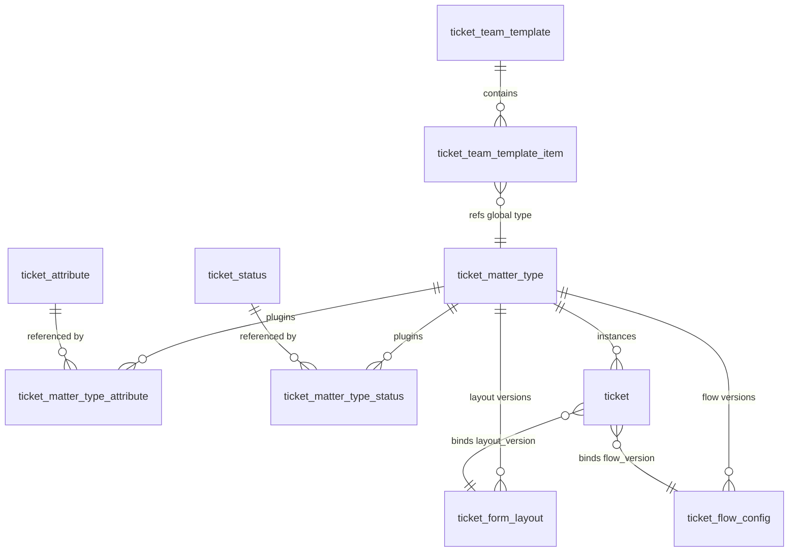
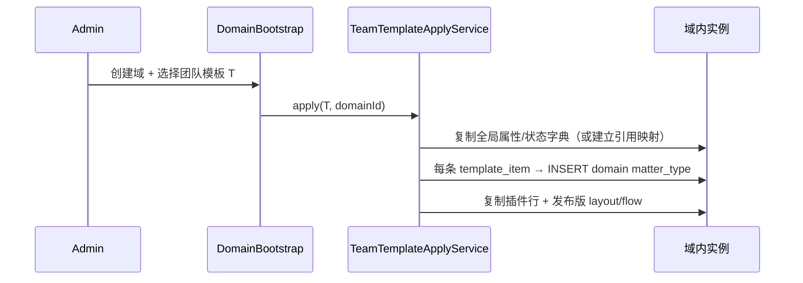

# 事项配置 — 文档索引（v3 背景）

> **本 Sprint 请以 [`design-attribute.md`](design-attribute.md) 为唯一专项设计。**  
> 本文档保留全量领域背景（团队模板、状态、插件模型等），**实施时以 proposal + design-attribute 为准**。

> **状态**：背景参考  
> **范围**：平台域；属性见 design-attribute；工作流拆表已 **移出本 Sprint**

---

## 0. 范围边界

### 0.1 本 Story 包含（平台域）

| 入口 | 说明 |
|------|------|
| **全局设置 → 事项配置** | 团队模板、全局事项类型/属性/状态字典 |
| **业务域 → 域管控 → 事项管理** | 某业务域内的事项类型、域内字典、插件、layout/flow 发布 |
| **创建业务域** | 可选绑定团队模板（快照复制） |
| **复制域属性→全局** | 全局设置内，仅 `platform_admin` |

### 0.2 本 Story 不包含（后续讨论）

| 项 | 说明 |
|----|------|
| 域成员独立后台 | `domain.ticket_*`、域内 `super_admin` 自助配置 |
| CustomerWeb | 用户端提单、可见性运行时过滤 |
| 域内 SLA / 通知模板 | 沿用现有域配置模块，仅「状态 SLA 继承域默认」引用 |
| 非 platform 角色 | 安全审计员只读等平台细分角色 — 后续按需开 |

### 0.3 权限原则（平台域）

- 凡本 Story UI/API，权限前缀仅 **`platform.ticket_config.*`** 与 **`platform.domain.control.ticket_*.*`**。
- **不新增、不绑定** `domain.ticket_*`（代码库中常量可保留，本 Story 不用）。
- 默认绑定角色：**`platform_admin`**（与现网域管控一致）。

---

## 1. 设计目标

1. **团队模板**：一个模板 = 一套可复用的「多事项类型」业务域方案；创建业务域时整体复制。
2. **插件式配置**：事项类型通过「插入」全局/域内属性、状态来装配，而非整页 JSON 黑盒。
3. **三维字典 + 双层作用域**：事项类型、事项属性、事项状态均支持 **平台全局** 与 **业务域内** 两套定义。
4. **域内可创新、可上浮**：域内可自定义属性；平台管理员可将域属性**复制提升**为全局属性。
5. **运行时稳定**：已提交工单绑定发布时点的布局版本与状态流版本，不受后续字典变更影响。

**命名约定**：产品用语「事项」；库表/API/代码统一 `ticket_*` 前缀。

---

## 2. 概念模型

### 2.1 实体一览

| 产品概念 | 含义 | 作用域 | 持久化（建议表名） |
|---------|------|--------|-------------------|
| **团队模板** | 聚合多个事项类型的业务域方案 | 仅平台 | `ticket_team_template` |
| **事项类型** | 一种工单的元约束（分类、启停、可见性） | 全局 / 域内 | `ticket_matter_type` |
| **事项属性** | 可复用字段定义（编码、组件类型、校验） | 全局 / 域内 | `ticket_attribute` |
| **事项状态** | 可复用处理态定义（编码、态类型、展示） | 全局 / 域内 | `ticket_status` |
| **类型↔属性插件** | 某类型启用了哪些属性及布局覆盖 | 随类型 | `ticket_matter_type_attribute` |
| **类型↔状态插件** | 某类型启用了哪些状态 | 随类型 | `ticket_matter_type_status` |
| **类型属性布局版本** | 属性插件 + 布局的草稿/发布快照 | 随类型 | `ticket_form_layout` |
| **类型工作流版本** | 状态插件 + 流转/规则的草稿/发布快照 | 随类型 | `ticket_flow_config` |
| **工单实例** | 用户提交的一条服务单 | 域内 | `ticket` |

> **说明**：现网 `ticket_type` 对应本稿「域内事项类型」；现网 `ticket_form_schema` 演进为 `ticket_form_layout`（**布局聚合版本**，不是属性字典）。

### 2.2 关系（Cardinality）



**团队模板链**

```
团队模板 (1) ──< 模板项 (N) ──> 全局事项类型 (1)
```

**事项类型链**

```
事项类型 (1) ──< 属性插件 (N) ──> 事项属性 (1)
事项类型 (1) ──< 状态插件 (N) ──> 事项状态 (1)
事项类型 (1) ──< 布局版本 (draft/published)
事项类型 (1) ──< 工作流版本 (draft/published)
```

### 2.3 三层语义（定义 / 装配 / 值）

| 层级 | 产品说法 | 存储 | 有无版本 |
|------|---------|------|---------|
| **定义层** | 全局/域内「事项属性」「事项状态」字典 | `ticket_attribute` / `ticket_status` | 字典本身无 draft/publish |
| **装配层** | 某类型「插入了哪些属性/状态」+ 布局/流转 | 插件表 + `ticket_form_layout` / `ticket_flow_config` | **有** draft/publish |
| **值层** | 用户填写的数据 | `ticket.title` / `description` / `custom_fields` | 随工单生命周期 |

**关键区分（避免再混淆）**

| 左菜单「事项属性」 | 列表操作「属性」 |
|-------------------|----------------|
| 字典 CRUD：有哪些字段零件 | 装配设计：本类型用哪些零件、怎么摆 |
| `ticket_attribute` | `ticket_matter_type_attribute` + `ticket_form_layout` |

| 左菜单「事项状态」 | 列表操作「工作流」 |
|-------------------|-------------------|
| 字典 CRUD：有哪些状态零件 | 装配设计：本类型用哪些状态、怎么流转 |
| `ticket_status` | `ticket_matter_type_status` + `ticket_flow_config` |

---

## 3. 作用域与可见性

### 3.1 统一 `scope` 字段

字典表（`ticket_matter_type` / `ticket_attribute` / `ticket_status`）共用：

| scope | business_domain_id | 谁可维护 | 谁可使用 |
|-------|-------------------|---------|---------|
| `platform` | NULL | 平台管理员 | 全平台模板 + 各域（通过复制/引用策略） |
| `domain` | NOT NULL | 域管理员 | 仅本域 |

### 3.2 域内自定义属性

- 域管理员可在 `ticket_attribute` 创建 `scope=domain` 行。
- 仅本域的类型插件可引用；其他域不可见。
- **上浮为全局（已确认）**：**仅平台管理员**（管理域平台 / `platform_admin`）可将域内 `ticket_attribute` **复制**为 `scope=platform` 全局属性；见 §18.1。

### 3.4 复制快照与隔离（已确认）

**原则：全局 ↔ 业务域完全隔离，仅「创建域 / 应用团队模板 / 人工升级模板」时做一次性深拷贝。**

| 场景 | 行为 |
|------|------|
| 创建域时选择团队模板 | 深拷贝：全局类型、属性、状态、插件、已发布 layout/flow → 域内独立实例 |
| 创建域时不选模板 | 允许**空域**；域管理员后续手动添加域内类型/字典 |
| 域内改属性/状态/类型/插件 | **不影响**平台全局 |
| 平台改全局字典/模板 | **不影响**已存在业务域（已拷贝快照） |
| 域内插件引用 | **禁止**跨 scope 实时引用；仅引用本域字典 id（含拷贝来的） |

域内数据通过 `source_*_id` 溯源，但运行时只读本域行。

### 3.3 事项类型：全局 vs 域内

| 类型 | scope | 出现在团队模板 | 出现在域内列表 |
|------|-------|--------------|--------------|
| 全局事项类型 | platform | ✅ | 仅复制后作为域内实例 |
| 域内事项类型 | domain | ❌ | ✅ |

**域内事项类型**复制自全局时：

- `source_matter_type_id` → 全局类型 id
- `source_team_template_id` → 可选，记录来自哪次团队模板复制
- 复制后为**独立实例**；全局变更不自动覆盖（与现方案一致）

---

## 4. 团队模板

### 4.1 定义

> **团队模板** = 平台侧「业务域事项方案包」，包含 N 个**全局事项类型**及其默认装配（属性插件、状态插件、初始布局/工作流）。

- **人工配置**：平台管理员在「团队模板」页 CRUD，勾选要纳入的全局事项类型及排序。
- **可选应用**：创建业务域时**不强制**选择模板；不选则空域起步。
- **域绑定一次性**：业务域创建时选定团队模板并完成快照复制；**之后不可更换模板、不可对已有域做模板升级/合并**（见 §4.4）。
- **模板版本**：仅用于平台侧维护模板定义；**只影响之后新建的业务域**，不回写已建域。

不等同于单个事项类型；不等同于旧 `ticket_template` 的 content 预设。

### 4.2 表结构

**`ticket_team_template`**

| 字段 | 说明 |
|------|------|
| id, code, name, description | 元数据 |
| status | active / disabled |
| is_system | 系统预置不可删 |
| sort_order | 列表排序 |
| version | 模板包版本（平台维护；**仅新域创建时**取当前版本快照） |

**`ticket_team_template_item`**

| 字段 | 说明 |
|------|------|
| team_template_id | FK |
| matter_type_id | 指向 **scope=platform** 的 `ticket_matter_type` |
| sort_order | 模板内排序 |
| snapshot_layout_version_no | 可选：锁定复制用哪版布局 |
| snapshot_flow_version_no | 可选：锁定复制用哪版工作流 |

### 4.3 创建业务域时的复制



**复制策略（已确认：深拷贝快照，全局/域互不影响）**

| 源 | 目标 |
|----|------|
| platform `ticket_attribute` 被插件引用 | domain `ticket_attribute`（`source_attribute_id` 溯源） |
| platform `ticket_status` 被插件引用 | domain `ticket_status` |
| platform `ticket_matter_type` | domain `ticket_matter_type`（`scope=domain`） |
| 插件 + published layout/flow | 新 owner 的插件 + published v1 |

**业务域记录（扩展 `business_domain` 或域配置 JSON）**

| 字段 | 说明 |
|------|------|
| `applied_team_template_id` | 创建域时选用的模板 id；NULL=空域 |
| `applied_team_template_version` | 创建时复制的模板版本号，永久不变 |

### 4.4 团队模板与业务域绑定（已确认）

| 规则 | 说明 |
|------|------|
| 绑定时机 | **仅**创建业务域时选择（或不选） |
| 绑定后 | 域内数据为快照副本，与模板定义**解耦** |
| 禁止 | 对已建域「换模板」「应用模板升级」「合并第二套模板」 |
| 平台改模板 | 只影响**之后新建**的域；已建域不变 |
| 域内演进 | 域管理员在快照基础上独立 CRUD 类型/属性/状态/插件/发布 |

```text
创建域 ──选模板 T@v3──> 深拷贝 ──> 域 D（applied_team_template_id=T, version=3）
之后平台把 T 升到 v4 ──X──> 域 D 仍为 v3 快照
域 D 内随意改配置 ──X──> 不影响全局 T 或 v4
```

---

## 5. 插件式配置

### 5.1 属性插件 `ticket_matter_type_attribute`

| 字段 | 说明 |
|------|------|
| matter_type_id | 所属类型 |
| attribute_id | 指向 `ticket_attribute`（同 scope 或域内复制后的 id） |
| sort_order | 表单内顺序 |
| group_key | 分组（可选） |
| required_override | NULL=用属性默认；true/false 覆盖 |
| visible_to_customer | 用户端是否展示 |
| layout_override_json | 标签、placeholder、宽度等覆盖 |
| status | enabled / disabled |

**系统属性**（`title`、`description`）：

- 以 `ticket_attribute.is_system=true` + 固定 `code` 表达；
- `category=transaction` 类型强制插入 title+description；
- `category=feedback` 仅强制 description。

### 5.2 状态插件 `ticket_matter_type_status`

| 字段 | 说明 |
|------|------|
| matter_type_id | 所属类型 |
| status_id | 指向 `ticket_status` |
| is_initial | 是否新建工单默认态（每类型恰一个） |
| sort_order | 工作流画布排序 |
| display_override_json | 名称/颜色覆盖 |
| sla_rule_json | **本状态 SLA**（见 §5.5）；NULL/空 = 继承业务域默认 SLA |
| status | enabled / disabled |

### 5.5 规则配置（已确认 MVP 范围）

规则分两层，均在「事项类型 → 工作流/状态插件」侧配置，发布时写入 `ticket_flow_config` 快照。

#### A. 流转条件（transitions）

挂在 `flow_json.transitions[]`：

| 字段 | 说明 |
|------|------|
| from / to | 状态 code |
| condition_json | 流转条件（角色、字段条件等；MVP 可先支持「执行角色」） |
| auto | 是否自动流转（Phase 3） |

校验：复用并扩展 [`StatusFlowValidator`](UnionDesk/uniondesk-ticket/src/main/java/com/uniondesk/ticket/core/StatusFlowValidator.java)。

#### B. 状态 SLA（per-status on matter type）

配置位置：**事项类型 × 事项状态插件** 的 `sla_rule_json`，不是全局状态字典本身。

| sla_rule_json | 运行时行为 |
|---------------|-----------|
| **有值** | 工单进入该状态时，按此规则计时/预警（首响、解决时长等，结构对齐现网 `sla_rule` 子集） |
| **空 / NULL** | **继承业务域默认 SLA**（域级 `sla_rule` 或域配置中的默认处理规则） |

与现网 [`sla_rule`](UnionDesk/uniondesk-app/src/main/resources/db/migration/archive/V202605031200__p0_prd_schema_extensions.sql) 关系：域级规则为底；类型×状态插件可覆盖；工单实例绑定 flow 快照中的 sla 副本。

**Phase 3 延后**：自动流转、通知模板联动、字段必填规则。

### 5.3 布局版本 `ticket_form_layout`（演进自 `ticket_form_schema`）

| 字段 | 说明 |
|------|------|
| matter_type_id | owner |
| business_domain_id | 域内 NOT NULL；全局类型 NULL |
| record_type | draft / published |
| version_no | draft=0；published=1..n（≤10） |
| layout_json | **发布快照**：解析后的 Formily schema（属性定义已 inline 拷贝） |
| plugin_snapshot_json | 可选：插件 id 列表 + 版本 hash，用于检测未发布 |
| published_by / published_at | |

**草稿 vs 发布**

- 改插件（增删属性）或改布局 → 写 draft 行或标记 `layout_has_unpublished`。
- 发布：根据当前插件 + 字典定义 **物化** 为 `layout_json` 快照 → 新 published 版本。

### 5.4 工作流版本 `ticket_flow_config`（演进自 `status_flow_config` 列）

| 字段 | 说明 |
|------|------|
| matter_type_id | owner |
| record_type / version_no | 同布局 |
| flow_json | `{ states: [...], transitions: [...], rules: [...] }` |
| plugin_snapshot_json | 状态插件快照 |

**`flow_json.states[]`**：从状态插件物化，含各状态 `sla_rule_json` 副本（见 §5.5 B）。

---

## 6. 事项类型（`ticket_matter_type`）

### 6.1 字段

| 字段 | 说明 |
|------|------|
| scope | platform / domain |
| business_domain_id | domain 时必填 |
| code, name, description, icon | 元数据 |
| category | transaction / feedback |
| status | active / disabled（管理端启停） |
| customer_visible | 用户端是否展示 |
| is_system | 系统预置 |
| source_matter_type_id | 域内复制自全局类型 |
| source_team_template_id | 域内复制自团队模板 |
| sort_order | |

### 6.2 与现网 `ticket_type` 映射

- 现网 `ticket_type` **重命名/演进**为 `ticket_matter_type`（或保留表名加 `scope` 列，迁移成本更低）。
- `status_flow_config` 列 **废弃**，迁入 `ticket_flow_config` 版本表。
- `ticket.form_schema_version_no` → `layout_version_no`；新增 `flow_version_no`。

---

## 7. 字典表结构

### 7.1 `ticket_attribute`

| 字段 | 说明 |
|------|------|
| scope | platform / domain |
| business_domain_id | |
| code | 域内唯一：(domain_id, code)；平台唯一：code |
| name, description | |
| field_type | text / textarea / select / number / date / ... |
| config_json | 校验、选项、默认值等 |
| is_system | title / description 等 |
| status | active / disabled |
| source_attribute_id | 域属性上浮或复制溯源 |

### 7.2 `ticket_status`

| 字段 | 说明 |
|------|------|
| scope | platform / domain |
| business_domain_id | |
| code, name, description | |
| state_type | in_progress / paused / terminal |
| config_json | 颜色、图标、allow_customer_withdraw 等 |
| is_system | 如「已关闭」 |
| status | active / disabled |
| source_status_id | 溯源 |

---

## 8. 可见性（与用户端的关系）

可见性**不是**字典/插件核心模型的一部分，而是**运行时门禁**：决定 CustomerWeb 用户能看到什么。管理端默认仍可见。

| 层级 | 字段 | 作用 | 用户端效果 |
|------|------|------|-----------|
| 事项类型 | `status=active` | 类型启停 | disabled → 不可新建此类工单 |
| 事项类型 | `customer_visible` | 类型是否对用户展示 | false → 类型不出现在用户端列表 |
| 属性插件 | `visible_to_customer` | 字段是否展示给用户 | false → 仅客服/内部可见 |
| 属性/状态字典 | `status=active` | 零件是否可用 | disabled → 发布时应校验 |

**用户端可选某事项类型需同时满足：** `status=active` **且** `customer_visible=true`（再加域访问权限）。

**与全局/域隔离：** 可见性随域内拷贝快照独立维护；平台改全局默认值**不影响**已建域，除非域内主动修改或接受模板升级。

**状态名称展示：** 读工单绑定的 **flow 快照**，不实时读字典。

---

## 9. 运行时（工单实例）

### 9.1 提单绑定

创建 `ticket` 时写入：

| 字段 | 来源 |
|------|------|
| matter_type_id | 用户选择 |
| layout_version_no | 当前 published 最大版 |
| flow_version_no | 当前 published 最大版 |
| status | 来自 flow 的 initial state code |
| title / description / custom_fields | 按 **当时** layout 快照校验与存储 |

### 9.2 历史不变性

- 字典属性改名、改校验 → **不影响**已提交 ticket（读 layout 快照）。
- 工作流发布新版本 → **不影响**已存在 ticket 的合法流转集合（读 flow 快照）。
- trim 删除最旧 published 前，跳过仍被 ticket 引用的 version_no。

---

## 10. 信息架构（UI）

### 10.1 平台 — 全局设置 → 事项配置

```text
事项配置
├── 团队模板          ← 新建：模板包 CRUD + 选择包含的全局类型
├── 事项类型          ← 全局类型 CRUD（字典）
├── 事项属性          ← 全局属性字典 CRUD
└── 事项状态          ← 全局状态字典 CRUD
```

**全局事项类型**操作列：

| 操作 | 能力 |
|------|------|
| 编辑 | 元数据 |
| 属性 | 插件管理 + 布局设计器（非字典 CRUD） |
| 工作流 | 状态插件 + 流转设计器 |
| 删除 | 校验团队模板/域内引用 |

### 10.2 平台 — 业务域 → 域管控 → 事项管理

> **注意**：本 Story 仅平台管理员（或持有 `platform.domain.control.*` 的平台角色）从**域管控**进入；非域成员后台。

```text
域管控 / 事项管理
├── 事项类型列表      ← 该域内类型（快照 + 域内自建）
├── 事项属性          ← 该域内属性字典
└── 事项状态          ← 该域内状态字典
```

域内类型操作列与全局类型一致（编辑 · 属性 · 工作流 · 删除）。  
**「复制为全局属性」** 仅在 **全局设置 → 事项配置** 提供，不在域管控 Tab 提供。

### 10.3 创建业务域

- **可选**选择团队模板；不选则空域，后续手动配置。
- 复制完成后域内可独立改插件与字典，不反写平台。

---

## 11. API 概要

### 11.1 平台

| 前缀 | 资源 |
|------|------|
| `/api/v1/admin/platform/ticket-team-templates` | 团队模板 |
| `/api/v1/admin/platform/ticket-matter-types` | 全局事项类型 |
| `/api/v1/admin/platform/ticket-attributes` | 全局属性字典 |
| `/api/v1/admin/platform/ticket-statuses` | 全局状态字典 |
| `.../matter-types/{id}/attribute-plugins` | 属性插件 |
| `.../matter-types/{id}/status-plugins` | 状态插件 |
| `.../matter-types/{id}/form-layout/draft\|publish\|versions` | 布局版本 |
| `.../matter-types/{id}/flow-config/draft\|publish\|versions` | 工作流版本 |
| `POST .../ticket-attributes/promote-from-domain` | 域属性复制为全局（**仅 platform_admin**） |

### 11.2 平台域管控 — 某业务域内实例

前缀：`/api/v1/admin/domains/{domain_id}/...`（调用方须持有 `platform.domain.control.ticket_*.*`）

| 前缀 | 资源 |
|------|------|
| `.../ticket-matter-types` | 域内类型 |
| `.../ticket-attributes` | 域内属性字典 |
| `.../ticket-statuses` | 域内状态字典 |
| 同上插件与 layout/flow 版本子路径 | |

**本 Story 权限**：`platform.ticket_config.*`（§11.1）+ `platform.domain.control.ticket_*.*`（上表）。  
**不在此 Story 校验**：`domain.ticket_*`（后续域成员后台再挂）。

---

## 12. 与现网迁移

| 现网 | 迁移 |
|------|------|
| `ticket_type` | 加 scope=domain；数据保留 |
| `ticket_form_schema` | 重命名/迁移为 `ticket_form_layout`；物化逻辑后补 |
| `ticket_type.status_flow_config` | 迁入 `ticket_flow_config` published v1 |
| Formily 整页 JSON | 拆分为：从 JSON 反解析属性 → 插入 `ticket_attribute` + 插件（迁移脚本） |
| `ticket_template` content 用法 | 废弃 |
| `dynamic_field_config` | 不恢复；由 `ticket_attribute` 取代 |

**默认团队模板**：将现网 seed 的 feedback/suggestion 等全局类型打入 `ticket_team_template`「默认客服方案」。

---

## 13. 分期实施建议

| Phase | 范围 | 交付 |
|-------|------|------|
| **P0** | 字典 + 域内类型插件 + 布局版本 | 域内可用；平台字典只读种子 |
| **P1** | 平台全局字典 + 全局类型 + 团队模板（人工配置/升级）+ 可选复制 | 新建域可选模板 |
| **P2** | 状态插件 + 工作流版本 + 流转条件 + 状态 SLA + **域属性上浮** | 工作流 MVP |
| **P3** | 规则增强（自动流转、通知等） | 运营增强 |

---

## 14. 风险

| 风险 | 缓解 |
|------|------|
| 从 JSON 迁移到插件模型工作量大 | 迁移脚本 + P0 兼容读取旧 layout_json |
| 字典与插件一致性 | 发布时物化快照；插件变更提示未发布 |
| 团队模板与全局类型循环依赖 | 模板仅引用 platform scope 类型 |
| 模块边界 domain↔ticket | `TeamTemplateApplyService` 放 app 层编排 |

---

## 15. 已确认决策（2026-06-16 更新）

| # | 决策 |
|---|------|
| 1 | 创建域**不强制**团队模板；允许空域 |
| 2 | 全局 ↔ 域内 **深拷贝快照**；互不影响 |
| 3 | 规则 MVP：**流转条件** + **类型×状态 SLA**（空则继承域默认 SLA） |
| 4 | 团队模板平台侧**人工配置**；**域创建时选定即固定**，不可换模板/不可对已建域升级 |
| 5 | **域属性上浮**：支持；**仅平台管理员**「复制为全局属性」；见 §18.1 |
| 6 | **权限**：**仅平台域**；定稿见 §19 |
| 7 | **范围**：不含域成员后台 / `domain.*` / CustomerWeb — 后续 Story |

## 16. 待补充的产品决策（Gap Checklist）

以下尚未在需求中写清，**建议在开发前逐项确认**：

### 16.1 团队模板

- [x] 创建域**不必选**团队模板；允许空域
- [x] 团队模板平台侧人工配置
- [x] **域创建时绑定模板即确定**；禁止对已建域换模板/升级
- [x] 模板 version 仅影响**之后新建**的域

### 16.2 全局 vs 域内引用

- [x] **深拷贝快照**；域改不影响全局，全局改不影响域
- [x] 域内禁止跨 scope 实时引用

### 16.3 事项属性

- [x] **域属性上浮**：平台管理员复制为全局；code 冲突默认**拒绝**并提示（可改 code 后重试）
- [ ] 属性类型 MVP 子集清单

### 16.4 事项状态与工作流

- [x] 规则 MVP：**流转条件** + **状态 SLA**（空=域默认）
- [ ] 同一类型多个 terminal 状态是否允许？
- [ ] 客户撤回是否仍仅 `in_progress`？

### 16.5 权限与审计

- [x] **§19 平台域权限矩阵**（已定稿；域成员后台后续）

### 16.6 非功能

- [ ] 布局/工作流 published 保留 10 版是否仍适用？
- [ ] 多语言是否 MVP 范围？

---

## 17. 完善度自评

| 维度 | 状态 | 说明 |
|------|------|------|
| 概念分层（字典/插件/版本/值） | ✅ 已覆盖 | 解决此前 form_schema 与属性字典混淆 |
| 团队模板 | ✅ 已建模 | 待确认 §14.1 |
| 全局/域双作用域 | ✅ 已覆盖 | 待确认引用 vs 复制策略 |
| 域属性上浮全局 | ✅ 已描述 | 待确认审批与 code 冲突 |
| 插件式属性/状态 | ✅ 已覆盖 | 状态规则细节待 §14.4 |
| API/UI 骨架 | ✅ 概要 | 缺详细 DTO 与错误码表 |
| 迁移路径 | ⚠️ 方向有 | 缺 JSON→插件反解析算法 |
| 权限/审计/用户端 | ✅ 平台域已定稿 | 域成员/CustomerWeb 后续 |
| SLA/通知/规则引擎 | ⏸ 刻意延后 | 与工作流 rules 一并 Phase 3 |

**结论**：作为**领域架构设计**已较完整，可支撑评审与拆 Epic；作为**可开发规格**仍需补齐 §14 中勾选决策 + 状态规则清单 + 权限矩阵 + 迁移算法细节。

---

## 18. 术语答疑（FAQ）

### 18.1 域属性上浮（已确认）

**操作名**：复制为全局属性（非链接、非移动）。

**场景**：域内自定义属性（如「校区」）需纳入平台全局字典，供团队模板与未来新域使用。

| 要点 | 说明 |
|------|------|
| 操作 | 平台管理员从指定域挑选 `scope=domain` 属性 → INSERT `scope=platform` 新行 |
| 权限 | **仅** `platform_admin`（管理域平台）；域管理员**不可**自行上浮 |
| 域内原记录 | **保留**；上浮不删除域内属性 |
| 全局 code 冲突 | **拒绝**并提示；管理员修改 code 或域属性 code 后重试 |
| 溯源 | 全局行写 `source_domain_id` + `source_attribute_id` |
| 已建域 | 其他域**不自动**获得该全局属性；仅新域/新模板装配可选 |

**API**：`POST /api/v1/admin/platform/ticket-attributes/promote-from-domain`  
Body: `{ domain_id, attribute_id, global_code?, global_name? }`

### 18.2 权限矩阵（平台域）

本 Story **只设计平台管理后台**两条入口的 IAM；域成员后台、`domain_admin` 自助配置 **不在范围内**。

| 能力 | 入口 | 权限 |
|------|------|------|
| 团队模板 / 全局字典 | 全局设置 → 事项配置 | `platform.ticket_config.*` |
| 复制域属性→全局 | 同上 | `platform.ticket_config.attribute.promote` |
| 域内类型/字典/插件/发布 | 域管控 → 事项管理 | `platform.domain.control.ticket_*.*` |
| 创建域时选模板 | 创建业务域 | `platform.domain.create` |

详见 **§19**。

### 18.3 可见性和配置模型有什么关系？

见 **§8**。简要：

- **配置模型**管「有哪些类型、字段、状态、怎么流转」；
- **可见性**管「用户端是否看得到」——是配置之上的**展示开关**，随域内快照独立维护，与全局/域隔离原则一致。

---

## 19. 权限矩阵（平台域 — 已定稿）

> **范围**：仅 [`UnionDeskAdminWeb`](UnionDeskWeb/apps/UnionDeskAdminWeb) 平台模式 — **全局设置** + **业务域域管控**。  
> **角色**：本 Story 默认只保证 **`platform_admin`**；其他平台角色按需分配，**不涉及** `domain_admin` / `super_admin` 域内自助。

### 19.1 两个入口

| ID | 入口 | 权限前缀 |
|----|------|---------|
| **A** | 全局设置 → 事项配置 | `platform.ticket_config.*` |
| **B** | 业务域 → 域管控 → 事项管理 | `platform.domain.control.ticket_*.*` |

### 19.2 权限码清单

#### A — `platform.ticket_config.*`（新增 Flyway）

| code | 说明 |
|------|------|
| `platform.ticket_config.read` | 读团队模板、全局类型/属性/状态 |
| `platform.ticket_config.create` | 新建模板、全局字典项 |
| `platform.ticket_config.update` | 编辑；含全局类型插件、**保存草稿**、**发布** layout/flow |
| `platform.ticket_config.delete` | 删除非系统项 |
| `platform.ticket_config.attribute.promote` | 从指定域**复制为全局属性** |

> **说明**：本 Story **不单独拆** `publish` 权限；`update` 含发布。上浮独立便于审计。

#### B — `platform.domain.control.ticket_*.*`（扩展 Flyway）

**已有**（保持）：

| code | 说明 |
|------|------|
| `platform.domain.control.ticket_type.read` | 域管控 · 事项列表/详情 |
| `platform.domain.control.ticket_type.create` | 新建域内类型 |
| `platform.domain.control.ticket_type.update` | 编辑元数据、域内字典、插件、草稿、**发布** layout/flow |
| `platform.domain.control.ticket_type.delete` | 删除类型（含终态校验） |

**新增**：

| code | 说明 |
|------|------|
| `platform.domain.control.ticket_attribute.read` | 域内属性字典列表 |
| `platform.domain.control.ticket_attribute.create` | 新建域内属性 |
| `platform.domain.control.ticket_attribute.update` | 编辑域内属性 |
| `platform.domain.control.ticket_attribute.delete` | 删除域内属性 |
| `platform.domain.control.ticket_status.read` | 域内状态字典列表 |
| `platform.domain.control.ticket_status.create` | 新建域内状态 |
| `platform.domain.control.ticket_status.update` | 编辑域内状态 |
| `platform.domain.control.ticket_status.delete` | 删除域内状态 |

**本 Story 不新增**：`domain.ticket_*`、CustomerWeb 接口权限。

### 19.3 能力矩阵（platform_admin）

| 能力 | A | B | permission |
|------|---|---|------------|
| 团队模板 CRUD | ✅ | — | `ticket_config.*` |
| 全局类型/属性/状态 CRUD + 发布 | ✅ | — | 同上 |
| 复制域属性→全局 | ✅ | — | `ticket_config.attribute.promote` |
| 创建域 + 选团队模板 | ✅ | — | `platform.domain.create` |
| 域内类型 CRUD + 插件 + 发布 | — | ✅ | `control.ticket_type.*` |
| 域内属性字典 CRUD | — | ✅ | `control.ticket_attribute.*` |
| 域内状态字典 CRUD | — | ✅ | `control.ticket_status.*` |
| 改 `customer_visible` 等 | — | ✅ | `control.ticket_type.update` |

### 19.4 默认角色绑定

| 角色 | 本 Story 绑定 |
|------|-------------|
| `platform_admin` | A 全开 + B 全开（含新增 attribute/status） |
| 其他平台角色 | 默认无；由平台权限管理另行分配 |
| `super_admin` / `domain_admin`（域） | **本 Story 不绑定** — 后续域成员 Story 再议 |

### 19.5 菜单与前端

| 菜单 | permission_code |
|------|-----------------|
| 全局设置 → 事项配置（目录/子菜单） | `platform.ticket_config.read` |
| 域管控 → 事项 Tab 按钮 | 沿用 `platform.domain.control.ticket_type.read` 等 |

[`AuthGuarded`](UnionDeskWeb/apps/UnionDeskAdminWeb) / [`platform-com-registry.ts`](UnionDeskWeb/apps/UnionDeskAdminWeb/src/pages/platform/system/menu/components/platform-com-registry.ts) 仅注册上述 platform 路径。

### 19.6 审计（平台域）

写入 `operation_log`：团队模板变更、全局字典变更、属性 promote、域内 layout/flow 发布、域内类型删除。

### 19.7 后续 Story（占位）

| 项 | 权限方向 |
|----|---------|
| 域成员后台事项配置 | `domain.ticket_type.*` 等，是否 mirror control 待定 |
| CustomerWeb 提单 | `ticket.create` 等现有工单权限 |
| 平台只读审计角色 | `platform.ticket_config.read` 不含 promote/update |

---

## 20. 与旧方案差异摘要

| 旧方案 | v3 |
|--------|-----|
| `ticket_template` = 单事项类型 blueprint | `ticket_team_template` = 多类型方案包 |
| `ticket_form_schema` = 事项属性 | `ticket_attribute` = 属性字典；`ticket_form_layout` = 布局版本 |
| `status_flow_config` 列内嵌状态 | `ticket_status` 字典 + `ticket_flow_config` 版本 |
| 左菜单「事项属性」占位 | 左菜单 = 全局字典 CRUD |
| 操作列「属性」= 同一存储 | 操作列 = 插件 + 布局发布 |
