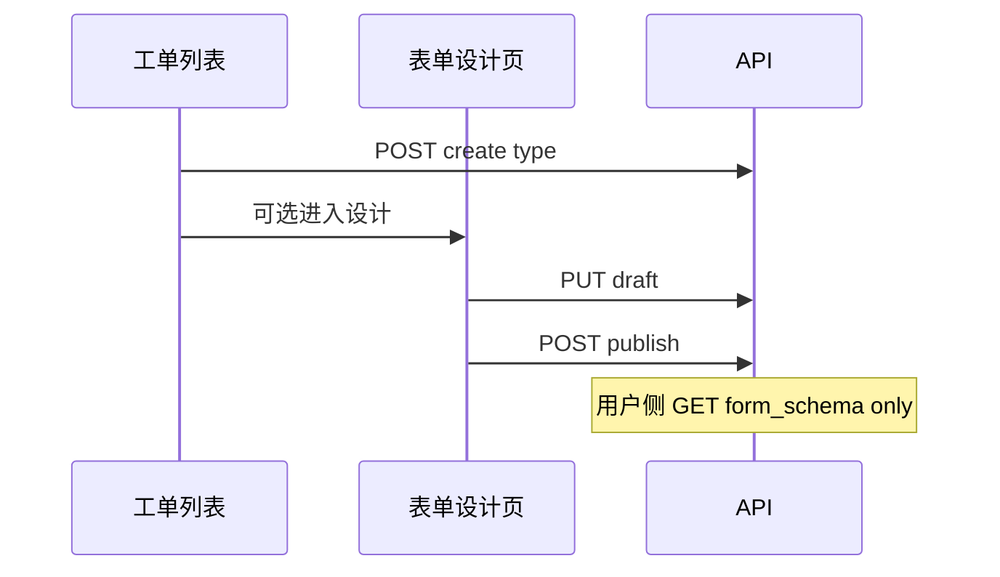

# Comet Design Handoff

- Change: ticket-type-list-form-designer-s3-02
- Phase: design
- Mode: compact
- Context hash: f8ead76f062b954d84580a243a68f6627f8e8f882857201117bcaa218eabe1b4

Generated-by: comet-handoff.sh (manual fallback, Git Bash unavailable)

OpenSpec remains the canonical capability spec. This handoff is a deterministic, source-traceable context pack, not an agent-authored summary.

## openspec/changes/ticket-type-list-form-designer-s3-02/proposal.md

- Source: openspec/changes/ticket-type-list-form-designer-s3-02/proposal.md
- Lines: 1-48
- SHA256: b93e21d696d58be1adfe4cd735cca0da872878223408b24a02728d86a8bf5cba

```md
## Why

**S3-01** 已交付工单类型列表、Formily 设计器与状态流配置，但存在三类缺口：

1. **持久化误导**：设计器顶栏「保存/发布」仅更新前端内存并提示「保存成功」，未调用后端；用户以为已落库。
2. **无草稿/发布分离**：`form_schema` 单字段，无法「保存草稿」与「发布生效」区分；用户侧应始终读取已发布版本。
3. **列表与流程体验不足**：SubTab 仍名「工单类型」、Table 展示；缺描述/图标、域内编码名称唯一约束；创建后强制跳转全量三 Tab 配置页，与「表单设计 / 编辑基础信息」分流需求不符。

## What Changes

### 后端

- Flyway：`form_schema_draft`、`description`、`icon`；域内 `(business_domain_id, code)` / `(business_domain_id, name)` 唯一索引。
- API：扩展 TicketType DTO；新增 `PUT .../form-schema/draft`、`POST .../form-schema/publish`；`updateTicketType` 不再写 `form_schema`。
- 创建/更新时唯一性校验与中文错误信息。

### 前端

- 域详情 SubTab「工单类型」→ **「工单列表」**；列表 **卡片网格** 展示（居中布局）。
- 创建弹窗：编码、名称、描述、图标；创建成功后 **询问是否进入表单设计**。
- 卡片操作：**表单设计**（独立页 Tab）、**编辑**（基础信息弹窗）、启用/停用、删除。
- 独立表单设计页 `/ticket-type-config/:domainId/:typeId/form`：仅设计器；**保存=草稿 API，发布=发布 API**。
- 抽取 `IconPicker` 至 `src/components/icon-picker/` 供菜单与工单类型共用。
- 设计器 Actions 区业务化（移除 Playground 链接）。

## Capabilities

### New Capabilities

- `ticket-type-list-form-designer` — 工单列表 UX、元数据扩展、表单 schema 草稿/发布持久化

### Modified Capabilities

- `ticket-type-config`（S3-01）— 配置入口由全量三 Tab 页拆分为列表 + 表单设计页 + 编辑弹窗

## Impact

- `uniondesk-ticket`：`TicketTypePo`、Mapper、Service、Controller、迁移
- `UnionDeskWeb/packages/shared`：类型与 API
- `detail-tickets.tsx`、表单设计路由、`formily-form-designer` 组件
- 用户侧（S3-03 及后续）仅消费 `form_schema`（已发布）

## Non-Goals

- CustomerWeb 提单页改造（仅约定读取发布版 schema）
- 工单模板 SubTab 卡片化（本 change 可顺带表格居中，非主目标）
- 编辑弹窗内嵌状态流（状态流保留独立入口 `/flow`）
- 设计器深浅色主题适配（已回退固定浅色）
```

## openspec/changes/ticket-type-list-form-designer-s3-02/design.md

- Source: openspec/changes/ticket-type-list-form-designer-s3-02/design.md
- Lines: 1-88
- SHA256: bf86667c6cb9e36f2b697cdc80ff4e18786501f4f98b1972957a5d021e6916cc

[TRUNCATED]

```md
## Context

- **前置**：[`ticket-type-config-s3-01`](../../ticket-type-config-s3-01/) 已实现 `detail-tickets` 列表、`TicketTypeDesigner` 三 Tab、`FormilyFormDesigner` 组件。
- **问题**：设计器 Save/Publish → `saveSchema()` → 仅 `onChange`；底部「保存」才 `updateDomainTicketType`。
- **用户确认**：保存=未发布草稿；发布=用户拉取的版本；列表卡片化 + 创建/编辑/表单设计分流。

## Goals

- 设计器「保存」「发布」分别对接后端 draft / publish API。
- 工单列表改名、卡片展示、元数据（description/icon）与域内唯一约束。
- 创建后可选进入独立表单设计页；卡片「表单设计」「编辑」职责分离。

## Decisions

### 1. Schema 双版本存储

| 列 | 语义 |
|:---|:---|
| `form_schema` | **已发布**（运行时/用户侧只读） |
| `form_schema_draft` | **草稿**（设计器编辑） |

设计器加载：`form_schema_draft ?? form_schema`。Publish：校验 draft 后复制到 `form_schema`。

### 2. API 边界

- `PUT /ticket-types/{id}`：仅 `name`、`description`、`icon`、`status`、`status_flow`。
- `PUT /ticket-types/{id}/form-schema/draft`：保存草稿。
- `POST /ticket-types/{id}/form-schema/publish`：发布。
- 权限：沿用 `platform.domain.control.ticket_type.update`。

### 3. 前端路由与页签

```
/platform/domains/detail/:id?tab=tickets     → 工单列表（卡片）
/platform/domains/ticket-type-config/:d/:t/form  → 表单设计（openAppScopeTab）
/platform/domains/ticket-type-config/:d/:t/flow  → 状态流（可选，复用 FlowDesigner）
```

原 `/ticket-type-config/:d/:t` 全量三 Tab 页废弃或重定向至 `/form`。

### 4. 列表 UX

- SubTab 标签：「工单列表」；Card 标题同步。
- 响应式 Card Grid；内容居中；未发布 Tag（draft ≠ published JSON）。
- Icon：Iconify 字符串，复用抽取后的 `IconPicker`。

### 5. 创建/编辑流程

**创建**：Modal（code/name/description/icon）→ API → `Modal.confirm`「是否进入表单设计？」→ 是则打开 `/form` Tab。

**编辑**：Modal 改 name/description/icon/status；code 只读。

**表单设计**：仅 `FormilyFormDesigner` + 顶栏保存/发布；无页面底部保存条。

### 6. 设计器 Actions

- 移除 Alibaba Fusion / Github / 语言切换。
- 「保存」→ draft API；「发布」→ publish API；Ctrl+S = 保存草稿。

## Data Flow



## Risks

| 风险 | 缓解 |
|:---|:---|
| 唯一索引与存量重复数据 | 迁移前清洗；Service 层友好错误 |
| 全量配置页废弃影响书签 | `/ticket-type-config` 重定向 `/form` |
| IconPicker 抽取影响菜单页 | 仅移动路径，行为不变 |

## Verification

- `TicketConfigServiceTests`：draft/publish/唯一性
- `pnpm run typecheck`
- agent-browser：创建 → 确认进设计 → 保存/发布 → 刷新验证
```

Full source: openspec/changes/ticket-type-list-form-designer-s3-02/design.md

## openspec/changes/ticket-type-list-form-designer-s3-02/tasks.md

- Source: openspec/changes/ticket-type-list-form-designer-s3-02/tasks.md
- Lines: 1-40
- SHA256: d1c34ea7fd3cdea2f3a151d8e3f387d5133431446047cbcaa066e4e965fd3971

```md
## 1. 数据库与后端

- [ ] 1.1 Flyway：`form_schema_draft`、`description`、`icon`；回填 draft；域内 code/name 唯一索引
- [ ] 1.2 `TicketTypePo` / Mapper / Repository 扩展字段
- [ ] 1.3 `TicketConfigService`：创建/更新唯一性校验；`saveFormSchemaDraft` / `publishFormSchema`
- [ ] 1.4 `TicketConfigController`：draft PUT、publish POST；DTO 扩展；`updateTicketType` 不再写 `form_schema`
- [ ] 1.5 `TicketConfigServiceTests` + `FormSchemaValidatorTests` 补充用例

## 2. Shared API

- [ ] 2.1 `DomainTicketType` 增加 `description`、`icon`、`form_schema_draft`
- [ ] 2.2 `saveDomainTicketTypeFormSchemaDraft` / `publishDomainTicketTypeFormSchema`
- [ ] 2.3 `CreateDomainTicketTypeBody` / `UpdateDomainTicketTypeBody` 扩展

## 3. 前端 — 公共组件

- [ ] 3.1 抽取 `src/components/icon-picker/`（菜单页改引用）
- [ ] 3.2 `FormilyFormDesigner`：`onSaveDraft` / `onPublish`；`saveDraftSchema` / `publishSchema`
- [ ] 3.3 `ActionsWidget` 业务化（保存/发布文案、loading、移除 Playground）

## 4. 前端 — 工单列表

- [ ] 4.1 SubTab/Card 改名「工单列表」
- [ ] 4.2 Table → Card 网格（居中）；未发布 Tag
- [ ] 4.3 创建 Modal：code/name/description/icon；创建后 confirm 是否进入表单设计
- [ ] 4.4 编辑 Modal：name/description/icon/status（code 只读）
- [ ] 4.5 卡片操作：表单设计 / 编辑 / 启停 / 删除；状态流入口（可选 `/flow`）

## 5. 前端 — 表单设计页

- [ ] 5.1 路由 `.../ticket-type-config/:domainId/:typeId/form`
- [ ] 5.2 独立页面：返回列表 + 仅设计器 + draft/publish 接线
- [ ] 5.3 原全量 `TicketTypeDesigner` 页重定向或废弃
- [ ] 5.4 `platform-pages.ts` / tabbar 标题「表单设计 - {name}」

## 6. 验收

- [ ] 6.1 `mvn test` + `pnpm run typecheck`
- [ ] 6.2 agent-browser：创建 → 表单设计 → 保存草稿 → 发布 → 列表未发布 Tag 消失
```

## openspec/changes/ticket-type-list-form-designer-s3-02/specs/ticket-type-list-form-designer/spec.md

- Source: openspec/changes/ticket-type-list-form-designer-s3-02/specs/ticket-type-list-form-designer/spec.md
- Lines: 1-81
- SHA256: c4d217fbc66f36a84922ccd72fb36631e93db0631c17d568e996e462777608f5

[TRUNCATED]

```md
# ticket-type-list-form-designer

## ADDED Requirements

### Requirement: Ticket type list displays as card grid

The platform domain detail tickets sub-tab SHALL be labeled「工单列表」and display ticket types as a responsive card grid with centered content, showing icon, name, code, description excerpt, status, field count, state count, and an unpublished indicator when draft schema differs from published schema.

#### Scenario: User views ticket type list

- **WHEN** user opens domain detail tickets tab with existing ticket types
- **THEN** types are shown as cards not table rows
- **AND** the sub-tab label reads「工单列表」

#### Scenario: Unpublished draft indicator

- **WHEN** `form_schema_draft` differs from `form_schema` for a ticket type
- **THEN** the card shows an「未发布」tag

### Requirement: Ticket type code and name are unique per domain

The system SHALL enforce unique `code` and `name` per `business_domain_id` at database and service layer with user-facing Chinese error messages.

#### Scenario: Duplicate code on create

- **WHEN** user creates a ticket type with a code already used in the same domain
- **THEN** the API returns an error indicating the code already exists

### Requirement: Ticket type supports description and icon

Ticket types SHALL support optional `description` (varchar) and `icon` (Iconify identifier string) persisted and returned in admin APIs.

#### Scenario: Create with description and icon

- **WHEN** user creates a ticket type with description and icon
- **THEN** the created type includes those fields in GET list response

### Requirement: Form schema draft and publish separation

The system SHALL store `form_schema_draft` for unpublished edits and `form_schema` as the published version consumed by end users.

#### Scenario: Save draft from designer

- **WHEN** user clicks Save in the form designer
- **THEN** the current schema is persisted to `form_schema_draft` only

#### Scenario: Publish from designer

- **WHEN** user clicks Publish in the form designer
- **THEN** validated draft schema is copied to `form_schema`
- **AND** end-user facing APIs read only `form_schema`

### Requirement: Create flow prompts optional form design entry

After creating a ticket type with code, name, description, and icon, the UI SHALL ask whether to open the dedicated form design page in a new tab.

#### Scenario: User confirms form design after create

- **WHEN** user confirms entering form design after create
- **THEN** a tab opens to `/platform/domains/ticket-type-config/{domainId}/{typeId}/form`

#### Scenario: User declines form design after create

- **WHEN** user declines
- **THEN** user remains on the ticket list with the new card visible

### Requirement: Card actions separate form design and metadata edit

Each ticket type card SHALL provide「表单设计」opening the dedicated form design page and「编辑」opening a modal to edit name, description, icon, and status with code read-only.

#### Scenario: Open form design from card

- **WHEN** user clicks「表单设计」on a card
- **THEN** the form design page tab opens with designer save/publish wired to APIs

#### Scenario: Edit metadata from card

- **WHEN** user clicks「编辑」on a card
- **THEN** a modal allows editing name, description, icon, status
- **AND** code field is read-only
```

Full source: openspec/changes/ticket-type-list-form-designer-s3-02/specs/ticket-type-list-form-designer/spec.md
