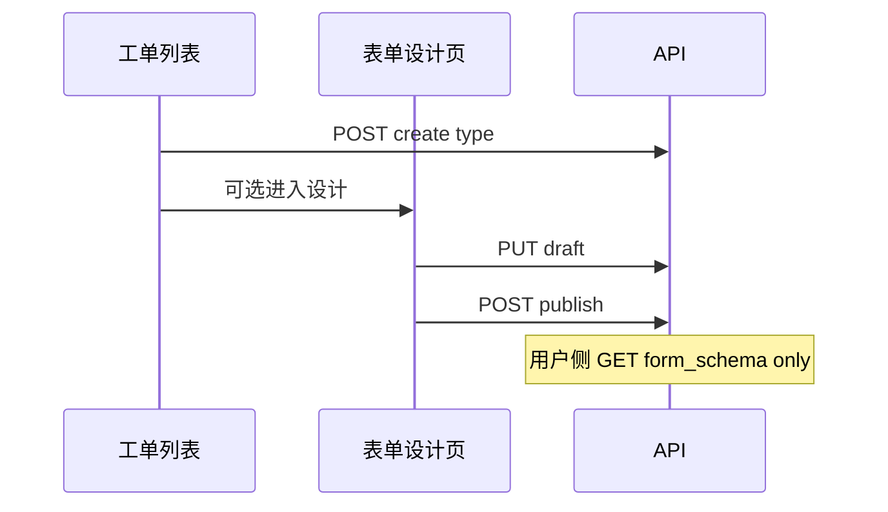

## Context

- **前置**：[`ticket-type-config-s3-01`](../../ticket-type-config-s3-01/) 已实现 `detail-tickets` 列表、`TicketTypeDesigner` 三 Tab、`FormilyFormDesigner` 组件。
- **问题**：设计器 Save/Publish → `saveSchema()` → 仅 `onChange`；底部「保存」才 `updateDomainTicketType`。
- **用户确认**：保存=未发布草稿；发布=用户拉取的版本；列表卡片化 + 创建/编辑/表单设计分流。

## Goals

- 设计器「保存」「发布」分别对接后端 draft / publish API。
- 工单列表改名、卡片展示、元数据（description/icon）与域内唯一约束。
- 创建后可选进入独立表单设计页；卡片「表单设计」「编辑」职责分离。

## Decisions

### 1. Schema 双版本存储

| 列 | 语义 |
|:---|:---|
| `form_schema` | **已发布**（运行时/用户侧只读） |
| `form_schema_draft` | **草稿**（设计器编辑） |

设计器加载：`form_schema_draft ?? form_schema`。Publish：校验 draft 后复制到 `form_schema`。

### 2. API 边界

- `PUT /ticket-types/{id}`：仅 `name`、`description`、`icon`、`status`、`status_flow`。
- `PUT /ticket-types/{id}/form-schema/draft`：保存草稿。
- `POST /ticket-types/{id}/form-schema/publish`：发布。
- 权限：沿用 `platform.domain.control.ticket_type.update`。

### 3. 前端路由与页签

```
/platform/domains/detail/:id?tab=tickets     → 工单列表（卡片）
/platform/domains/ticket/form-design/:d/:t                    → 表单设计（openAppScopeTab）
/platform/domains/ticket-type-config/:d/:t/flow  → 状态流（可选，复用 FlowDesigner）
```

页面组件：`src/pages/common/form-design/index.tsx`。  
原 `/ticket-type-config/:d/:t` 及 `/form` 子路径重定向至 `/platform/domains/ticket/form-design/:d/:t`。

### 4. 列表 UX

- SubTab 标签：「工单列表」；Card 标题同步。
- 响应式 Card Grid；内容居中；未发布 Tag（draft ≠ published JSON）。
- Icon：Iconify 字符串，复用抽取后的 `IconPicker`。

### 5. 创建/编辑流程

**创建**：Modal（code/name/description/icon）→ API → `Modal.confirm`「是否进入表单设计？」→ 是则打开 `/form` Tab。

**编辑**：Modal 改 name/description/icon/status；code 只读。

**表单设计**：仅 `FormilyFormDesigner` + 顶栏保存/发布；无页面底部保存条。

### 6. 设计器 Actions

- 移除 Alibaba Fusion / Github / 语言切换。
- 「保存」→ draft API；「发布」→ publish API；Ctrl+S = 保存草稿。

## Data Flow



## Risks

| 风险 | 缓解 |
|:---|:---|
| 唯一索引与存量重复数据 | 迁移前清洗；Service 层友好错误 |
| 全量配置页废弃影响书签 | 旧 `/ticket-type-config` 及 `/form` 重定向 `/platform/domains/ticket/form-design/:d/:t` |
| IconPicker 抽取影响菜单页 | 仅移动路径，行为不变 |

## Verification

- `TicketConfigServiceTests`：draft/publish/唯一性
- `pnpm run typecheck`
- agent-browser：创建 → 确认进设计 → 保存/发布 → 刷新验证
